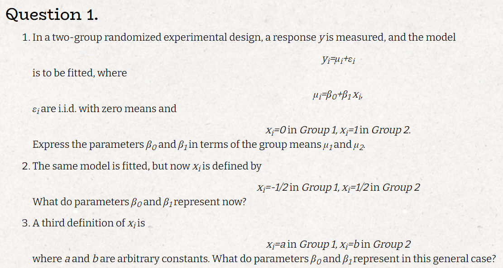

```{r setup, include=FALSE}
knitr::opts_chunk$set(echo = TRUE)
library(tidyverse)
library(glue)
```



**a**

*we will imput* $x_1, x_2$ *and get:*

$\mu_1 = \beta_0$

$\mu_2 = \beta_0 + \beta_1 \Rightarrow \beta_1 = \mu_2 - \mu_1$


**b**

$(1) \mu_1 = \beta_0 - \frac{1}{2}\beta_1$

$(2) \mu_2 = \beta_0 + \frac{1}{2}\beta_1$

$(1)+(2) \Rightarrow \mu_1+\mu_2 = 2 \beta_0 \Rightarrow \beta_0 = \frac{\mu_1+\mu_2}{2}$

$(2)-(1) \Rightarrow \mu_2-\mu_1 = \beta_1$

**c**

$(3) \mu_1 = \beta_0 + a\beta_1$

$(4) \mu_2 = \beta_0 + b\beta_1$

$(3) - (4) \Rightarrow \mu_1-\mu_2 = (a-b)\beta_1 \Rightarrow \beta_1 = \frac{\mu_1-\mu_2}{a-b}$

*imput * $\beta_0$ *in (3):* 

$\mu_1 = \beta_0 + a\frac{\mu_1-\mu_2}{a-b} \Rightarrow \beta_0 = \frac{(a-b)\mu_1 - a\mu_1+a\mu_2}{a-b}= \frac{a\mu_2-b\mu_1}{a-b}$


**first lets compute g for each situtaion**

$$
(1)\,g(x_i) =
\begin{cases}
\beta_0 + \beta_1x_{1i}\, , & i \le n_1 \\
\beta_0 + \beta_2 +\beta_1x_{1i} \, ,& i > n_1
\end{cases}
\\
(2)\,g(x_i) = \beta_0 + \beta_1x_{1i} + \beta_3x_{1i}^2
\\
(3)\,g(x_i) =
\begin{cases}
\beta_0 + \beta_1x_{1i} + \beta_3x_{1i}^2\, , & i \le n_1 \\
\beta_0 + \beta_2 + \beta_1x_{1i} + \beta_3x_{1i}^2 \, ,& i > n_1
\end{cases}
\\
(4)\,g(x_i) =
\begin{cases}
\beta_0 + \beta_1x_{1i} + \beta_3x_{1i}^2\, , & i \le n_1 \\
\beta_0 + (\beta_1+\beta_4)x_{1i} + \beta_3x_{1i}^2 \, ,& i > n_1
\end{cases}
\\
(5)\,g(x_i) =
\begin{cases}
\beta_0 + \beta_1x_{1i} + \beta_3x_{1i}^2\, , & i \le n_1 \\
\beta_0 + \beta_1x_{1i} + (\beta_3+\beta_5)x_{1i}^2 \, ,& i > n_1
\end{cases}
$$
**for plotting we will make the following assumptions:**
$$
\beta_0 =10
\\
\beta_1 = 1
\\
\beta_2 = 20
\\
\beta_3 = 1
\\
\beta_4 = 4
\\
\beta_5 = 4
\\
\varepsilon \sim N(0,1)
\\
X_1 \sim U(0,25)
\\
n_1 = 50
\\
n_2 = 50
$$

```{r}
#initilaze parameters
b0 <-  10
b1 <-1
b2 <-20
b3 <-1
b4 <-4
b5 <-4
eps <- rnorm(100)
x1 <- runif(100,0,25)
x3 <- x1^2
x2 <- c(rep(0,50),rep(1,50))
g1 <- b0 +b1*x1+b2*x2
g2 <- b0 +b1*x1+b3*x3
g3 <- b0 +b1*x1+b2*x2 +b3*x3
g4 <- b0 +b1*x1+b3*x3 + b4 *x1*x2
g5 <- b0 +b1*x1+b3*x3 + b5 *x3*x2

mat <- cbind(g1,g2,g3,g4,g5)
for (i in 1:5){
  y <- mat[,i]
  tbl <-  tibble(x=x1,y=y,x2 =x2)
  #plot data
  print(ggplot(data = tbl,aes(x = x1, y = y,group = x2,color = x2)) +
    geom_point()+
    ggtitle(glue("g{i}"))+
    geom_smooth(fullrange=TRUE))
}

```


$$
X = \begin{bmatrix}
    1 & x_1  \\ \vdots & \vdots \\ 1 & x_n
  \end{bmatrix}
\\
X^tX = 
 \begin{bmatrix}
    1 & x_1  \\ \vdots & \vdots \\ 1 & x_n
  \end{bmatrix}
  \begin{bmatrix}
    1 \ldots 1  \\ x_1 \ldots x_n
  \end{bmatrix} = \begin{bmatrix}
  n & \sum_ix_i \\
  \sum_ix_i & \sum_i x_i^2 
  \end{bmatrix}
\\
(X^tX)^{-1} = \frac{1}{n\sum_ix_i^2-(\sum_i(x_i))^2}\begin{bmatrix}
  \sum_i x_i^2 & -\sum_ix_i \\
  -\sum_ix_i &  n
  \end{bmatrix} :=C\begin{bmatrix}
  \sum_i x_i^2 & -\sum_ix_i \\
  -\sum_ix_i &  n
  \end{bmatrix}
  \\
  (X^tX)^{-1}X^t=C \begin{bmatrix}
  \sum_ix_i^2 - x_1\sum_ix_i&, \ldots&,&\sum_ix_i^2 - x_n\sum_ix_i\\
  nx_1 - \sum_i x_i&, \ldots&,&nx_n - \sum_i x_i
  \end{bmatrix}
  \\
  X(X^tX)^{-1}X^t_{jj} = C(\sum_ix_i^2-x_j\sum_ix_i+nx_j^2-x_j\sum_ix_i) = C(\sum_ix_i^2-2x_j\sum_ix_i+nx_j^2)=
  C(\sum_ix_i^2+n(x_j^2-2x_j\bar x +\bar x^2 -\bar x^2)) =\\
  = C(\sum_ix_i^2 - n\bar x^2 +n(x_j-\bar x^2)) = \frac{\sum_ix_i^2 - n\bar x^2 +n(x_j-\bar x^2)}{n\sum_ix_i^2-n^2\bar x^2} = \frac{1}{n} + \frac{x_j-\bar x^2}{\sum_ix_i^2-n\bar x^2} = \frac{1}{n} + \frac{x_j-\bar x^2}{\sum_i(x_i-x)^2}
$$


**a**

$$
denote\,\,V^{-1}\,\, as\,\, W \\
(y-X\beta)^tW(y-X\beta) = (y-X\beta)^y(Wy-WX\beta) = y^tWy-y^tWX\beta-\beta^tX^tWy+\beta^tX^tX\beta\\
\frac{\partial(y-X\beta)^tW(y-X\beta)}{\partial\beta} = -X^tWy-X^tWy+2X^tWX\beta :=0 \Rightarrow\\
X^tWX\beta = X^tWy \Rightarrow \hat\beta_{WLS} = (X^tWX)^{-1}X^tWy
$$

**b**

*yes i will show that the expected value of the estimator is:* $\beta$

$$
E(\hat\beta_{WLS}) = E((X^tWX)^{-1}X^tWy) = E((X^tWX)^{-1}X^tWX\beta) = E(\beta) = \beta
$$

**c**

$$
Var(\beta_{WLS}) = Var((X^tWX)^{-1}X^tWy) = (X^tWX)^{-1}X^tW\,Var(y) ((X^tWX)^{-1}X^tW)^t = (X^tWX)^{-1}X^tWVWX(X^tWX)^{-1}=\\
=(X^tWX)^{-1}X^tWX(X^tWX)^{-1} = (X^tWX)^{-1}
$$

**d**

$$
\hat y = Hy = X\beta_{WLS} = X(X^tWX)^{-1}X^tWy \,\,\, \forall y \Rightarrow H = X(X^tWX)^{-1}X^tW
$$

**e**

$$
\varepsilon_i \sim N(0,\sigma_i^2) \Rightarrow \vec{y} \sim N(X\beta,V)
\\L(\beta,V,\vec{y}) = \frac{1}{\sqrt{(2\pi)^n}|V|} e^{-\frac{1}{2}(y-X\beta)^tW(y-X\beta)}
\\log(L(\beta,V,\vec{y})) = C_V - \frac{(y-X\beta)^tW(y-X\beta)}{2}\\
where\,C_v\, is \,a \, constant \, given \, V
\\ \beta_{WLS} = argmin_{\beta}((y-X\beta)^tW(y-X\beta)) = argmax_{\beta}( - (y-X\beta)^tW(y-X\beta)) = argmax_{\beta}(log(L(\beta,V,\vec{y}))) = argmax_{\beta}(L(\beta,V,\vec{y})) =\beta_{MLE}
$$