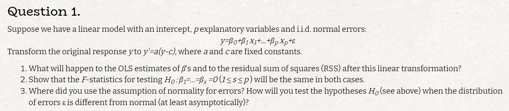
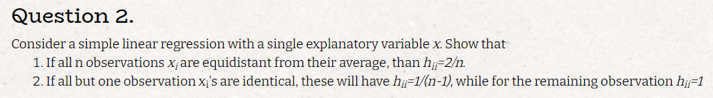
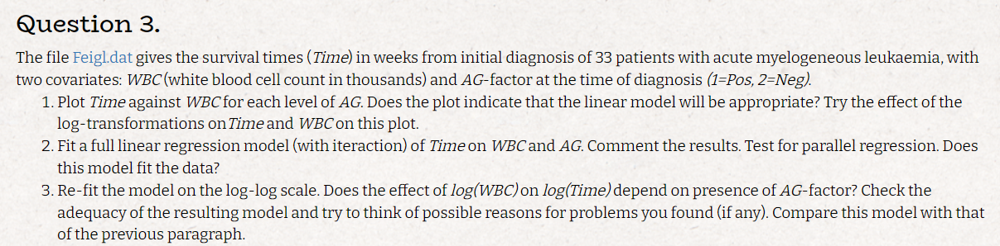
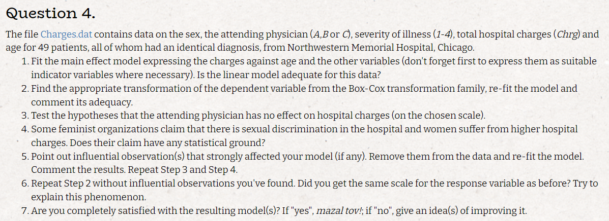

```{r setup, include=FALSE}
knitr::opts_chunk$set(echo = TRUE)
```

# Q.1



## a

$$
y' = a(y-c)\\
\hat\beta' = (X^tX)^{-1} X^ty' = (X^tX)^{-1} X^t(a(y-c)) = a\hat\beta - ac((X^tX)^{-1} X^t)
$$

## b

$$
\textrm{we saw in class that: } RSS = \varepsilon^t(I-H)\varepsilon \sim \sigma^2\chi_{n-p}^2\\
\textrm{and also: } \varepsilon^tH\varepsilon + \varepsilon^t(I-H)\varepsilon = \varepsilon^t\varepsilon \sim \chi_n^2\textrm { and both are independent} \\ 
H\varepsilon = X(\hat\beta'-\beta) \Rightarrow \varepsilon^tH\varepsilon = (\hat\beta'-\beta)^tX^tX(\hat\beta'-\beta) \sim \sigma^2\chi_p^2\\
\textrm{thus we get: }  \frac{(\hat\beta'-\beta)^tX^tX(\hat\beta'-\beta)}{\sigma^2p} / \frac{RSS}{\sigma^2(n-p)} =
\frac{(\hat\beta'-\beta)^tX^tX(\hat\beta'-\beta) }{RSS}\frac{n-p}{p} \sim\frac{\chi_{p}/p}{\chi_{n-p}/(n-p)} = F_{p,n-p}
$$

## c

i used the normality for the distribution of $\varepsilon^t(I-H)\varepsilon$ and $\varepsilon^tH\varepsilon$
if the errors are not distributed normally we can try and use a transformation as to make them normal and them use an F test


# Q.2



**1**

$$
y = ax +b +\varepsilon\\
x_i = x_j\quad \forall i,j\\
h_{ii} = \frac{1}{n} + \frac{(x_i - \bar{x})^2}{\sum_{i=1}^n(x_j-\bar{x})^2}\\
x_i-\bar{x} = d \Rightarrow h_{ii} = \frac{1}{n} + \frac{d^2}{nd^2} = \frac{2}{n}
$$

**2**

*w.l.o.g we can assume i = 1 is the different x*

$$
x_j = w \quad \forall j>1\\
\bar{x} = \frac{x_1}{n} + \frac{(n-1)}{n}w\\
x_1 -\bar{x} = x_1 -  \frac{x_1}{n} - \frac{(n-1)}{n}w = \frac{(n-1)(w-x_1)}{n}\\
x_j -\bar{x} = w -  \frac{x_1}{n} - \frac{(n-1)}{n}w = \frac{(w-x_1)}{n}\\
\sum_{j=1}^n(x_j -\bar{x})^2 = (x_1 -\bar{x})^2 + (n-1)(w -\bar{x})^2 = (\frac{(n-1)(w-x_1)}{n})^2 + (n-1)\frac{(w-x_1)^2}{n^2} = \frac{[(n-1)^2-(n-1)](w-x_1)^2}{n^2} = \frac{(n-1)(w-x_1)^2}{n}\\
h_{11} = \frac{1}{n} +  \frac{(x_1 -\bar{x})^2}{\sum_{j=1}^n(x_j -\bar{x})^2} = \frac{1}{n} + \frac{n-1}{n} = 1\\
h_{jj} = \frac{1}{n} +  \frac{(x_j -\bar{x})^2}{\sum_{k=1}^n(x_k -\bar{x})^2} = \frac{1}{n} + \frac{(\frac{(w-x_1)}{n})^2}{\frac{(n-1)(w-x_1)^2}{n}}  =\frac{1}{n} + \frac{1}{n(n-1)} = \frac{1}{n-1}
$$

# Q.3




## a

```{r message=TRUE, warning=TRUE, include=FALSE}
library(tidyverse)
library(glue)
library(patchwork)
library(MASS)
```


```{r}
tbl <- as_tibble(read.table("Feigl.dat"))
colnames(tbl) <- c("Time","WBC","AG")
tbl <- tbl %>%
  mutate(AG = as.factor(AG))
g_reg <- ggplot(tbl,aes(WBC,Time))+
  geom_point()+
  facet_wrap(tbl$AG)+
  ggtitle("Regular data")
g_log <- ggplot(tbl,aes(log(WBC),Time))+
  geom_point()+
  facet_wrap(tbl$AG)+
  ggtitle("logged WBC")
g_reg + g_log
```

## b

```{r}
model <- lm(Time~WBC + AG + WBC:AG,data = tbl)
summary(model)
```

we can see that at least one of the covariates is significant according to the pvalue,lets check the interaction with a nested model anova:

```{r}
model_wo_interaction <- lm(Time~WBC + AG,data = tbl)
anova(model_wo_interaction,model)
```

we can see that the interaction is significant therefore the lines are not parallel, but the low R squered suggests that the model does not fit the data well.

```{r}
pred = data.frame(Time_pred = predict(model,tbl))
ggplot(tbl,aes(WBC,Time))+
  geom_point()+
  facet_wrap(tbl$AG)+
  geom_smooth(method = "lm",formula = y~x,se = FALSE)+
  ggtitle("fitted lines data")
```

we can see from the plots that the line does not fit the data very well

## c

```{r}
log_tbl <- tbl %>%
  mutate(across(c(Time,WBC),log))
log_log_model <- lm(Time~WBC + AG + WBC:AG,data = log_tbl)
summary(log_log_model)
```

our pvalue is lower and out R squared is higher which suggestes that the model better fits the data, lets also see it visually

```{r}
log_pred = data.frame(Time_pred = predict(log_log_model,log_tbl))
ggplot(log_tbl,aes(WBC,Time))+
  geom_point()+
  facet_wrap(log_tbl$AG)+
  geom_smooth(method = "lm",formula = y~x,se = FALSE)+
  ggtitle("fitted log-log lines data")
```

fit looks better in both groups

```{r}
log_log_model_wo_interaction <- lm(Time~WBC + AG,data = log_tbl)
summary(log_log_model_wo_interaction)
anova(log_log_model_wo_interaction,log_log_model)
```

the interaction no longer matters, we would expect that the interaction relevence to the model will stay the same, it could be that the not so normal errors in the regular model will cause this problem, lets comapre the qqplots and see how the non interaction model fits all the data

```{r}
coef_log_log_wo_interaction = log_log_model_wo_interaction$coefficients
slope = coef_log_log_wo_interaction[2]
inter_a = coef_log_log_wo_interaction[1]
inter_b = inter_a + coef_log_log_wo_interaction[3]
g3 <- ggplot(log_tbl,aes(WBC,Time))+
  geom_point(aes(color = AG))+
  geom_abline(slope = slope,intercept = inter_a,color = "red")+
  geom_abline(slope = slope,intercept = inter_b,color = "blue")+
  ggtitle("log-log fitted lines without interaction")
  
g4 <- ggplot(tibble(res = model$residuals),aes(sample = res)) +
  stat_qq()+
  stat_qq_line()+
  ggtitle("reular model residual qq-plot")
g5 <- ggplot(tibble(res = log_log_model$residuals),aes(sample = res)) +
  stat_qq()+
  stat_qq_line()+
  ggtitle("log-log model residual qq-plot")
g3 + g4+g5
```


# Q.4



# a

```{r}
charges <- as_tibble(read.table("Charges.dat"))
colnames(charges) <- c("sex","physician","severity","Chrg","age")
charges <- charges %>%
  mutate(across(c(sex,physician,severity),as.factor))
lm_model <- lm(Chrg~.,data = charges)
summary(lm_model)
```

the R squared of 0.6779 suggests that the model fits the data ok but not good enough

# b

```{r}
boxcox(lm_model)
```

we can see that $\lambda = 0$ is at the interval so i will use the ln transformation

```{r}
log_model <- lm(log(Chrg)~.,data = charges)
summary(log_model)
```

we got R-squared:  0.8398 that's much better then out previous model

# c

```{r}
log_no_phys <- lm(log(Chrg)~.,data = dplyr::select(charges,-physician))
anova(log_no_phys,log_model)
```

we can reject the null at 95% confidence: thus conclude that physician has an effect on hospital charges 

# d

lets see if sex has an effect on hospital charges

```{r}
log_no_sex <- lm(log(Chrg)~.,data = dplyr::select(charges,-sex))
anova(log_no_sex,log_model)
```

we can not reject the null at 95% confidence: thus we can not conclude that sex effect hospital charges

# e

```{r}
par(mfrow = c(2,2))
plot(log_model)
influential <- c(3,37,47)
glue("influential observations based on plots are: " ,glue_collapse(influential,sep=", "))
re_charge <- charges[-influential,]
re_log_model <- lm(log(Chrg)~.,data = re_charge)
re_log_no_phys <- lm(log(Chrg)~.,data = dplyr::select(re_charge,-physician))
anova(re_log_no_phys,re_log_model)
re_log_no_sex <- lm(log(Chrg)~.,data = dplyr::select(re_charge,-sex))
anova(re_log_no_sex,re_log_model)
```

we can see that now we do not reject the null hypotheses for physician meaning it does not effect charges and we still don't reject the null for sex.

# f

```{r}
boxcox(lm(Chrg~.,data = re_charge))
```

the interval for $\lambda$ moved.
an explanation to this phenomenon can be that removing influential observations effects the likelihood function thus our $\lambda$ changes.

# g

```{r}
par(mfrow = c(2,2))
plot(re_log_model)
summary(re_log_model)
```

i think we can do better with the model, maybe try several lambdas in the interval and get a more suitable transformation (we can see that our log transformation could improve based on the qqplot) or maybe removing non significant covariants