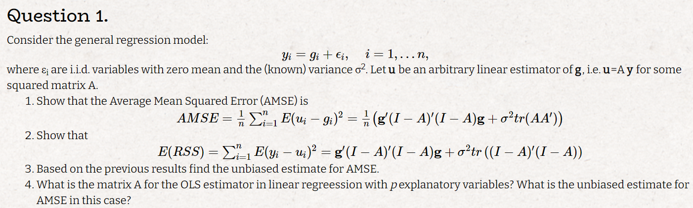
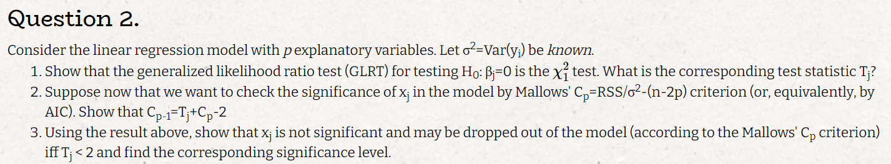
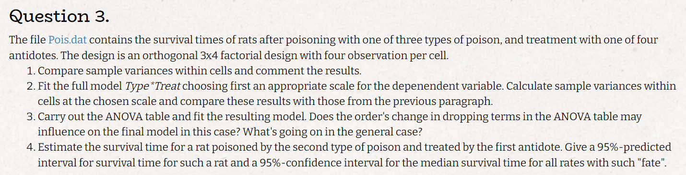
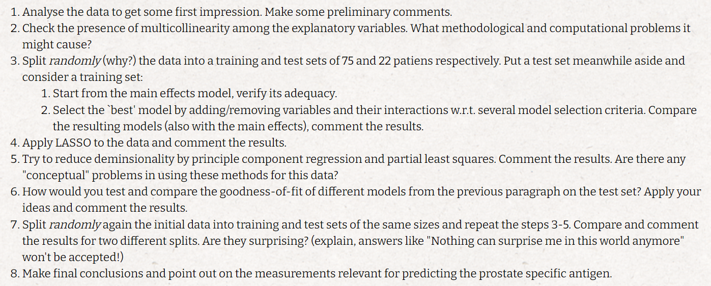

```{r setup, include=FALSE}
knitr::opts_chunk$set(echo = TRUE)
```

# Q.1



## a

$$
\textrm{it is sufficent to show:} (1) \sum_{i=1}^nE(u_i-g_i)^2 = g^t(I-A)^t(I-A)g + \sigma^2tr(AA^t)
\\
(2) E(u_i-g_i)^2 = V(u_i-g_i) + [E(u_i-g_i)]^2
\\
(3) V(u_i-g_i) = V(u_i) = V((Ay)_i) = V((A(g+\varepsilon))_i) = V((A\varepsilon)_i)= A_i^2\sigma^2
\\
(4) [E(u_i-g_i)]^2 = [E(A(g+\varepsilon)_i-g_i)]^2 = ((Ag)_i - g_i)^2 = ((A-I)g)_i^2
\\
\textrm{plug (3),(4) back to (1) and we get:} \sum_{i=1}^nE(u_i-g_i)^2 = g^t(I-A)^t(I-A)g + \sigma^2tr(AA^t)
$$

## b

$$
(5) \sum_{i=1}^nE(y_i-u_i)^2 = \sum_{i=1}^n V(y_i-u_i) + [E(y_i-u_i)]^2
\\
(6)\ V(y_i-u_i) = V[((I-A)y)_i] = \sigma^2 (I-A)_i^2
\\
(7) \ [E(y_i-u_i)]^2 = [E((I-A)y)_i]^2 = [E((I-A)(g+\varepsilon))_i]^2 = [((I-A)g)_i]^2
\\
\textrm{plug (7),(8) back to (5) and we get:} \sum_{i=1}^nE(y_i-u_i)^2 = g^t(I-A)^t(I-A)g + \sigma^2tr((I-A)^t(I-A))
\\
$$

## c

$$
\textrm{our only paramater is } \sigma^2 \textrm{ so in order to get an unbaised estimator for AMSE we can use } \hat\sigma^2
\\
\textrm{thus we get: } g^t(I-A)^t(I-A)g + \hat\sigma^2tr(AA^t) \textrm{ is an unbaised estimator for AMSE}
$$

## d

$$
\textrm{the matrix A for the OLS estimator in linear regreession is H therefor the unbiased estimate for AMSE is:}
\\
\hat{AMSE} = \frac{1}{n}[y(I-H)y + \hat\sigma^2p] = \frac{1}{n}[X^t\hat\beta^t(I-H)X\hat\beta +(n-p)\hat\sigma^2 + p\hat\sigma^2] = \\
= \frac{1}{n}[X^t\hat\beta^t(I-H)X\hat\beta +n\hat\sigma^2]
$$


# Q.2



## a

$$
(1)\ \lambda_{LR} = -2 (l(\beta_0) - l(\beta_{MLE})) = 2(l(\beta_{MLE}) - l(\beta_0))
\\
(2)\ ln(f_{\beta}(y)) = C_\sigma - \frac{1}{2\sigma^2}(y-X\beta)^t(y-X\beta) = C_\sigma - \frac{1}{2\sigma^2}RSS_\beta
\\
\textrm{plug (2) into (1) using: }\hat\beta_0, \hat\beta_{MLE} = \frac{RSS_{\hat\beta_{MLE}} - RSS_{\hat\beta_0}}{\sigma^2}  \sim \chi_1^2
\\
\textrm{the corresponding test statistic } T_j \textrm{ is: } \frac{RSS_{\hat\beta_{MLE}} - RSS_{\hat\beta_0}}{\sigma^2}
$$

## b

$$
(3)\ C_{p-1} - C_P = \frac{RSS_{p-1} - RSS_p}{\sigma^2} - (n-2p+2) + n-2p = \frac{RSS_{p-1} - RSS_p}{\sigma^2} - 2 = T_j-2
$$

## c

$$
T_j <2 \iff C_{p-1} - C_P >0 \iff \ x_j \textrm{ is not significant and may be dropped out of the model (according to the Mallows' Cp criterion)}
\\
\textrm{the corresponding significance level is }P(\chi^2_1 \ge2) \approx 0.05
$$

# Q.3



## a

```{r message=TRUE, warning=TRUE, include=FALSE}
library(tidyverse)
library(glue)
library(patchwork)
library(tidymodels)
library(glmnet)
library(pls)
```


```{r}
tbl <- as_tibble(read.table("Pois.dat",header = T))%>%
  mutate(across(c(Type,Treat),as.factor))
tbl %>%
  group_by(Type,Treat) %>%
  summarise(varinace_Time = var(Time)) %>%
  arrange(-varinace_Time)
```

*we can see a large difference in variance between types and that for each type treat 2 has the largest variance*

## b

```{r}
# chosing relevant transformation
g1 <- tbl %>%
  ggplot()+
  geom_density(aes(x = log(Time)))+
  ggtitle("density of ln(Time)")
g2 <- tbl %>%
  ggplot()+
  geom_qq(aes(sample = log(Time)))+
  geom_qq_line(aes(sample = log(Time)))+
  ggtitle("qqplot for ln(Time)")
g1 + g2
#model
logtbl <- tbl %>%
  mutate(across(Time,log)) %>%
  rename(log_Time = Time)

model <- lm(log_Time~ Type+Treat+Type*Treat,data = logtbl)

#in group var
logtbl %>%
  group_by(Type,Treat) %>%
  summarise(varinace_Time = var(log_Time)) %>%
  arrange(-varinace_Time)
```

*variance does not seem to have changed much*

## c

```{r}
anova(model)
res_model <-  lm(log_Time~ Type+Treat,data = logtbl)
anova(res_model,model)
```

*the resulting model indicates that the interaction does not contribute in predicting Time, in general each Treatment and each type have their own influence on survival time*

## d

```{r}
pred_tibl <- tibble(Type = 2, Treat = 1)%>% mutate(across(c(Type,Treat),factor))
pred_ci <- exp(predict.lm(res_model,pred_tibl,interval = "prediction"))
med_ci <- exp(predict.lm(res_model,pred_tibl,interval = "confidence"))
glue("the estimated survival time is: {round(pred_ci[1],3)}\n",
     "the prediction interval is: ({round(pred_ci[2],3)},{round(pred_ci[3],3)})\n",
     "the interval for median survival time is: ({round(med_ci[2],3)},{round(med_ci[3],3)})")
```

# Q.4




## a

```{r}
Prostate <- as_tibble(read.table("Prostate.dat",header = T)) %>% mutate(across(svi,factor))
g3 <- Prostate %>%
  ggplot()+
  geom_density(aes(x = lpsa))+
  ggtitle("density of lpsa")

g4 <- Prostate %>%
  ggplot()+
  geom_qq(aes(sample = lpsa))+
  geom_qq_line(aes(sample = lpsa))+
  ggtitle("qqplot for lpsa")
g3 + g4

Prostate %>%
  gather(-lpsa,-svi,key = "var", value = "value") %>% 
  ggplot(aes(x = value, y = lpsa, color = svi)) +
    geom_point() +
    facet_wrap(~ var, scales = "free") +
    theme_bw()
```

*we can see that lpsa is rather distributed normally*

*we can also see that svi would probably have a large influnce on the model given that svi =0 and svi =1 have different relationship with lpsa*

*lpsa~lcavol looks rather linear*

## b

```{r}
Prostate %>%
  select(-lpsa)%>%
  mutate(across(svi,as.numeric))%>%
  cor()
```

*in multicollinearity the coefficient estimates of the multiple regression may change erratically in response to small changes in the model or the data, if we have a full multicollinearity X is not of full rank and this* $X^T X$ *cannot be inverted*

*the highest correlation is between pgg45 and gleason with r = 0.75, which is high but seems ok*

## c

```{r}
set.seed(5)
split_obj <- Prostate%>%
  initial_split(prop = 74.5/97)
Prostate_tr <- training(split_obj)
Prostate_te <- testing(split_obj)
model_main <- lm(lpsa~.,data = Prostate_tr)
summary(model)
model_with_inter<- lm(lpsa~.+svi*lcavol+svi*lweight+svi * age + svi*lbph + svi*lcp+svi*gleason+svi*pgg45,data = Prostate_tr)
AIC <- stats::step(model_with_inter,direction  = "both",trace = 0)
BIC <- stats::step(model_with_inter,direction  = "both",trace = 0, k = log(75))
RIC <- stats::step(model_with_inter,direction  = "both",trace = 0, k = 2*log(15))
summary(AIC)
summary(BIC)
summary(RIC)
anova(BIC,AIC)
```

*we can see that both RIC and BIC lead to the same model*

*from the anova result we can conclude that AIC model is no better then BIC model*

## d

```{r}
lambda_cv <- cv.glmnet(model.matrix(model_with_inter),Prostate_tr$lpsa,alpha=1)$lambda.min
lasso_model <- glmnet(model.matrix(model_with_inter),Prostate_tr$lpsa,alpha=1,lambda = lambda_cv)
print(round(predict(lasso_model,s=lambda_cv,type="coefficients"),5))
```

*we can see that the lasso model is different from the AIC,BIC models, but the lcavol,lweight and svi are still importat, interactions have changed and we added lbph*

## e

```{r}
#pcr
pcr_model <- pcr(lpsa~.,data = Prostate_tr,scale=T,validation="CV")
summary(pcr_model)
validationplot(pcr_model, val.type = "R2")
#pls
pls_model <- plsr(lpsa~.,data = Prostate_tr,scale=T,validation="CV")
summary(pls_model)
validationplot(pls_model, val.type = "R2")
```

*a problem that might arise is that some of the features are correlated and multicollinearity might impar these models*

*we can see that for the pcr model 3 components are sufficent, adding more components does not incrase model preformance very much*

*for ths pls model 3 components reach the best R^2*

## f

*we can use the test set mse in order to compare the models*

```{r warning=FALSE}
models <- list(model_main,
model_with_inter,
AIC,
BIC,
RIC,
lasso_model,
pls_model,
pcr_model)
model_names <- c("model_main",
"model_with_inter",
"AIC",
"BIC",
"RIC",
"lasso_model",
"pls_model",
"pcr_model")
mse = c()
for (i in 1:length(models)){
  if (i <= 5){y_pred <- predict(models[[i]],Prostate_te)}
  if (i==6) {y_pred <- predict(models[[i]],model.matrix(lpsa~.+svi*lcavol+svi*lweight+svi * age + svi*lbph + svi*lcp+svi*gleason+svi*pgg45,Prostate_te))}
  if (i >6){y_pred <- predict(models[[i]],Prostate_te,ncomp = 3)}
  mse[i] <- mean((y_pred - Prostate_te$lpsa)^2)
}
tibble(model = model_names,"mse" = mse) %>% arrange(mse)
```

*we can see that our best choise would be the lasso model*

## g

```{r warning=FALSE}
set.seed(100)
split_obj <- Prostate%>%
  initial_split(prop = 74.5/97)
Prostate_tr <- training(split_obj)
Prostate_te <- testing(split_obj)
model_main <- lm(lpsa~.,data = Prostate_tr)
model_with_inter<- lm(lpsa~.+svi*lcavol+svi*lweight+svi * age + svi*lbph + svi*lcp+svi*gleason+svi*pgg45,data = Prostate_tr)
AIC <- stats::step(model_with_inter,direction  = "both",trace = 0)
BIC <- stats::step(model_with_inter,direction  = "both",trace = 0, k = log(75))
RIC <- stats::step(model_with_inter,direction  = "both",trace = 0, k = 2*log(15))
lambda_cv <- cv.glmnet(model.matrix(model_with_inter),Prostate_tr$lpsa,alpha=1)$lambda.min
lasso_model <- glmnet(model.matrix(model_with_inter),Prostate_tr$lpsa,alpha=1,lambda = lambda_cv)
#pcr
pcr_model <- pcr(lpsa~.,data = Prostate_tr,scale=T,validation="CV")
summary(pcr_model)
validationplot(pcr_model, val.type = "R2")
#pls
pls_model <- plsr(lpsa~.,data = Prostate_tr,scale=T,validation="CV")
summary(pls_model)
validationplot(pls_model, val.type = "R2")

mse_2 = c()
for (i in 1:length(models)){
  if (i <= 5){y_pred <- predict(models[[i]],Prostate_te)}
  if (i==6) {y_pred <- predict(models[[i]],model.matrix(lpsa~.+svi*lcavol+svi*lweight+svi * age + svi*lbph + svi*lcp+svi*gleason+svi*pgg45,Prostate_te))}
  if (i >6){y_pred <- predict(models[[i]],Prostate_te,ncomp = 3)}
  mse_2[i] <- mean((y_pred - Prostate_te$lpsa)^2)
}
tibble(model = model_names,"mse 1st split" = mse,"mse 2nd split" = mse_2) %>% arrange(mse)
```

*We can see a difference in all of the models and even in best model (mse wise)*

*this is not surprising as Nothing can surprise me in this world anymore!*

*but seriously it is not surprising because different training set result in different models, and different testing sets results in different mse assessment, the test mse is an estimation to the expected error, but this estimation has a variance and it is not a constant* 

## h

*our 2 main relevant measurements are lcavol and lweight, as they are a part of every model and has a rather large coefficients. also svi looks important and its interaction with these 2 predictors*

