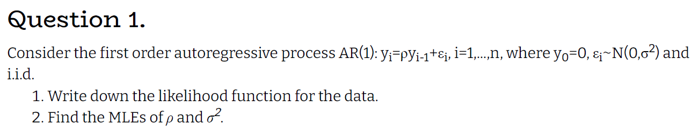
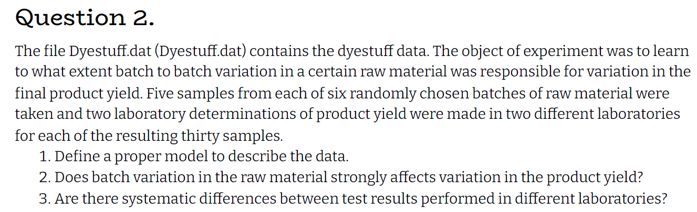
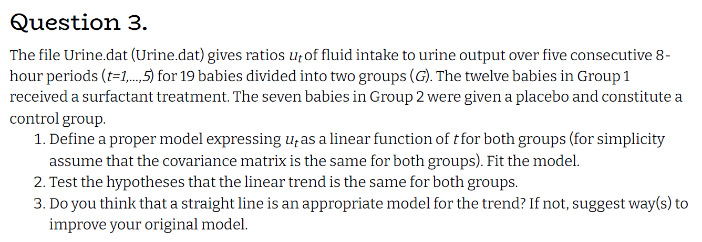

```{r setup, include=FALSE}
knitr::opts_chunk$set(echo = TRUE)
```

```{r message=FALSE, warning=FALSE}
# imports
library(tidyverse)
library(glue)
library(nlme)
```

# Q1



$$
y_i|y_{i-1} \sim N(\rho y_{i-1},\sigma^2) \textrm{ as a sum of normal variables}
\\
f(y_i|y_{i-1}) = \frac{1}{\sqrt{2\pi \sigma^2}}e^{-\frac{(y_i-\rho y_{i-1})^2}{2\sigma^2}}
\\
L(\rho,\sigma^2) = f(y_1,\ldots,y_n) = f(y_n|y_{n-1},\ldots,y_0)f(y_{n-1},\ldots,y_0) = \ldots = \Pi_{i=1}^nf(y_i|y_{i-1},\ldots y_0)f(y_0) = \Pi_{i=1}^nf(y_i|y_{i-1},\ldots,y_0) 
\\
\textrm{notice that: } f(y_i|y_{i-1},\ldots,y_0) = f(y_i|y_{i-1}) \textrm{ thus we get:}
\\
L(\rho,\sigma^2) = \Pi_{i=1}^nf(y_i|y_{i-1}) = \Pi_{i=1}^n \frac{1}{\sqrt{2\pi \sigma^2}}e^{-\frac{(y_i-\rho y_{i-1})^2}{2\sigma^2}}
\\
l(\rho,\sigma^2) = Log(L(\rho,\sigma^2)) = \sum_{i=1}^n ln(\frac{1}{\sqrt{2\pi \sigma^2}}e^{-\frac{(y_i-\rho y_{i-1})^2}{2\sigma^2}}) = 
C + n ln(\sigma)-\sum_{i=1}^n(\frac{(y_i-\rho y_{i-1})^2}{2\sigma^2})
\\
\frac{\partial l}{\partial \rho} = \frac{1}{2\sigma^2}\sum_{i=1}^n 2 y_iy_{i-1}-2\rho y_{i-1}^2 := 0 \Rightarrow \hat \rho_{MLE} = \frac{\sum_{i=1}^n y_iy_{i-1}}{\sum_{i=1}^ny_{i-1}^2}
\\
\frac{\partial l}{\partial \sigma} = \frac{n}{\sigma} - \sum_{i=1}^n\frac{(y_i-\rho y_{i-1})^2}{\sigma^3} = \frac{n \sigma^2 - \sum_{i=1}^n(\varepsilon_i^2)}{\sigma^3} :=0 \Rightarrow \hat\sigma^2_{MLE} = \frac{\sum_{i=1}^n(\hat \varepsilon_i^2)}{n} ; \hat \varepsilon_i = y_i - \hat \rho_{MLE}y_{i-1}
$$


# Q2



$$
\textrm{lets define a LMM:}
\\
Y = \textrm{vector of product yield}
\\
X_1 = \underline 1
\\
X_2 = \textrm{vector of lab number}
\\
Z = \textrm{vector of batch number}
\\
Y_i | \gamma = X\beta + Z\gamma + \varepsilon \ ; \ \varepsilon\sim N(0,\sigma_\varepsilon^2I),\ \gamma \sim N(0,\sigma_\gamma^2)
\\
\textrm {thus: } Y \sim N(X\beta,\Sigma) ; \Sigma = diag(V) ; V_{ij} =
\begin{cases}
\sigma_\varepsilon^2 + \sigma_\gamma^2\, ,& i = j \\
\sigma_\gamma^2 \, ,& i \ne j
\end{cases}
$$


```{r}
dyestuff <- as_tibble(read.table("Dyestuff.dat",header = T)) %>%
  mutate(across(c(batch,laboratory),factor))
model_dye <- lme(yield~laboratory,random =~ 1|batch,data = dyestuff, method = "ML")
summary(model_dye)
```

*we can see that batch variation has a strong affect on product yield due to the fact that ~ 1/2 of the variance can be explained by batch variation*

*we can also see that laboratory 2 has (in average) 9 less product yield but it is not significant so we can't conclude that there is a difference*


# Q3



$$
\textrm{lets define a LMM:}
\\
\mu_t(i) = \textrm{fluid intake to urine output for baby i at time t}
\\
X_1 = \underline 1
\\
X_2 = \textrm{vector of group number}
\\
X_3 = \textrm{vector of times}
\\
Z_1 = \textrm{vector of baby ID}
\\
Z_2 = \textrm{vector of times}
\\
\mu_t(i) | \gamma = X\beta + Z\gamma + \varepsilon \ ; \ \varepsilon\sim N(0,\sigma_\varepsilon^2I),\ \gamma \sim N(0,D)
\\
\mu_t(i)\sim N(X\beta,ZDZ^t+\sigma_\varepsilon^2I)
$$


```{r}
urine <- as_tibble(read.table("Urine.dat",header = T)) %>%
  mutate(across(G,factor))
urine_model_mat <- tibble("G"=rep(urine$G,5),
                          "baby" = factor(rep(1:19,5)),
                          "urine_time" = c(rep(1,19),rep(2,19),rep(3,19),rep(4,19),rep(5,19)),
                          "mu_t" = c(urine$u_1,urine$u_2,urine$u_3,urine$u_4,urine$u_5))%>%
  arrange(baby)
urine_model <- lme(mu_t ~ G + urine_time ,random =~ urine_time|baby ,data = urine_model_mat, method = "ML")
summary(urine_model)
```

$$
\textrm{the linear model is the same for both groups if } \beta_1 = 0 \textrm{ in the summary we can see that }
\\
\beta_1 \textrm{ has a pvalue of 0.9256 thus not significant meaning that the linear trend is the same for both groups}
$$

```{r}
urine_model_mat %>%
  ggplot(aes(x = urine_time, y = mu_t))+
  geom_point()+
  facet_wrap(urine_model_mat$baby)+
  geom_smooth(method='lm',formula = y~poly(x,2),se = F,aes(color = "poly"),lty =2)+
  geom_smooth(method='lm',se = F,aes(color = "linear"),lty =2)+
  labs(x = "time",
       y = "mu(t)",
       color = "Legend")+
  scale_color_manual(values = c("poly" = "red","linear" = "blue"))
```

$$
\textrm{we can see that while most babies does have a linear relation, some babies have a more cubic relation so adding } time^2 \textrm{ may improve our results}
$$
