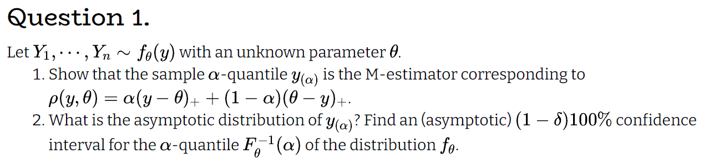
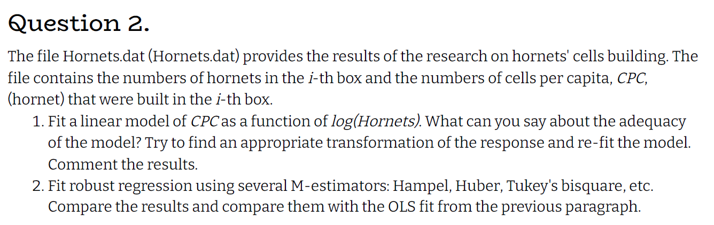
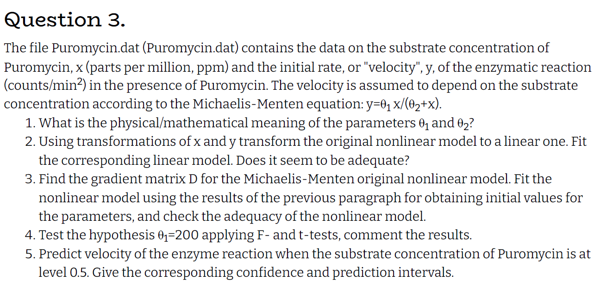

```{r setup, include=FALSE}
knitr::opts_chunk$set(echo = TRUE)
```

```{r message=FALSE, warning=FALSE}
#imports
library(tidyverse)
library(MASS)
library(tidymodels)
library(glue)
```


# Q1



## 1

$$
\textrm{we are looking for a } \hat{\theta} = argmin_\theta \sum_{i=1}^n \rho(y_i,\theta)
\\
\textrm{denote } n_- =\sum_{i=1}^n I(y_i<\theta),\quad  n_+ = n-n_-
\\
\sum_{i=1}^n \rho(y,\theta) = n_+ \alpha+ (1-\alpha) n_-
\\
\psi(y,\theta) = \begin{cases}
-1 ,& y>\theta \\
0 ,& y=\theta  \\
1 ,& y<\theta 
\end{cases}
\\
\frac{\partial \sum_{i=1}^n \rho(y,\theta)}{\partial \theta} = -n_+\alpha + n_-(1-\alpha)
\\
\textrm{if } \theta = \hat{\theta_{(\alpha)}} = y_{(\alpha)}:
\\
n_+ = n(1-\alpha) , \quad n_- = n\alpha \Rightarrow \frac{\partial \sum_{i=1}^n \rho(y,\theta)}{\partial \theta} = - n(1-\alpha)\alpha + (1-\alpha)n\alpha  = 0 \Rightarrow \hat{\theta_{(\alpha)}} = argmin_\theta \sum_{i=1}^n \rho(y_i,\theta)
\\
\textrm{notice that this is indeed a minimum point as the function is not bound from above w.l.o.g difine } \alpha > 0.5
\\
\textrm{we can alwyas decreace }  \theta \textrm{ and get a higher value for the function }  \rho
$$

## 2

$$
\textrm{under regulatory conditions we saw in class that: } \hat{\theta} \dot \sim N(\theta^*,V^2)
\\
\textrm{denote }  p = P(y<\theta)
\\
\theta^* = argmin(E(\rho(y,\theta))) = y_{(\alpha)}
\\
E_{\theta_0} (\psi(y,y_{(\alpha)})^2 = E(1) = 1
\\
E_{\theta_0} \psi'(y,y_{(\alpha)}) = (E_{\theta_0} \psi(y,y_{(\alpha)}))' = (\int_{- \infty} ^ \theta f_{\theta_0}(y)dy - \int_\theta ^ {\infty} f_{\theta_0}(y)dy)' = (2F(\theta^*) -1 )' = 2f_{\theta_0}(y_{(\alpha)})
\\
\textrm{thus we get: }
\hat{\theta} \dot \sim N(y_{(\alpha)},\frac{1}{4nf_{\theta_0}(y_{(\alpha)})^2} )
$$

# Q2



## 1

```{r}
horn <- read.table("Hornets.dat",header = T)
horn %>%
  ggplot(aes(x = log(hornets),y = cpc)) +
  geom_point()+
  geom_smooth(se = F,method = lm)

mod_1 <- lm(cpc~ log(hornets),data =horn)
plot(mod_1)
boxcox(cpc~ log(hornets),data =horn)

horn %>%
  ggplot(aes(x = log(hornets),y = cpc^0.25)) +
  geom_point()+
  geom_smooth(se = F,method = lm)

mod_2 <- lm(cpc^0.25~ log(hornets),data =horn)
plot(mod_2)
```

*from the residuals of model 1 we can see that the linear model tested does not adequately fit, after applying a ^0.25 transformation to CPC we can see a better fit.*

*also it looks like the variance is not equal for all x values.*

## 2

```{r}
hampel <- rlm(cpc^0.25~ log(hornets),data =horn,psi = psi.hampel)
huber <- rlm(cpc^0.25~ log(hornets),data =horn,psi = psi.huber)
tukey <- rlm(cpc^0.25~ log(hornets),data =horn,psi = psi.bisquare)
plot(hampel)
plot(huber)
plot(tukey)
tibble("humple" = tidy(hampel)$estimate,
       "huber" = tidy(huber)$estimate,
       "tukey" = tidy(tukey)$estimate,
       "mod_2" = tidy(mod_2)$estimate)
```

*all robust models look rather the same, the estimates are the same, and the plots are similar*

# Q3




## 1

$$
\theta_1 \textrm{ is the maxsimum achivable velocity}
\\
\theta_2 \textrm{ is a decaying paramater probabbly connected to the substrate concentration}
$$


## 2

$$
\frac{1}{y} = \frac{\theta_2}{\theta_1} \frac{1}{x} + \frac{1}{\theta_1} 
$$


```{r}
puro <- read.table("Puromycin.dat")
#calc prediction
y_hat <- function(x,theta1,theta2){
  return(theta1*x/(x+theta2))
}

nls_mod <- nls(1/V2 ~ t2/t1 * 1/V1 + 1/t1,data = puro)
summary(nls_mod)
theta <- tidy(nls_mod) %>% pluck("estimate")
theta2 = theta[1]
theta1 = theta[2]
plot(nls_mod)

puro %>%
  ggplot(aes(x = 1/V1,y = 1/V2)) +
  geom_point()+
  geom_abline(slope = theta2/theta1,intercept = 1/theta1)+
  ggtitle("Linear model")

x_range <- seq(0,1.2,0.01)
y_pred <- y_hat(x_range,theta1,theta2)

puro %>%
  ggplot(aes(x = V1,y = V2)) +
  geom_point()+
  geom_smooth(aes(x = x_range, y = y_pred),data = tibble("x_range" = x_range,"y_pred" = y_pred),se = F)+
  ggtitle("Non-Linear model")


```

*looks like the model is a very good fit to the linear model, but when we convert back to the nonlinear model we can see that the fit is not as good*


## 3

$$
\frac{\partial y}{\partial\theta_1} = \frac{x}{\theta_2+x}
\\
\frac{\partial y}{\partial\theta_2} = -\frac{\theta_1x}{(\theta_2+x)^2}
\\
D = \begin{bmatrix}
     \frac{x_1}{\theta_2+x_1} & -\frac{\theta_1x_1}{(\theta_2+x_1)^2}  
     \\ \vdots & \vdots \\
     \frac{x_n}{\theta_2+x_n} & -\frac{\theta_1x_n}{(\theta_2+x_n)^2}
  \end{bmatrix}
$$

```{r}
#calc gradient matrix
grad <- function(x,theta1,theta2){
  c1 <- x/(x+theta2)
  c2 <- - theta1*x/((x+theta2)^2)
  D <- cbind(c1,c2)
  return(D)
}
#init values
x <- puro$V1
y <- puro$V2

epsilon <- 0.001
cont <- T
while (cont){
  theta1_l <- theta1
  theta2_l <- theta2

  D <- grad(x,theta1_l,theta2_l)
  e <- y - y_hat(x,theta1_l,theta2_l)
  theta <- as.numeric(solve(t(D)%*%D)%*%t(D)%*%e) + c(theta1_l,theta2_l)
  theta1 <- theta[1]
  theta2 <- theta[2]
  
  cont <- sum((theta - c(theta1_l,theta2_l))^2) > epsilon
}

#does it fit?
x_range <- seq(0,1.2,0.01)
y_pred <- y_hat(x_range,theta1,theta2)
puro %>%
  ggplot(aes(x = V1,y = V2)) +
  geom_point()+
  geom_smooth(aes(x = x_range, y = y_pred),data = tibble("x_range" = x_range,"y_pred" = y_pred),se = F)
```

*the model fits the data nicly, better than the last model fit the data*

## 4

$$
\hat \theta \sim N(\theta,\sigma^2 (D^tD)^{-1})
$$

```{r}
rss <- mean((y-y_hat(x,theta1,theta2))^2)
sigma_hat <- sqrt(rss)
D <- grad(x,theta1,theta2)
beta_sd_hat <- sigma_hat * sqrt(solve(t(D)%*%D)[1,1])
t_stat <- (theta1-200)/beta_sd_hat
rss_200 <- mean((y-y_hat(x,200,theta2))^2)
delta_rss <- rss_200 - rss
f_stat <- delta_rss/(rss_200/(nrow(puro)-1))
glue("t-statisitc is : {round(t_stat,4)}, pvalue is {round((1-pt(t_stat,nrow(puro)))/2,3)}
     F-statisitc is : {round(f_stat,4)}, pvalue is {round((1-pf(f_stat,1,nrow(puro)-1))/2,3)}")

```

$$
\textrm{in both tests we can reject } H_0 \textrm{ and conclude at a confidance level of 5% that } \theta_1 \ne 200
$$


## 5

```{r}
v_pred <- y_hat(0.5,theta1,theta2)
ci <- v_pred + c(-1,1)*qnorm(0.975)*beta_sd_hat
pi <- v_pred + c(-1,1)*qnorm(0.975)*sigma_hat*sqrt(as.numeric( grad(0.5,theta1,theta2) %*% solve(t(D)%*%D) %*% t(grad(0.5,theta1,theta2))))
glue("expected velocity for concentration of 0.5 is: {round(v_pred,3)}
     ci is: ({round(ci[1],4)},{round(ci[2],4)})
     pi is: ({round(pi[1],4)},{round(pi[2],4)})")
```


