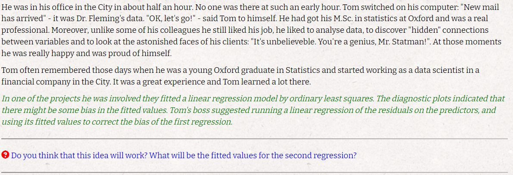

```{r setup, include=FALSE}
knitr::opts_chunk$set(echo = TRUE)
```

# Q1


### I

$$
Y_{ij} \sim N(\beta^tx_i,\sigma^2) \Rightarrow \bar{Y_i} \sim(\beta^tx_i,\frac{\sigma^2}{m}) \textrm{ as a sum of normal distributions}
\\
\textrm{Define } Z^t = (\bar{Y_1},\bar{Y_2},\ldots,\bar{Y_n}) ;\bar{Y_i},\bar{Y_j} \textrm{ are i.i.d } \forall i\ne j
\\
\textrm{thus: } Z \sim N(X\beta,\frac{\sigma^2}{m}I)
\\
\textrm{the MLE for this case is:}
\\
\boxed{\hat{\beta}_{MLE} = (X^tX)^{-1}X^t}
\\
\hat{\frac{\sigma^2_{MLE}}{m}} = \frac{RSS}{n} \Rightarrow \boxed{\hat\sigma^2_{MLE} = \frac{m}{n}RSS }
\\
\textrm{where } RSS = (Z-X\hat{\beta}_{MLE})^t(Z-X\hat{\beta}_{MLE})
$$

### II

$$
E(\hat{\beta}_{MLE}) = E((X^tX)^{-1}X^tZ) = (X^tX)^{-1}X^tE(Z) = (X^tX)^{-1}X^tX\beta = \beta \Rightarrow \boxed{\hat{\beta}_{MLE} \textrm{ is unbiased}}
\\
\textrm {we know that } \frac{mRSS}{\sigma^2} \sim \chi^2_{n-p} \Rightarrow E(RSS) = \frac{(n-p)\sigma^2}{m}
\\
E(\hat{\sigma^2}_{MLE}) = \frac{m}{n}E(RSS) = \frac{m}{n}E(RSS) = \frac{(n-p)\sigma^2}{n} \Rightarrow \boxed{\hat{\sigma^2}_{MLE} \textrm{ is biased}}
\\
\textrm{thus if we take } \boxed{\hat{S^2} = \frac{m}{n-p}RSS} \textrm{ we get an unbiased estimator}
\\
E(\hat{S}^2) = \frac{m}{n-p}E(RSS) = \frac{(n-p)\sigma^2}{n-p} = \sigma^2
$$

### III

$$
\textrm{we calculated the expected value of } \hat{\beta} \textrm{ lets calculate the variance,}
\\
\textrm{keep in mind that it distribute normally as a linear transofrmation of a normal variable}
\\
V(\hat{\beta}) = V((X^tX)^{-1}X^tZ) = (X^tX)^{-1}X^tV(Z)X(X^tX)^{-1} = V(Z)(X^tX)^{-1}
\\
\hat{\beta} \sim N(\beta,\frac{\sigma^2}{m}(X^tX)^{-1})
\\
\textrm{therefore an exact } 100(1-\alpha) \textrm {% confidence interval is:}
\\
\boxed{(\hat{\beta}- Z_{1-\frac{\alpha}{2}}\sqrt{\frac{\sigma^2}{m}(X^tX)^{-1}},\hat{\beta} + Z_{1-\frac{\alpha}{2}}\sqrt{\frac{\sigma^2}{m}(X^tX)^{-1}})}
\\
\textrm{for a bonferroni adjustment all we need to do is divide } \alpha \textrm{ by p and derive the following: }
\\
\boxed{(\hat{\beta}- Z_{1-\frac{\alpha}{2p}}\sqrt{\frac{\sigma^2}{m}(X^tX)^{-1}},\hat{\beta} + Z_{1-\frac{\alpha}{2p}}\sqrt{\frac{\sigma^2}{m}(X^tX)^{-1}})}
$$

# Q2


### I.1

$$
\\
\textrm{before we start a couple notations: }
\\
diag(w) := \textrm{a diagonal matrix with w on its diagonal}
\\
w_{a\times b} := \textrm{ a matrix in } \mathbb{R}^{a\times b} \textrm{that all its values are w}
\\
\boxed{A = (I_m,0_{m\times p-m})}
\\
\boxed{C = \underline 0 \in \mathbb R^{m}}
\\
A\beta = (\beta_1,\ldots,\beta_m)^t = \underline 0
$$

### I.2

$$
\textrm{Define: }
\\
1^t = (1,\ldots,1) \in \mathbb R^{m-1}
\\
D = diag(-1)\in \mathbb R^{{m-1}\times{m-1}}
\\
\boxed{A = (\underline 1,D,0_{m\times p-m})\in \mathbb R^{{m-1}\times{p}}}
\\
\boxed{C = \underline 0 \in \mathbb R^{m}}
\\
A\beta = C \Rightarrow(A\beta)_{i} = \beta_1 - \beta_{i+1} = 0 \Rightarrow \beta_1 = \beta_{i+1} \ \forall \ 0<i<m \Rightarrow \beta_1 = \ldots = \beta_m
\\
$$

### I.3

$$
\boxed{A = (0,1,0,\ldots,0)}
\\
\boxed{C = 6}
\\
A\beta = C \Rightarrow \beta_2 = 6
$$

### I.4

$$
\boxed{A = \begin{bmatrix}
    1 & 0 & \ldots &\ldots &\ldots &\ldots & 0
    \\ 0 & -3 & 1 & 0  & \ldots & \ldots & 0
    \\ 0 & 0 & 1 & -1 & -2 & \ldots & 0
  \end{bmatrix}}
\\
\boxed{C = (7,-4,0)^t}
\\
A\beta = (\beta_1,-3\beta_2 + \beta_3,\beta_3-\beta_4-2\beta_5)^t = C \Rightarrow 
\\
\beta_1 = 7
\\
-3\beta_2 + \beta_3 = -4 \Rightarrow \beta_3 =3\beta_2 -4
\\
\beta_3 -\beta_4-2\beta_5 = 0 \Rightarrow 2\beta_5 = \beta_3 -\beta_4
$$


### II

$$
\textrm{in OLS we have the following optimization problem: }
\\
\textrm{minimize } f:= (Y-X\beta)^t(Y-X\beta)
\\
s.t \ A\beta =C
\\
\textrm {denote the argmin of this optimization problem as }  \beta^c
\\
\textrm{with lagrange multipliers we get the equivalent problem of: }
\\
\textrm{minimize } f:= (Y-X\beta)^t(Y-X\beta) - \lambda (A\beta -C)
\\
\frac{\partial f}{\partial \beta} = 2 X^tX\beta -3X^tY -2 A^t \lambda^t := 0 \Rightarrow \hat{\beta^c} = (X^tX)^{-1}(X^tY+A^t\lambda^t)
\\
A\beta = C \Rightarrow A(X^tX)^{-1}X^tY+A(X^tX)^{-1}A^t\lambda^t=C \Rightarrow A(X^tX)^{-1}A^t\lambda^t = C-A\hat{\beta_{OLS}}
\\
\textrm{thus we get: }
\\
\lambda^t = A(X^tX)^{-1}A^t)^{-1}(C-A\hat{\beta_{OLS}})
\\
\textrm{plug it back in and we get:}
\\
\boxed{\hat{\beta^c} = (X^tX)^{-1}(X^tY+A^t(A(X^tX)^{-1}A^t)^{-1}(C-A\hat{\beta_{OLS}}))) = \hat{\beta_{OLS}} + (X^tX)^{-1}A^t(A(X^tX)^{-1}A^t)^{-1}(C-A\hat{\beta_{OLS}})}
$$

### III

$$
\textrm{under } H_0:
\\
E(A\hat{\beta}_{OLS}) = A\beta = C
\\
V(A\hat{\beta}_{OLS}) = AV(\hat{\beta}_{OLS})A^t = A(X^tX)^{-1}A^t\sigma^2
\\
\textrm{we know that } \hat{\beta}_{OLS} \sim N(\beta,(X^tX)^{-1}\sigma^2)
\\
\textrm{thus } A\hat{\beta}_{OLS} \sim_{H_0} N(C,A(X^tX)^{-1}A^t\sigma^2) \textrm{ as a linear transformation of a normal random variable}
\\
\textrm{also we know that: } (A\hat{\beta}_{OLS}- C)^t(A(X^tX)^{-1}A^t\sigma^2)^{-1}(A\hat{\beta}_{OLS}- C)  \sim_{H_0} \chi^2_p
\\
\textrm{and also we know that: } \frac{RSS}{\sigma^2} \sim \chi^2_{n-p}
\\
\textrm{thus we can derive the following F-test:}
\\
\frac{(A\hat{\beta}_{OLS}- C)^t(A(X^tX)^{-1}A^t\sigma^2)^{-1}(A\hat{\beta}_{OLS}- C) }{\frac{RSS}{\sigma^2}}\frac{n-p}{p} = \boxed{\frac{(A\hat{\beta}_{OLS}- C)^t(A(X^tX)^{-1}A^t)^{-1}(A\hat{\beta}_{OLS}- C) }{RSS}\frac{n-p}{p} \sim F_{p,n-p}}
$$

# Q3


### I

$$
MSE(\hat{\beta}^tx_0,\beta^tx_0) = V(\hat{\beta}^tx_0) + Bias^2(\hat{\beta}^tx_0,\beta^tx_0)
\\
V(\hat{\beta}^tx_0) = x_0^tV(\hat{\beta}^t)x_0 = \sigma^2x_0^t(X^tX)^{-1}x_0
\\
E(\hat{\beta}^tx_0) = E(\hat{\beta}^t)x_0 = \beta^tx_0 \Rightarrow Bias^2(\hat{\beta}^tx_0,\beta^tx_0) = 0
\\
\textrm{to conclude we get: } \boxed{MSE(\hat{\beta}^tx_0,\beta^tx_0) = V(\hat{\beta}^tx_0) = \sigma^2x_0^t(X^tX)^{-1}x_0}
$$

### II

$$
\\
\textrm{let } \tilde{\beta} \textrm{ be an unbiased linear estimator of } \beta
\\
\textrm{thus we can write: } \tilde{\beta} = Ay
\\
\textrm{there exsits a matrix C such that: }A = (X^tX)^{-1}X^t + C
\\
V(\tilde{\beta}) = ((X^tX)^{-1}X^t + C) V(y)((X^tX)^{-1}X^t + C)^t = \sigma^2 ((X^tX)^{-1}X^t + C)(X(X^tX)^{-1} + C^t) = 
\\
=\sigma^2((X^tX)^{-1}X^tX(X^tX)^{-1} + (X^tX)^{-1}X^tC^t + CX(X^tX)^{-1} + CC^t) = 
V(\hat{\beta}_{OLS}) +(X^tX)^{-1}X^tC^t\sigma^2 + CX(X^tX)^{-1}\sigma^2 + CC^t\sigma^2
\\
\beta = E(\tilde{\beta}) = ((X^tX)^{-1}X^t + C)X\beta \Rightarrow CX = 0
\\
\textrm{plug it bak in and we get: }V(\tilde{\beta}) = V(\hat{\beta}_{OLS}) + CC^t\sigma^2
\\
\boxed{V(\tilde{\beta}^tx_0) = x_0^t V(\tilde{\beta}) x_0 = x_0^t (V(\hat{\beta}_{OLS}) + CC^t) x_0 = V(\hat{\beta}^t_{OLS}x_0) +\sigma^2x_0^tCC^tx_0 \ge V(\hat{\beta}^t_{OLS}x_0)}
\\
*x^tCC^tx \ge 0 \ \forall x
$$

### III

$$
\textrm{with the assumption we can get the C-R lower bound for the MSE}
\\
I(\beta,\sigma^2) = \begin{bmatrix}
    \frac{X^tX}{\sigma^2} & 0
    \\ 0 &  \frac{2n}{\sigma^2}
  \end{bmatrix}
\\
\textrm{define } g(\beta) = \beta^tx_0 \textrm{ thus } \hat{\beta}_{OLS}^tx_0 \textrm{ is an unbiased estimator for } g(\beta)
\\
\boxed{C-R \ bound = \frac{g'(\beta)^2}{I(\beta,\sigma^2)}=x_0^t (X^tX)^{-1}\sigma^2  x_0 = V(\hat{\beta}^t_{OLS}x_0)}
$$

# Q4


### I.1

$$
Y_{ij} \sim N(\mu + \alpha_j,\sigma^2) \textrm{ as a linear transformation of a normal random variable}
\\
L(Y,\sigma^2,\alpha,\mu) = \left( \frac{1}{\sqrt{2 \pi \sigma^2}} \right)^{nm}e^-{\frac{\sum_{i=1}^n\sum_{j=1}^m(Y_{ij}-\mu-\alpha_j)^2}{2\sigma^2}}
\\
l(Y,\sigma^2,\alpha,\mu) = C - \frac{mn}{2}ln(\sigma^2) -{\frac{\sum_{i=1}^n\sum_{j=1}^m(Y_{ij}-\mu-\alpha_j)^2}{2\sigma^2}}
\\
\frac{\partial l}{\partial \mu} = -2{\frac{\sum_{i=1}^n\sum_{j=1}^m(Y_{ij}-\mu-\alpha_j)}{2\sigma^2}} = 0 \iff \sum_{i=1}^n\sum_{j=1}^m(Y_{ij}-\mu-\alpha_j) = 0
\\
\textrm{keep in mind that: } \sum_{j=1}^m\alpha_j = 0 \textrm{ so we get:}
\\
\sum_{i=1}^n\sum_{j=1}^m(Y_{ij}-\mu-\alpha_j) = nm\bar{Y} - nm\mu - 0 \Rightarrow \boxed{\hat{\mu} = \bar{Y}}
\\
\frac{\partial l}{\partial \alpha_j}= -2\frac{\sum_{i=1}^n(Y_{ij}-\mu-\alpha_j)}{2\sigma^2}= 0 \iff \sum_{i=1}^n(Y_{ij}-\mu-\alpha_j) =0 \iff n\alpha_j = n\mu - n\bar{Y_{.j}} \Rightarrow \hat{\alpha_j} = \bar{Y} - \bar{Y_{.j}}
\\
\frac{\partial l}{\partial \sigma^2} = \frac{mn}{\sigma} - {\frac{\sum_{i=1}^n\sum_{j=1}^m(Y_{ij}-\mu-\alpha_j)^2}{\sigma^3}} = 0 \iff \sigma^2mn = \sum_{i=1}^n\sum_{j=1}^m(Y_{ij}-\mu-\alpha_j)^2 \Rightarrow
\\
\boxed{\hat{\sigma^2} = \frac{\sum_{i=1}^n\sum_{j=1}^m(Y_{ij}-\hat\mu-\hat\alpha_j)^2}{mn} =  \frac{\sum_{i=1}^n\sum_{j=1}^m(Y_{ij}-\bar{Y_{.j}})^2}{mn}}
$$


### I.2

$$
H_0: \alpha_1 = \ldots = \alpha_m = 0
\\
H_1: \exists \ \alpha_i \ne 0
\\
\textrm{lets derive a GLRT text}
\\
L_0 = \left( \frac{1}{\sqrt{2 \pi \sigma^2}} \right)^{nm}e^-{\frac{\sum_{i=1}^n\sum_{j=1}^m(Y_{ij}-\mu)^2}{2\sigma^2}}
\\
\hat \mu_0 = \bar{Y}
\\
\hat{\sigma^2_0} = {\frac{\sum_{i=1}^n\sum_{j=1}^m(Y_{ij}-\bar{Y})^2}{nm}}
\\
\Lambda = \frac{\hat L_1}{\hat L_0} = \frac{\left( \frac{1}{\sqrt{2 \pi \hat\sigma_1^2}} \right)^{nm}e^-{\frac{mn}{2}}}{\left( \frac{1}{\sqrt{2 \pi \hat\sigma_0^2}} \right)^{nm}e^-{\frac{mn}{2}}} = \left(\frac{\hat\sigma_0^2}{\hat\sigma_1^2}\right)^{\frac{nm}{2}}
\\
\textrm{this is an ascending function in: } \frac{\hat\sigma_0^2}{\hat\sigma_1^2} = \frac{\sum_{i=1}^n\sum_{j=1}^m(Y_{ij}-\bar{Y})^2}{\sum_{i=1}^n\sum_{j=1}^m(Y_{ij}-\bar{Y_{.j}})^2} = \frac{\sum_{i=1}^n\sum_{j=1}^m(Y_{ij}-\bar{Y} + \bar{Y_{.j}} - \bar{Y_{.j}})^2}{\sum_{i=1}^n\sum_{j=1}^m(Y_{ij}-\bar{Y_{.j}})^2} =
\\
= \frac{\sum_{i=1}^n\sum_{j=1}^m(Y_{ij}- \bar{Y_{.j}})^2 +\sum_{i=1}^n\sum_{j=1}^m(\bar{Y} - \bar{Y_{.j}})^2}{\sum_{i=1}^n\sum_{j=1}^m(Y_{ij}-\bar{Y_{.j}})^2}= 1 + \frac{\sum_{i=1}^n\sum_{j=1}^m(\bar{Y} - \bar{Y_{.j}})^2}{\sum_{i=1}^n\sum_{j=1}^m(Y_{ij}-\bar{Y_{.j}})^2} = 1+ \frac{n\sum_{j=1}^m(\bar{Y} - \bar{Y_{.j}})^2}{\sum_{i=1}^n\sum_{j=1}^m(Y_{ij}-\bar{Y_{.j}})^2}
\\
n\sum_{j=1}^m(\bar{Y} - \bar{Y_{.j}})^2\sim \sigma^2\chi^2_{m-1}
\\
\sum_{i=1}^n\sum_{j=1}^m(Y_{ij}-\bar{Y_{.j}})^2 \sim \sigma^2\chi^2_{n(m-1)}
\\
\textrm{thus we get: } \frac{n\sum_{j=1}^m(\bar{Y} - \bar{Y_{.j}})^2/(m-1)}{\sum_{i=1}^n\sum_{j=1}^m(Y_{ij}-\bar{Y_{.j}})^2/(n(m-1))} = 
\boxed{\frac{n\sum_{j=1}^m(\bar{Y} - \bar{Y_{.j}})^2/(m-1)}{\hat S^2} \sim F_{n(m-1),m-1}}
$$

### II.1

$$
E(Y_{ij}) = E_{\alpha_j}(E(Y_{ij})|\alpha_j) = \mu
\\
V(Y_{ij}) = E_{\alpha_j}(V(Y_{ij}|\alpha_j))+ V_{\alpha_j}(E(Y_{ij}|\alpha_j)) = E_{\alpha_j}(V(Y_{ij}|\alpha_j)) = \sigma^2+\sigma_{\alpha}^2
\\
Y_{ij}|\alpha_j \sim N(\mu,\sigma^2)
\\
Cov(Y_{ij},Y_{kl}) = E(Y_{ij}Y_{kl}) - E(Y_{ij})E(Y_{kl}) = E_{\alpha}(E(Y_{ij}Y_{kl}|\alpha)) - \mu^2 =
\\
E_{\alpha}((\mu + \alpha_j + \varepsilon_{ij})Y(\mu + \alpha_l + \varepsilon_{kl}))) - \mu^2=
\\
=E_{\alpha}(\mu^2 + \alpha_j\alpha_l + \varepsilon_{ij}\varepsilon_{kl}+ \mu (\alpha_j+\alpha_l)+ (\mu + \alpha_j)\varepsilon_{kl} + (\mu + \alpha_l)\varepsilon_{ij})- \mu^2 =
\\
=\mu^2  + E_{\alpha}(\alpha_j\alpha_l) + E_{\alpha}(\varepsilon_{ij}\varepsilon_{kl}) +0 +0+0 - \mu^2 = E_{\alpha}(\alpha_j\alpha_l) + E_{\alpha}(\varepsilon_{ij}\varepsilon_{kl}) =
\\
=\begin{cases}
0\, , & j \ne l \\
\sigma_{\alpha}^2\, ,& j = l,  i \ne k\\
\sigma^2 + \sigma_{\alpha}^2\, ,& j = l,  i = k
\end{cases}
\\
\textrm{thus we get: } \bar{Y_{j.}} \sim N(\mu,\frac{\sigma^2}{n} + \sigma^2_{\alpha}) :=N(\mu,\sigma^2(\frac{1}{n} + \gamma))
\\
L(\mu,\sigma^2,\sigma^2_{\alpha}) \propto \Pi_{j=1}^m\int\Pi_{i=1}^n \frac{1}{\sigma}e^{-{\frac{1}{2\sigma^2}(y_{ij}-\mu - \alpha_j)^2}\frac{1}{\sigma_{\alpha}}e^-{\frac{1}{\sigma_{\alpha}}\alpha_j^2}}=
\\
=\Pi_{j=1}^m\int\frac{1}{\sigma^n}e^{-\sum_{i=1}^n{\frac{1}{2\sigma^2}}(y_{ij}-\mu - \alpha_j)^2}\frac{1}{\sigma_{\alpha}}e^{-{\frac{1}{\sigma_{\alpha}}\alpha_j^2}}
\\
\textrm{simplifing }\sum_{i=1}^n(y_{ij}-\mu - \alpha_j)^2 :
\\
\sum_{i=1}^n(y_{ij}-\mu - \alpha_j)^2 = \sum_{i=1}^n(y_{ij} - \bar{Y_{j.}} + \bar{Y_{j.}} -\mu - \alpha_j)^2 =
\\
=\sum_{i=1}^n(y_{ij} - \bar{Y_{j.}})^2 - \sum_{i=1}^n(y_{ij} - \bar{Y_{j.}})(\bar{Y_{j.}} -\mu - \alpha_j) + \sum_{i=1}^n(\bar{Y_{j.}} -\mu - \alpha_j)^2=
\\
=\sum_{i=1}^n(y_{ij} - \bar{Y_{j.}})^2 + 0 + n(\bar{Y_{j.}} -\mu - \alpha_j)^2 \textrm{ plug it back in and we get:}
\\
L(\mu,\sigma^2,\sigma^2_{\alpha}) \propto 
\Pi_{j=1}^m
\int\frac{1}{\sigma^n}
e^{-{\frac{1}{2\sigma^2}\sum_{j=1}^m\sum_{i=1}^n(y_{ij} - \bar{Y_{j.}})^2  + n(\bar{Y_{j.}} -\mu - \alpha_j)^2}}
\frac{1}{\sigma_{\alpha}}e^{-\frac{\alpha_j^2}{\sigma_{\alpha}}}=
\\
=\frac{1}{\sigma^{nm}}e^{-\frac{1}{2\sigma^2}\sum_{j=1}^m\sum_{i=1}^n(y_{ij} - \bar{Y_{j.}})^2}\Pi_{j=1}^m\int e^{-\frac{1}{2\sigma^2}n(\bar{Y_{j.}} -\mu - \alpha_j)^2}\frac{1}{\sigma_{\alpha}}e^{-\frac{\alpha_j^2}{\sigma_{\alpha}}}=
\\
=\frac{1}{\sigma^{nm}}Z\Pi_{j=1}^m\left(\frac{\sigma}{\sqrt{n}} \right)\int f(\bar{Y_{j.}}|\alpha_j) f(\alpha_j)\propto
\\
\propto\frac{1}{\sigma^{nm}}Z\sigma^m\frac{1}{\sigma^m(\frac{1}{n}+\gamma)^\frac{m}{2}}e^{-\frac{1}{2\sigma^2(n\gamma + 1)}\sum_{j=1}^mn(\bar{Y_{j.}}-\mu)^2}=
\\
=\frac{1}{\sigma^{nm}}Z\frac{1}{(\frac{1}{n}+\gamma)^\frac{m}{2}}e^{-\frac{1}{2\sigma^2(n\gamma + 1)}\sum_{j=1}^mn(\bar{Y_{j.}}-\mu)^2}
\\
\textrm{denote: } \psi = n\gamma +1
\\
l = log(L) =\propto nmln(\sigma) - \frac{1}{2\sigma^2}\sum_{j=1}^m\sum_{i=1}^n(y_{ij} - \bar{Y_{j.}})^2-\frac{m}{2}ln(\psi) - \frac{1}{2\sigma^2\psi}\sum_{j=1}^mn(\bar{Y_{j.}}-\mu)^2
\\
\frac{\partial l}{\partial \mu} = \frac{1}{2\sigma^2\psi}\sum_{j=1}^mn(\bar{Y_{j.}}-\mu) = 0 \iff 0 = \sum_{j=1}^mn(\bar{Y_{j.}}-\mu) = mn\bar{Y} - nm\mu \Rightarrow \boxed{\hat{\mu} = \bar{Y}}
\\
\frac{\partial l}{\partial \sigma} = -\frac{nm}{\sigma} + \frac{1}{\sigma^3}RSS + \frac{1}{\sigma^3\psi}ASS = 0 \iff - nm\sigma^2\psi +\psi RSS + ASS  = 0 \Rightarrow \hat{\sigma}^2 = \frac{1}{nm}(RSS + \frac{ASS}{\psi})
\\
\frac{\partial l}{\partial \psi} = -\frac{m}{2\psi}+\frac{1}{2\sigma^2\psi^2}ASS = 0 \iff m\sigma^2\psi = ASS \Rightarrow \hat{\psi} = \frac{ASS}{m\sigma^2}
\\
\textrm{thus we get: }
\\
\hat{\sigma}^2 = \frac{1}{nm}(RSS + \frac{ASS}{\frac{ASS}{m\sigma^2}}) = \frac{1}{nm}(RSS + m\sigma^2) \Rightarrow \boxed{\hat{\sigma}^2 = \frac{1}{m(n-1)}RSS}
\\
\hat{\psi} = \frac{ASS}{m\hat{\sigma}^2} \Rightarrow \frac{\hat\sigma_{\alpha}^2}{\hat\sigma^2}= \hat{\gamma} = \frac{\hat\psi -1}{n} \Rightarrow \boxed{\hat\sigma_{\alpha}^2 = \frac{ASS}{nm} - \frac{\hat\sigma^2}{n} = \frac{1}{nm}(ASS - \frac{RSS}{n-1})}
\\
$$

### II.2

$$
H_0: \sigma^2_{\alpha} = 0
\\
H_1: \sigma^2_{\alpha} \ne 0
\\
\textrm{lets derive a GLRT text}
\\
Y_{ij} \sim_{H_0} N(\mu,\sigma^2)
\\
L_0 = \left(\frac{1}{\sqrt{2 \pi \sigma_0^2}}\right)^{nm}e^{-\frac{1}{\sigma_0^2}\sum_{i=1}^n\sum_{j=1}^m(y_{ij} - \mu)^2}
\\
\hat{\mu_0} = \bar Y
\\
\hat{\sigma_0^2} = \frac{1}{nm}\sum_{i=1}^n\sum_{j=1}^m(y_{ij} - \bar Y)^2
\\
\hat{L_0} = C(\frac{1}{\hat{\sigma_0^2}})^{nm}e^{-nm}
\\
\textrm{plug MLE estimators to the liklihood function under }H_1 \textrm{, and dropping nonrelevant constant yields:}
\\
\hat{L_1} \propto \frac{1}{\hat{\sigma_1}^{nm}}e^{-\frac{1}{2\hat{\sigma_1}^2}RSS} \frac{1}{(1+n\hat{\gamma})^{m/2}}e^{-\frac{1}{2\hat{\sigma_1}^2(1+n\hat{\gamma})}ASS}
\\
\textrm{notice: }
\\
(1+n\hat{\gamma}) = n(\frac{\hat\psi -1}{n}) +1 = \hat\psi = \frac{ASS}{m\hat{\sigma_1}^2}
\\
\textrm{thus we get: } \hat{L_1} \propto \frac{1}{\hat{\sigma_1}^{nm}}\left(\frac{m\hat{\sigma_1}^2}{ASS}\right)^{m/2}
\\
\Lambda = \frac{\hat{L_1}}{\hat{L_0}} \propto \left(\frac{\hat{\sigma_0}}{\hat{\sigma_1}}\right)^{nm} =
\frac{\sum_{i=1}^n\sum_{j=1}^m(y_{ij} - \bar Y)^2}{\sum_{j=1}^m\sum_{i=1}^n(y_{ij} - \bar{Y_{j.}})^2} = \frac{n\sum_{j=1}^m(\bar{Y} - \bar{Y_{.j}})^2}{\sum_{i=1}^n\sum_{j=1}^m(Y_{ij}-\bar{Y_{.j}})^2}
\\
\textrm{so we derive the same test as before: }
\\
\boxed{\frac{n\sum_{j=1}^m(\bar{Y} - \bar{Y_{.j}})^2/(m-1)}{\hat S^2} \sim F_{n(m-1),m-1}}
$$

### III

$$
\textrm{a fixed effect emphasize that there is a fixed difference between a set of groups we want to measure, }
\\
\textrm{meaning each group has a differenct expected value for example testing wheter a drug has an effect on illness duration}
\\
\textrm{on the other hand a random effect emphasize that the difference between categorical values is random}
\\
\textrm{for emaple if i wanted to see how a patch effects heart rate daily and measure people with and without the patch}
\\
\textrm{for each day the heart rate of each pesron might change a bit at random}
$$

# Q5


$$
E(Y_{ij}) = E_\beta(E(y_{ij}|\beta)) = E_\beta(\beta_{0j}^* + \beta_{1j}^*t_i+\varepsilon_{ij}) = \beta_{0j}^* + \beta_{1j}^*t_i
\\
V(Y_{ij}) = E_\beta(V(Y_{ij}|\beta))+ V_\beta(E(Y_{ij}|\beta)) = E_\beta(V(\varepsilon_{ij})) + V(\beta_{0j}^* + \beta_{1j}^*t_i) = \sigma^2 + \sigma_0^2 + \sigma_1^2t_i^2
\\
Cov(Y_{ij},Y_{kl}) = E(Y_{ij}Y_{kl}) - E(Y_{ij})E(Y_{kl}) = E_\beta(E(Y_{ij}Y_{kl}|\beta))- E(Y_{ij})E(Y_{kl}) = 
\\ =E_\beta((\beta_{0j}^* + \beta_{1j}^*t_i+\varepsilon_{ij})(\beta_{0l}^* + \beta_{1l}^*t_k+\varepsilon_{kl})) -  E(Y_{ij})E(Y_{kl})
\\
\textrm{consider the following cases: }
j \ne l
\\
Cov(Y_{ij},Y_{kl}) = E_\beta(\beta_{0j}^* + \beta_{1j}^*t_i+\varepsilon_{ij})E_\beta(\beta_{0l}^* + \beta_{1l}^*t_k+\varepsilon_{kl}) -  E(Y_{ij})E(Y_{kl}) =
\\ =E_\beta(\beta_{0j}^* + \beta_{1j}^*t_i)E_\beta(\beta_{0l}^* + \beta_{1l}^*t_k) -  E_\beta(\beta_{0j}^* + \beta_{1j}^*t_i)E_\beta(\beta_{0l}^* + \beta_{1l}^*t_k) =0
\\
\textrm{in case } j=l,i \ne k
\\
Cov(Y_{ij},Y_{kl}) = E_\beta(\beta_{0j}^* + \beta_{1j}^*t_i+\varepsilon_{ij})E_\beta(\beta_{0j}^* + \beta_{1j}^*t_k+\varepsilon_{kl}) -  E(Y_{ij})E(Y_{kj}) 
= \\ = E_\beta(\beta_{0j}^{*2} + \beta_{1j}^{*2}t_it_k + \beta_{0j}^*\beta_{1j}^*t_i+\beta_{0j}^*\beta_{1j}^*t_k) - E_\beta(\beta_{0j}^* + \beta_{1j}^*t_i)E_\beta(\beta_{0j}^* + \beta_{1j}^*t_k)=
\\
=E_\beta(\beta_{0j}^{*2}) + E_\beta(\beta_{1j}^{*2})t_it_k + \beta_{0j}^*\beta_{1j}^*t_i+\beta_{0j}^*\beta_{1j}^*t_k -(\beta_{0j}^*\beta_{1j}^*t_i+\beta_{0j}^*\beta_{1j}^*t_k) - E(\beta_{0j}^{*})^2E(\beta_{1j}^{*})^2t_it_k = 
\\ = V(\beta_{0j}^{*}) + V(\beta_{1j}^{*})t_it_k = \sigma_0^2 + \sigma_1^2t_it_k
\\
\textrm{in case } j=l,i = k, 
\\
\textrm{evreything is the same except for the parts that were dependent on epsilon, and beacuse epsilon and beta are independent}
\\
\textrm{and epsilon expected value is zero we get:}
\\
Cov(Y_{ij},Y_{kl}) = \sigma_0^2 + \sigma_1^2 + E(\varepsilon_{ij}^2) = \sigma^2 + \sigma_0^2 + \sigma_1^2t_i^2
\\
Cov(Y_{ij},Y_{kl})=\begin{cases}
0\, , & j \ne l \\
\sigma_0^2 + \sigma_1^2t_it_k\, ,& j = l,  i \ne k\\
\sigma^2 + \sigma_0^2 + \sigma_1^2t_i^2\, ,& j = l,  i = k
\end{cases}
\\
\textrm{thus if:} Y = (Y_{11},Y_{21},\ldots,Y_{n1},Y_{12},\ldots,Y_{n2},\ldots,Y_{1,},\ldots,Y_{nm})^t
\\
\textrm {and } X = \begin{bmatrix}
    1 & t_1 \\ 
    \vdots & \vdots \\ 
    1 & t_n \\
    1 & t_1 \\ 
    \vdots & \vdots \\ 
    1 & t_n \\
    \vdots & \vdots \\ 
      1 & t_1 \\ 
    \vdots & \vdots \\ 
    1 & t_n \\
  \end{bmatrix}
\\
\textrm {and } V_0 = \sigma^2I_{n\times n} + (\sigma_0^2 + \sigma_1^2)\underline 1 \underline 1^t_{n\times n}
\\
\textrm {and } V = diag(V_0)_{nm\times nm}
\\
\boxed{\textrm{finnaly we get: } Y \sim N(X\beta,V)}
$$

# Story




$$
\textrm{first regression: } Y=X\beta + \varepsilon
\\
\textrm{second regression: } e=Y-X\hat \beta = X\beta + \varepsilon - X\hat \beta
\\
\textrm{i think it will not work that well, because we have a bias in our model there is a }
\\
\textrm{good reason to think that the true relation is non linear this is due to the fact that }
\\
X\hat\beta \textrm{ is an unbaised estimator for } X\beta \textrm{ and because the residuals are also a linear transforamtion}
\\
\textrm{of our variables they can not fix the bias}
\\
\textrm{i wouuld use a graph of residuals ~ y/box-cox in order to produce an adequate transformation}
$$


$$
(1)\\ \textrm{the meaning is that for group 1 we get a different intercept from group 2,}
\\
\textrm{therefore the slope for the problematic observations will stay the same}
\\
\textrm{but the intercept will be different}
\\
(2)\\
\textrm{beacuse we are dealing with only 1 miss-recorded observation giving a null weight to that observation}
\\
\textrm{and a different weight (the same) to all other observations}
\\
\textrm{is equivalent to adding a vector group for the good observations.}
\\
\textrm{the difference will be for the miss-recorded observation which will get an intercept of its own in grouppy's model}
\\
\textrm{thus the difference in RSS will be the deviation of the miss-recorded value from the predicted value of a regression without this observation}
\\
\textrm{In simple words in grouppy's model we fit 2 line 1 identical to Weightman for all good-recorded observations }
\\
\textrm{and one special line for the miss-recorded therefore its RSS contribution is 0 at grouppy's model}
$$


$$
\textrm{we learn in class that the is no goodness of fit statistical test}
\\
\textrm{but we can check if our linear model is better then a null model using a GLRT and wilks theorem}
$$


$$
\textrm{Yes i can! now that Lin No Lin can to our aid and we know } \sigma^2 \textrm{ then:}
\\
R^2 = 1-\frac{RSS}{\sigma^2} \textrm{ thus }R^2 \textrm{ is a decreacing function of } \frac{RSS}{\sigma^2} \textrm{ and we know that } \frac{RSS}{\sigma^2} \sim \chi^2_{n-1}
$$


$$
\textrm{this is indeed a non linear model beacuse Y is not linear in} \gamma,\alpha,\beta \textrm{ due to the coefficients of: } \alpha\gamma,\beta\gamma
\\
\textrm{tom probbably did an iterative procedure as he ran a series of linear regressions,}
\\
\textrm{his idea was to find the minimum of the OLS using a numerical solution}
$$


$$
(1) \textrm{ it was based on anova, tom wanted to see if there was any difference between the groups given treatment}
\\
\textrm{meaning he fitted the next model: } Y_{ij} = treatment_j + \varepsilon_{ij}
\\
\textrm{if the coefficients of this model are significant then we can reject the original t-test hypothesis}
\\
(2) \textrm{ yes he needed the assumtion because in the said model we assume homoscedasticity}
$$