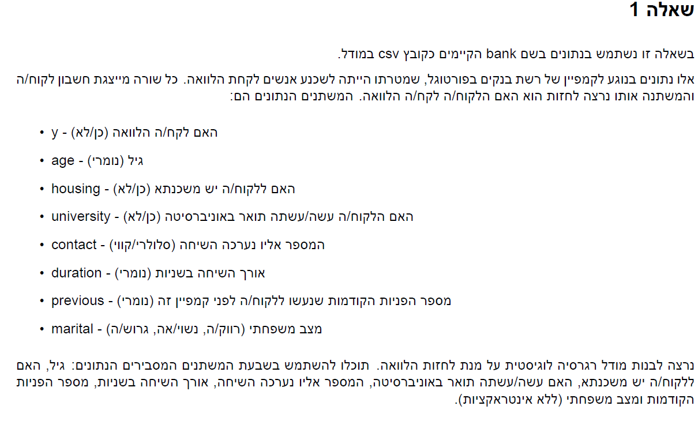
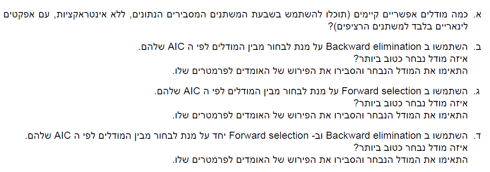
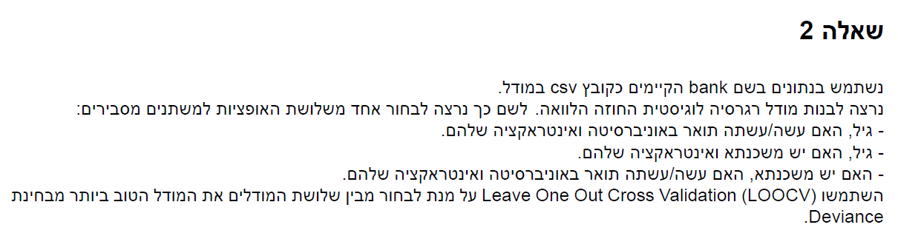
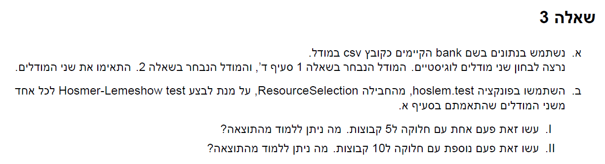

```{r setup, include=FALSE}
knitr::opts_chunk$set(echo = TRUE)
```

```{r}
library(glue)
library(tidyverse)
library(tidymodels)
library(caret)
library(MASS)
library(ResourceSelection)
```


# Q1





## a

$$
\textrm{we have 7 features to choose from each feature can either be in the model or not thus we have } 2^7 = 128 \textrm{ possible models}
$$

## b

```{r}
bank <- read_csv("bank.csv") %>% dplyr::select(-1,-2) %>% mutate(y = ifelse(y=="yes",1,0))
full_model <- glm(y~.,data = bank,family = "binomial")
back <- MASS::stepAIC(full_model,method = "backward")
summary(back)
```

*the model that was chosen is a model containing age,university,duration,contact,marital and precious*

*each estimate is the log OR for a 1 unit change*

## c

```{r}
forward <- MASS::stepAIC(full_model,method = "forward")
summary(forward)
```

*the model that was chosen is a model containing age,university,duration,contact,marital and precious*

*each estimate is the log OR for a 1 unit change*


## d

```{r}
both <- MASS::stepAIC(full_model,method = "both")
summary(both)
```

*the model that was chosen is a model containing age,university,duration,contact,marital and precious*

*each estimate is the log OR for a 1 unit change*

# Q2




```{r, eval=F, echo=T}
# this takes to long to run so i wont knit it to the pdf.
# ressults were saved to csv so i could reuse them

mod_1 <-  glm(y~age+university+age*university,data = bank,family = "binomial")
mod_2 <-  glm(y~age+housing+age*housing,data = bank,family = "binomial")
mod_3 <-  glm(y~housing+university+housing*university,data = bank,family = "binomial")

CalcValidDev <- function(valid_preds, valid_y)
{
-2*(sum(valid_y*log(valid_preds) + (1-valid_y)*log(1-valid_preds)))
}

dev_1 <- c()
dev_2 <- c()
dev_3 <- c()

for (i in 1:nrow(bank)){
  print(i)
  #data
  bank_dat <- bank[-i,]
  left_dat <- bank[i,]
  #models
  mod_1 <-  glm(y~age+university+age*university,data = bank_dat,family = "binomial")
  mod_2 <-  glm(y~age+housing+age*housing,data = bank_dat,family = "binomial")
  mod_3 <-  glm(y~housing+university+housing*university,data = bank_dat,family = "binomial")
  #predictions
  pred_1 <- as.numeric(predict(mod_1,left_dat,type = "response"))
  pred_2 <- as.numeric(predict(mod_2,left_dat,type = "response"))
  pred_3 <- as.numeric(predict(mod_3,left_dat,type = "response"))
  #deviances
  dev_1[i] <- CalcValidDev(pred_1,left_dat$y)
  dev_2[i] <- CalcValidDev(pred_2,left_dat$y)
  dev_3[i] <- CalcValidDev(pred_3,left_dat$y)
}
#saving results
tbl <- tibble("model 1"= dev_1,
       "model 2"= dev_2,
       "model 3"= dev_3)
```


```{r}
tbl <- read_csv("loocv.csv") %>% dplyr::select(-X1)

tbl%>% summarise_all(mean)
```


# Q3



## a

```{r}
mod_a <- both
mod_b <- glm(y~age+university+age*university,data = bank,family = "binomial")
```

## b

```{r}
#g5
ht_a_5 <- ResourceSelection::hoslem.test(bank$y,predict(mod_a,type = "response"),g=5)
ht_b_5 <- ResourceSelection::hoslem.test(bank$y,predict(mod_b,type = "response"),g=5)
#g10
ht_a_10 <- ResourceSelection::hoslem.test(bank$y,predict(mod_a,type = "response"),g=10)
ht_b_10 <- ResourceSelection::hoslem.test(bank$y,predict(mod_b,type = "response"),g=10)

tibble("g"= c(5,10),
       "mod_a" = c(ht_a_5$statistic,ht_a_10$statistic) ,
       "mod_b" = c(ht_b_5$statistic,ht_b_10$statistic) )
```

*both models have a good fit according to holsem test*


