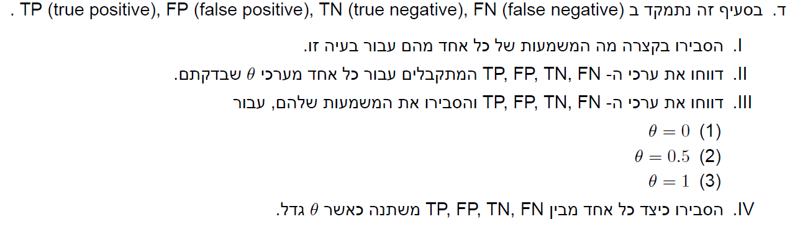

```{r setup, include=FALSE}
knitr::opts_chunk$set(echo = TRUE)
```


```{r message=FALSE, warning=FALSE}
#imports
library(tidyverse)
library(tidymodels)
library(glmnet)
library(glue)
library(microbenchmark)
library(caret)
library(ROCit)
```


# Q1


## a


```{r}
bank <- read_csv("bank.csv") %>% mutate(y = ifelse(y == "yes",1,0)) %>% select(-1,-2)
X <- model.matrix(y~ 0+.,data = bank)
y <- bank$y
lasso <- glmnet(X,y,family = "binomial",alpha = 1)
lasso
plot(lasso, label = T)
```

*we can learn from this graph which features enter the model for different L1 norm, we can see that features university,contact,martial,previous are the stronger features*

```{r}
model_1 <- glmnet(X,y,family = "binomial",alpha = 1,lambda = 0.1)
model_2 <- glmnet(X,y,family = "binomial",alpha = 1,lambda = 0.025)
model_3 <- glmnet(X,y,family = "binomial",alpha = 1,lambda = 0.001)

glue("model 1 coef")
coef(model_1)

glue("model 2 coef")
coef(model_2)

glue("model 3 coef")
coef(model_3)
```

*as lambda increases the parameter coefficients decrease because we have a larger penalty on them, also fewer coefficients are > 0*

## b

#### I

##### 1

```{r}
cv_lambda <- cv.glmnet(X,y,family = "binomial",alpha = 1)
glue("best lambda value is: {cv_lambda$lambda.min}")
```

##### 2

```{r}
min_lambd <- cv_lambda$lambda[which.min(cv_lambda$cvm)]
glue("best lambda value is: {min_lambd}")
```

##### 3

```{r}
cv_lambda
glue("from the table we can see that all variables are non zero")
```


#### II

##### 1

```{r}
plot(cv_lambda)
glue("biggest lambda with 1 std away is approx: {exp(-4.6)}")
```


##### 2

```{r}
ci <- min(cv_lambda$cvm) + c(-1,1)* cv_lambda$cvsd[60]
# all values are begger then the lower bound
lambdas <- cv_lambda$lambda[cv_lambda$cvm < ci[2]]
biggest_lambda <- max(lambdas)
biggest_lambda
```

##### 3

```{r}
non_zero <- tidy(cv_lambda) %>% filter(near(lambda,0.01039345)) %>% pull (nzero)
glue ("the number f non zero paramaters is: {non_zero}")
```

#### III

```{r}
coef(glmnet(X,y,family = "binomial",alpha = 1,lambda = 0.01039345))

coef(glmnet(X,y,family = "binomial",alpha = 1,lambda = exp(-6)))

coef(glmnet(X,y,family = "binomial",alpha = 1,lambda = exp(-7.3)))
```


*i would chose one of these 3 models as all of them are in lambdas CI, these are not the same model as EX10.1.d*

# Q2





## a

```{r}
train_inds <- sample(1:nrow(X),floor(0.7*nrow(X)))
train <- bank %>% slice(train_inds)
test <- bank %>% slice(-train_inds)
```

## b

```{r}
logistic_model <- glm(y~.,data = train,family = "binomial")
test$y_pred <- predict(logistic_model,test,type = "response")
test
```


## c

```{r}
test_with_thetas <- test %>% mutate(theta05 = as.numeric(y_pred>0.05)) %>%
  mutate(theta1 = as.numeric(y_pred>0.1)) %>%
  mutate(theta2 = as.numeric(y_pred>0.2))
test_with_thetas %>% summarise(across(c(theta05,theta1,theta2),mean))
```


## d

#### I

*false negative we identified an observation as negative (meaning no loan), but the true value was positive*

*true negative we identified an observation as negative (meaning no loan) and we were correct*

*false positive we identified an observation as positive (meaning no loan), but the true value was negative*

*true positive we identified an observation as positive (meaning no loan) and we were correct*

#### II

```{r}

tbl_theta <- function(theta){
  cm <- confusionMatrix(data = factor(as.numeric(test$y_pred>theta),levels = c(0,1)),reference  = factor(test$y))$table
  glue("for theta = {theta}
       fn = {cm[2,1]}
       tn = {cm[1,1]}
       fp = {cm[1,2]}
       tp = {cm[2,2]}
       ")
}
tbl_theta(0.05)
tbl_theta(0.1)
tbl_theta(0.2)
```


#### III

```{r}
tbl_theta(0)
tbl_theta(0.5)
tbl_theta(1)
```

*for theta = 0 we assume all predictions are true there for we only have true positives and false negatives, same goes for theta = 1 but the other way around*

*for theta = 0.5 we assume that the chance of taking a lone is the same as not taking one*

#### IV

*as theta increases: fn decrease*

*tn increase*

*tp decrease*

*fp decrease*

## e

#### I

*specificity is P(Y_pred = 0|Y=0)*

*accuracy is the ratio of our correctly classified predictions out of all the observations*

*sensitivity is P(Y_pred = 1|Y=1)*

#### II + III

```{r}
acc_vales <- function(theta){
  cm <- confusionMatrix(data = factor(as.numeric(test$y_pred>theta),levels = c(0,1)),reference  = factor(test$y))
  acc = cm$overall["Accuracy"]
  sensi = cm$byClass["Sensitivity"]
  speci = cm$byClass["Specificity"]
  glue("for theta = {theta}
       Accuracy = {acc}
       Sensitivity = {sensi}
       Specificity = {speci}
       ")
}

map(c(0,0.05,0.1,0.2,0.5,1),acc_vales)

```

#### IV

*Accuracy increases then decreases*

*Sensitivity increases*

*Specificity decreases*


## f

```{r}
## Warning: package 'ROCit' was built under R version 3.5.2
ROCit_obj <- rocit(score=test$y_pred,class=factor(test$y))
plot(ROCit_obj)
```

*we can learn from this graph for each cut point theta what is the Sensitivity (y-axis) and the Specificity(x-axis)*

## g

*it depends what we are more concerned with is it better to predict a loan but a person wont take it or not to predict but he would take it?*

*because i don't know which is better i would go with youden index meaning theta = 0.25 (approx)*

# Q3


## a

#### I

$$
2^{14}= 16384 \ models
$$

#### II

*lets assume that training time is symetric around 7 (the mean number of predictors)*

```{r}
bank_full <- read_csv("bank_full.csv") %>% mutate(y = ifelse(y == "yes",1,0)) %>% select(-1,-2)
totsec <- mean(microbenchmark(glm(y~.,data = bank_full[c(sample(colnames(bank_full)[-14],7),"y")],family = "binomial"), times = 100, unit = "s")$time/10^9)
glue("the estimated amout of time is: {totsec*16384/60} mintues ")
```


## b

#### I

$$
2^{\binom{14}{2} +14} \approx 4.05*10^{31}  models
$$

#### II

*ill make the same assumption but now i will use all the interactions for the selected predictors*

```{r}
totmin <- mean(microbenchmark(glm(y~.^2,data = bank_full[c(sample(colnames(bank_full)[-14],7),"y")],family = "binomial"), times = 10, unit = "s")$time/10^9)
glue("the estimated amout of time is: {totmin*4.05*10^31/60/60/24/365} years")
```

## c

#### I
*cv.glmnet does not work for some reason, i left the code*
```{r eval=FALSE}
X <- model.matrix(y~ .^2,data = bank_full)
y <- bank_full$y

las_cv <- cv.glmnet(X,y,family = "binomial",alpha = 1,nfolds = 5,lambda = seq(0.005,0.15,length.out=50))
las_cv

plot(las_cv)
lasso_model <- glmnet(X,y,family = "binomial",alpha = 1,lambda = las_cv$lambda.min)
```

##### 1

```{r eval=FALSE}
coef(lasso_model)
```

##### 2 

```{r eval=FALSE}
ncol(X) - tidy(cv_lambda) %>% filter(near(lambda,las_cv$lambda.min)) %>% pull (nzero)
```

##### 3

*we can interpet the model nicley*

#### II

##### 1

```{r eval=FALSE}
plot(las_cv)

ci <- min(cv_lambda$cvm) + c(-1,1)* cv_lambda$cvsd[which.min(cv_lambda$cvm)]
# all values are begger then the lower bound
lambdas <- cv_lambda$lambda[cv_lambda$cvm < ci[2]]
biggest_lambda <- max(lambdas)
biggest_lambda
```

##### 2 

```{r eval=FALSE}
ncols(X) - tidy(cv_lambda) %>% filter(near(lambda,las_cv$lambda.min)) %>% pull (nzero)
```

##### 3

*too many predictors makes the interpettebbilty of the model harder*


