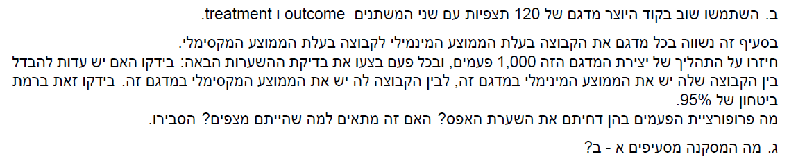

```{r setup, include=FALSE}
knitr::opts_chunk$set(echo = TRUE)
```


# Q1

**a**

$$
Reminder\, of \, assumtions:
\\(1) \sum_{i=1}^I\alpha_i = 0
\\(2) \sum_{j=1}^J\beta_j = 0
\\(3) \sum_{i=1}^I\gamma_{ij} = 0\,\,\, \forall j
\\(4) \sum_{j=1}^J\gamma_{ij} = 0\,\,\, \forall i
\\\mu_{.j} -\mu = \frac{1}{nI}\sum_{i=1}^I\sum_{k=1}^n(\mu_{ij}) - \mu = \frac{1}{nI}\sum_{i=1}^I\sum_{k=1}^n(\mu +\alpha_i +\beta_j +\gamma_{ij}) - \mu = \frac{1}{nI}nI\mu + \frac{n\sum_{i=1}^I\alpha_i}{nI} + \frac{nI\beta_j}{nI} + \frac{n\sum_{i=1}^I\gamma_{ij}}{nI} - \mu =\\
=\mu + \frac{\sum_{i=1}^I\alpha_i}{I} + \beta_j + \frac{\sum_{i=1}^I\gamma_{ij}}{I} - \mu := A + \beta_j + C
\\
\\ (1),(3) \Rightarrow A=C=0 \Rightarrow \mu_{.j} -\mu = \beta_j
$$

**b**

$$
\gamma_{ij} = \mu_{ij} - \mu - \alpha_i -  \beta_j = \mu_{ij} - \mu -(\mu_{.j} -\mu) - (\mu_{i.} -\mu) = \mu_{ij} +2\mu - \mu -\mu_{i.} -  \mu_{.j} = \mu_{ij} -\mu_{i.} -  \mu_{.j} + \mu
$$

**c**

$$
MSA = \frac{SSA}{I-1} = \frac{nJ\sum_{i=1}^I(\bar Y_{i..} - \bar Y)^2}{I-1}
\\\bar Y_{i..} - \bar Y = \frac{1}{nJ}\sum_{j=1}^J\sum_{k=1}^nY_{ijk} - \frac{1}{N}\sum_{i=1}^I\sum_{j=1}^J\sum_{k=1}^nY_{ijk}=\frac{1}{nJ}\sum_{j=1}^J\sum_{k=1}^n(\mu + \alpha_i+\beta_j+\gamma_{ij}+\varepsilon_{ijk}) - \frac{1}{N}\sum_{i=1}^I\sum_{j=1}^J\sum_{k=1}^n(\mu + \alpha_i+\beta_j+\gamma_{ij}+\varepsilon_{ijk})=\\
=\mu +\alpha_i+0+0+\bar \varepsilon_{i..} - (\mu +0 +0 +0 +\bar \varepsilon) = \alpha_i - (\bar \varepsilon + \bar \varepsilon_{i..})\Rightarrow (\bar Y_{i..} - \bar Y)^2 = \alpha_i^2 +2\alpha_i(\bar\varepsilon_{i..} - \bar \varepsilon) + (\bar\varepsilon_{i..} - \bar \varepsilon)^2
\\E(MSA) = E(\frac{nJ\sum_{i=1}^I(\alpha_i^2 +2\alpha_i(\bar\varepsilon_{i..} - \bar \varepsilon) + (\bar\varepsilon_{i..} - \bar \varepsilon)^2)}{I-1}) = \frac{nJ\sum_{i=1}^I\alpha_i^2}{I-1} + \frac{2nJ\sum_{i=1}\alpha_i E(\bar\varepsilon_{i..} - \bar \varepsilon)}{I-1} + \frac{E(nJ\sum_{i=1}^I(\bar\varepsilon_{i..} - \bar \varepsilon)^2)}{I-1}\\
(5) \frac{2nJ\sum_{i=1}^I\alpha_i E(\bar\varepsilon_{i..} - \bar \varepsilon)}{I-1} = \frac{nJ\sum_{i=1}^I\alpha_i (-E(\bar \varepsilon) + E(\bar\varepsilon_{i..}))}{I-1} = 0
\\(6) nJ\sum_{i=1}^I\frac{E((\bar\varepsilon_{i..} - \bar \varepsilon)^2)}{I-1} = nJ\sum_{i=1}^I\frac{V(\bar\varepsilon_{i..} - nJ\sum_{i=1}^I\bar \varepsilon)}{I-1} + nJ\sum_{i=1}^I\frac{(E(\bar\varepsilon_{i..} - \bar \varepsilon))^2}{I-1} = nJ\sum_{i=1}^I\frac{V(\bar\varepsilon_{i..} - \bar \varepsilon)}{I-1} = \\
=\frac{nJ}{I-1}\sum_{i=1}^I (\frac{\sigma^2}{nJ}-\frac{\sigma^2}{N}) = \frac{nJ}{I-1} \frac{(I-1)\sigma^2}{nJ} = \sigma^2
\\ E(MSA) =  \frac{nJ\sum_{i=1}^I\alpha_i^2}{I-1} + (5) + (6) = \frac{nJ\sum_{i=1}^I\alpha_i^2}{I-1} + \sigma^2
$$

**d**

$$
(7)\,\bar Y = \frac{1}{N}\sum_{i=1}^I\sum_{j=1}^J\sum_{k=1}^nY_{ijk} = \frac{1}{N}\sum_{i=1}^I\sum_{j=1}^J\sum_{k=1}^n \mu + \alpha_i+\beta_j+\gamma_{ij}+\varepsilon_{ijk} = \mu + \bar \varepsilon
\\(8)\,\bar Y_{i..} = \frac{1}{nJ}\sum_{j=1}^J\sum_{k=1}^nY_{ijk} = \frac{1}{nJ}\sum_{j=1}^J\sum_{k=1}^n \mu + \alpha_i+\beta_j+\gamma_{ij}+\varepsilon_{ijk} = \mu + \alpha_i + \bar \varepsilon_{i..}
\\(9)\,\bar Y_{.j.} = \frac{1}{nI}\sum_{i=1}^I\sum_{k=1}^nY_{ijk} = \frac{1}{nI}\sum_{i=1}^I\sum_{k=1}^n \mu + \alpha_i+\beta_j+\gamma_{ij}+\varepsilon_{ijk} = \mu + \beta_j + \bar \varepsilon_{.j.}
\\(10)\,\bar Y_{ij.} = \frac{1}{n}\sum_{k=1}^nY_{ijk} = \frac{1}{n}\sum_{k=1}^n \mu + \alpha_i+\beta_j+\gamma_{ij}+\varepsilon_{ijk} = \mu + \alpha_i + \beta_j + \gamma_{ij} + \bar \varepsilon_{ij.}
\\(11)\,\bar Y_{i..} - \bar Y = \mu + \alpha_i + \bar \varepsilon_{i..} - \mu - \bar \varepsilon = \alpha_i +\bar \varepsilon_{i..} - \bar \varepsilon
\\(12)\,\bar Y_{ij.}-\bar Y_{i..}-\bar Y_{.j.}+\bar Y =\gamma_{ij}
\\(13)\, \sum_{i=1}^I\sum_{j=1}^J(\bar Y_{i..} - \bar Y)(\bar Y_{ij.}-\bar Y_{i..}-\bar Y_{.j.}+\bar Y) = \sum_{i=1}^I\sum_{j=1}^J(11)(12) = \sum_{i=1}^I\sum_{j=1}^J\gamma_{ij}(\alpha_i +\bar \varepsilon_{i..} - \bar \varepsilon) = \sum_{i=1}^I(0(\alpha_i +\bar \varepsilon_{i..} - \bar \varepsilon)) = 0
$$




# Q2

**a**

```{r}
library(tidyverse)
library(glue)
options(dplyr.summarise.inform = FALSE)
n <-  120
B <- 1000
alpha <- 0.05
treat <- c(rep("A",30),rep("B",30),rep("C",30),rep("D",30))
get_t <- function(n,treat){
  outcome <- rnorm(n)
  tbl <- tibble(outcome = outcome,treat = treat)
  A <- tbl %>%
    filter(treat == "A")%>%
    select(outcome)
  D <- tbl %>%
    filter(treat == "D")%>%
    select(outcome)
  return(t.test(A,D,var.equal = T)$p.value)
}
p_values <- map2_dbl(rep(n,B),replicate(B,treat,F),get_t)
rejected <- p_values <= alpha
mean_reject <- mean(rejected)
glue("we rejected H_0 {round(mean_reject*100,2)} % of the time")
```

*התוצאה נראית הגיונית שכן נצפה ל5 אחוז דחייה*

**b**

```{r warning=FALSE}
get_t2 <- function(n,treat){
  outcome <- rnorm(n)
  tbl <- tibble(outcome = outcome,treat = treat)
  group_means <- tbl %>% 
    group_by(treat)%>%
    summarize(mean=mean(outcome))
  min_group_let <- group_means %>%
    filter(mean == min(mean)) %>%
    select(treat)
  max_group_let <- group_means %>%
    filter(mean == max(mean)) %>%
    select(treat)
  Max_group <- tbl %>%
    filter(treat == max_group_let$treat)%>%
    select(outcome)
  Min_group <- tbl %>%
    filter(treat == min_group_let$treat)%>%
    select(outcome)
  return(t.test(Max_group,Min_group,var.equal = T)$p.value)
}
p_values2 <- map2_dbl(rep(n,B),replicate(B,treat,F),get_t2)
rejected2 <- p_values2 <= alpha
mean_reject2 <- mean(rejected2)
glue("we rejected H_0 {round(mean_reject2*100,2)} % of the time")
```


*זה לא תואם את המצופה, נצפה שנדחה את השערת ה0 כ5 אחוז מהפעמים אך מכיוון ואנו מכניסים כאן בחירה אנו פוגעים בשמירה על אלפא*

**c**

*לא ניתן לבצע בחירה לאחר הסתכלות בדאטא ואז בדיקת השערות, עלינו לבצע בדיקת השערות מרובה ולבצע תיאום לפי וואליו על מנת לשמור על האלפא הרצוי*


