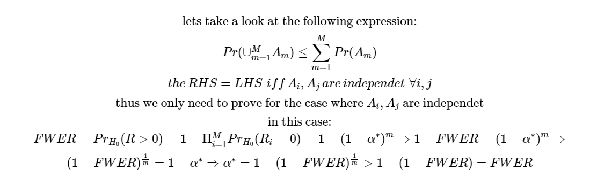
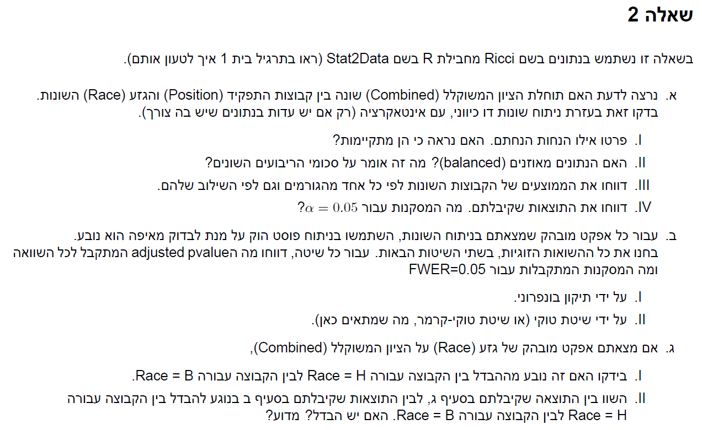
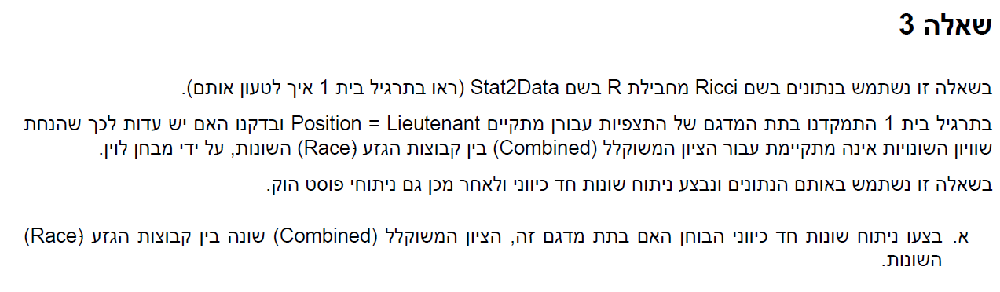
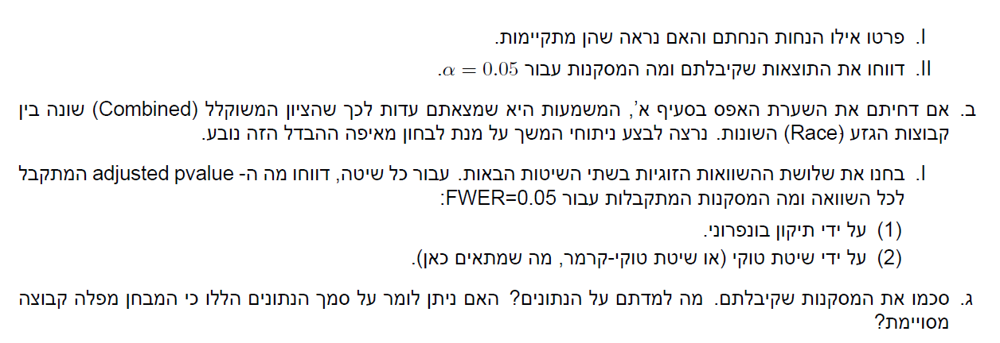
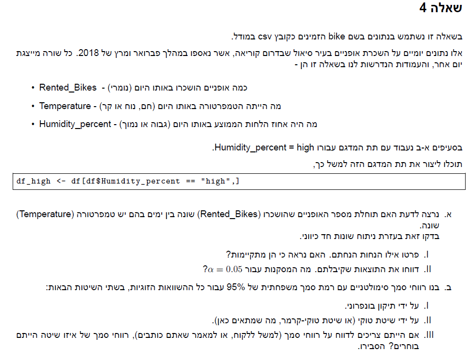
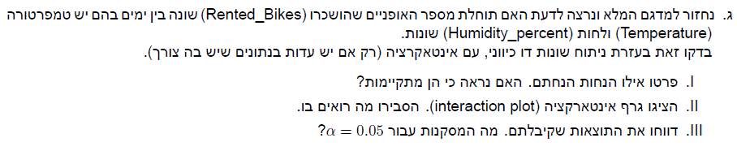
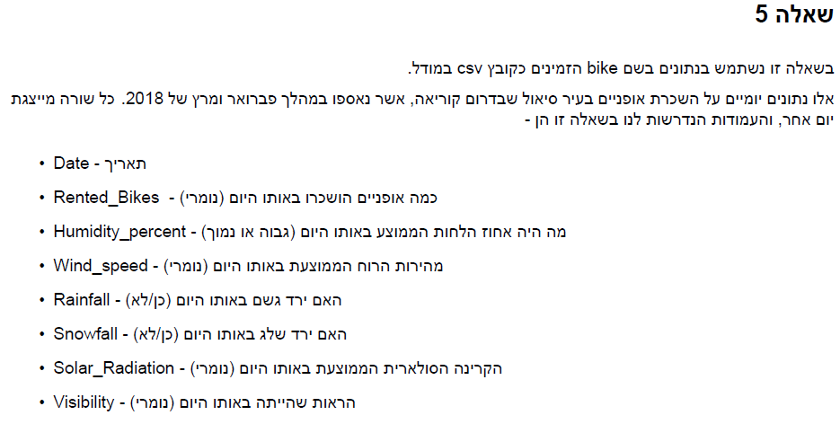

```{r setup, include=FALSE}
knitr::opts_chunk$set(echo = TRUE,message = FALSE)
```

# Q.1 




# Q.2



**a**

```{r}
library(tidyverse)
library(Stat2Data)
library(glue)
library(lawstat)
#see if intercation is necceserty
data(Ricci)
full_model <- lm(Combine ~ Position*Race,data = Ricci)
no_inter_model <- lm(Combine ~ Position + Race,data = Ricci)
anov_test <- anova(no_inter_model,full_model)
pv <- anov_test[["Pr(>F)"]][2]
glue("interaction relevence p value is: {pv} therefore we will not reject the null, meaning the interaction is not needed")

#assumptions
glue("we assume equal variance")
levene_test <-levene.test(Ricci$Combine,Ricci$Race:Ricci$Position,location = "mean")
glue("pvalue for levene test is {round(levene_test$p.value,4)} therefore we will not reject the null and conclude equal varicane")

glue("we assume normality of the residuals")
ggplot(Ricci,aes(sample = Combine - predict(no_inter_model,Ricci[c("Position","Race")]))) +
  stat_qq()+
  stat_qq_line()+
  ggtitle("error normality check")

glue("looks ok")
glue("we also assume independece but we cant check it")

#balance check
Ricci %>% 
  group_by(Position,Race) %>%
  summarize(n())
glue("we can see that the groups are unbalanced")
glue("it mneas that SST =/= SSA +SSB + SSAB + SSE")

#show means
Ricci %>% 
  group_by(Position,Race) %>%
  summarize(mean(Combine))

Ricci %>% 
  group_by(Position) %>%
  summarize(mean(Combine))

Ricci %>% 
  group_by(Race) %>%
  summarize(mean(Combine))

#anova for Position
Pos_model <- lm(Combine ~ Race ,data = Ricci)
anov_test_pos <- anova(Pos_model,no_inter_model)
pv_pos <- anov_test_pos[["Pr(>F)"]][2]
glue("interaction relevence p value is: {pv_pos} therefore we will not reject the null, meaning that position has no effect on test results")

#anova for Race
Race_model <- lm(Combine ~ Position ,data = Ricci)
anov_test_R <- anova(Race_model,no_inter_model)
pv_R <- anov_test_R[["Pr(>F)"]][2]
glue("interaction relevence p value is: {pv_R} therefore we will reject the null, meaning that race has an effect on test results")
```

**b**

```{r}
library(multcomp)
contr <- rbind(
  "Race H - Race B" = c(-1,1,0),
  "Race W - Race B" = c(-1,0,1),
  "Race W - Race H" = c(0,-1,1)
)
aov_model <-no_inter_model
pair_wise <- glht(aov_model, linfct = mcp(Race = contr))
glue("bonferroni method results:")
summary(pair_wise, test = adjusted(type = "bonf"))
glue("Tukey method results:")
summary(glht(aov_model, mcp(Race = "Tukey")), test = univariate())
glue("we can conculde from both methods that there is a difference between: whites and blacks, whites and hispanics for FWER = 0.05 ")
```

**c**
```{r}
W_C <- Ricci %>% 
  filter(Race == "W") %>% 
  pull(Combine)
B_C <- Ricci %>% 
  filter(Race == "B") %>% 
  pull(Combine)
glue(" the difference is {mean(W_C) - mean(B_C)} which is the same as in the test, because it is calculated the same way")
```


# Q.3




**a**

```{r}
aov_model <- aov(Combine~Race,data = Ricci)
summary(aov_model)
glue("we can reject the null and conclude at a confidance level of 95% that Race effects the Combined score")

#assumptions
glue("we assume equal variance")
levene_test <-levene.test(Ricci$Combine,Ricci$Race,location = "mean")
glue("pvalue for levene test is {round(levene_test$p.value,4)} therefore we will not reject the null and conclude equal varicane")

glue("we assume normality of the residuals")
ggplot(Ricci,aes(sample = Combine - predict(lm(Combine~Race,data = Ricci),Ricci[c("Position","Race")]))) +
  stat_qq()+
  stat_qq_line()+
  ggtitle("error normality check")

glue("looks ok")
glue("we also assume independece but we cant check it")
```

**b**

```{r}
contr <- rbind(
  "Race H - Race B" = c(-1,1,0),
  "Race W - Race B" = c(-1,0,1),
  "Race W - Race H" = c(0,-1,1)
)
pair_wise <- glht(aov_model, linfct = mcp(Race = contr))
glue("bonferroni method results:")
summary(pair_wise, test = adjusted(type = "bonf"))
glue("Tukey method results:")
summary(glht(aov_model, mcp(Race = "Tukey")), test = univariate())
glue("we can conculde from both methods that there is a difference between: whites and blacks, whites and hispanics for FWER = 0.05 ")
```

**c**

המסקנות שקיבלנו הן שיש הבדל בציון בין קבוצות הגזע השונות,ניתן ללמוד כי המבחן מפלה לרעה את אוכלסויית השחורים וההספנים

# Q.4 




**a**

```{r}
bike <- read_csv("bike.csv")
bike <- bike %>%
  dplyr::select(Rented_Bikes,Temperature,Humidity_percent) %>%
  filter(Humidity_percent == "high") %>%
  mutate(across(c(Temperature,Humidity_percent),as.factor))
bike_aov <- aov(Rented_Bikes~Temperature,data = bike)
#assumptions
glue("we assume equal variance")
levene_test <-levene.test(bike$Rented_Bikes,bike$Temperature,location = "mean")
glue("pvalue for levene test is {round(levene_test$p.value,4)} therefore we will not reject the null and conclude equal varicane")

glue("we assume normality of the residuals")
plot(bike_aov)

glue("qqplot looks ok")
glue("we also assume independece but we cant check it")
#pvalue
pv_bike <- summary(bike_aov)[[1]][["Pr(>F)"]][1]
glue("pvalue is: {pv_bike} therefore we will reject the null and conclude that there is a difference in bike rentals for different Temperatures")
```

**b**

```{r}
contr <- rbind(
  "Temperature hot - Temperature cold" = c(-1,1,0),
  "Temperature nice - Temperature cold" = c(-1,0,1),
  "Temperature nice - Temperature hot" = c(0,-1,1)
)
glue("bonferonni ci's method")
pairwise_res <- glht(bike_aov,linfct = mcp(Temperature = contr))
pairwise_ci <- confint(pairwise_res,level = 1- (0.05/3) ,calpha = univariate_calpha())
pairwise_ci
glue("Tukey - Kramer method")
TukeyHSD(bike_aov)
glue("i would report Tukey - Kramer CI because they are smaller")
```

**c**

```{r}
bike <- read_csv("bike.csv")
bike <- bike %>%
  dplyr::select(Rented_Bikes,Temperature,Humidity_percent) %>%
  mutate(across(c(Temperature,Humidity_percent),as.factor))

bike %>%
  group_by(Temperature,Humidity_percent) %>%
  summarize(n())
glue("we have unblaced groups")

#see if intercation is necceserty
full_model <- lm(Rented_Bikes ~ Temperature*Humidity_percent,data = bike)
no_inter_model <- lm(Rented_Bikes ~ Temperature + Humidity_percent,data = bike)
anov_test <- anova(no_inter_model,full_model)
pv <- anov_test[["Pr(>F)"]][2]
glue("interaction relevence p value is: {pv} therefore we will reject the null, meaning the interaction is needed")

#assumptions
glue("we assume equal variance")
levene_test <-levene.test(bike$Rented_Bikes,bike$Temperature:bike$Humidity_percent,location = "mean")
glue("pvalue for levene test is {round(levene_test$p.value,4)} therefore we will not reject the null and conclude equal varicane")

glue("we assume normality of the residuals")
ggplot(bike,aes(sample = Rented_Bikes - predict(no_inter_model,bike[c("Temperature","Humidity_percent")]))) +
  stat_qq()+
  stat_qq_line()+
  ggtitle("error normality check")

glue("looks ok")
glue("we also assume independece but we cant check it")

Rented_Bikes_mean <- bike %>%
  group_by(Temperature,Humidity_percent) %>%
  summarize(mean_group = mean(Rented_Bikes))

Rented_Bikes_mean %>%
  ggplot() +
  aes(x = Humidity_percent,y = mean_group, color = Temperature)+
  geom_line(aes(group = Temperature))+
  geom_point()
glue("we can see in this graph that the lines are not parallel meaning we have a different slope for each interaction so the interaction does have an effect")
```

# Q.5 




**a**

```{r}
bike <- read_csv("bike.csv")
bike <- bike %>%
  mutate(across(c(Rainfall,Snowfall,Humidity_percent),as.factor))

t_test_pval <- function(formula){
  #checks equality assumption and based on that conducts the test
  f_test_pv <- var.test(formula)$p.value
  if (f_test_pv > 0.05){
    return(t.test(formula)$p.value)
  }
  return(t.test(formula)$p.value)
}
bike_tibl <- tibble(values = rep(c("Rented_Bikes","Wind_speed","Solar_Radiation","Visibility"),each = 3),
       groups = rep(c("Rainfall","Snowfall","Humidity_percent"),4))
bike_tibl <- bike_tibl %>%
  rowwise() %>%
  mutate(pval = t_test_pval(pull(bike,values)~pull(bike,groups)))
glue("pvalues before correction are:")
bike_tibl
```

**b** 
```{r}
bike_tibl$pval_adjust_BH = p.adjust(bike_tibl$pval,method = "BH")
bike_tibl$BH_conc <- ifelse(bike_tibl$pval_adjust_BH<0.05,"Reject","don't reject")
bike_tibl
```

**c**
```{r}
adj_pv <- function(vec,alpha,index){
  bool_vec = vec<=alpha
  M <- length(bool_vec)
  if (index > 1) {bool_vec[1:index-1] = FALSE}
  if (sum(bool_vec) == 0){return(min(vec[index:M]))}
  nex_rej <- min(which(bool_vec))
  return(vec[nex_rej])
}
my_bh <- function(vec,alpha = 0.05){
  ord <- order(vec)
  sorted_vec <- sort(vec)
  M <- length(vec)
  k <- 1:M
  corrected_alphas <- k/M*alpha
  corrected_pvals <- c()
  for (i in k){
    corrected_pvals[i] <- adj_pv(sorted_vec*M/k,alpha,i)
  }
  return(ifelse(corrected_pvals >1 ,1 ,corrected_pvals)[order(ord)])
}

bike_tibl$pval_adjust_my_BH = my_bh(bike_tibl$pval)
bike_tibl$my_BH_conc <- ifelse(bike_tibl$pval_adjust_my_BH<0.05,"Reject","don't reject")
bike_tibl %>%
  dplyr::select(values,groups,pval_adjust_my_BH,my_BH_conc)
```

**d**

```{r}
bonf_pval <- bike_tibl$pval* length(bike_tibl$pval)
bike_tibl$p_adjusted_bonf <- ifelse(bonf_pval>1,1,bonf_pval)
bike_tibl$bonf_conc <- ifelse(bike_tibl$p_adjusted_bonf<0.05,"Reject","don't reject")
bike_tibl %>%
  dplyr::select(values,groups,p_adjusted_bonf,bonf_conc)
```

**בינימיני הוכברג שולטת על ה**

**FDR**

**כלומר על אחוז ההשערות שדחינו אך לא היינו אמורים לדחות**

**לעומת זאת בונפריני שומר על כך שלא נעשה כלל טעות מסוג ראשון בסיכוי אלפא**
