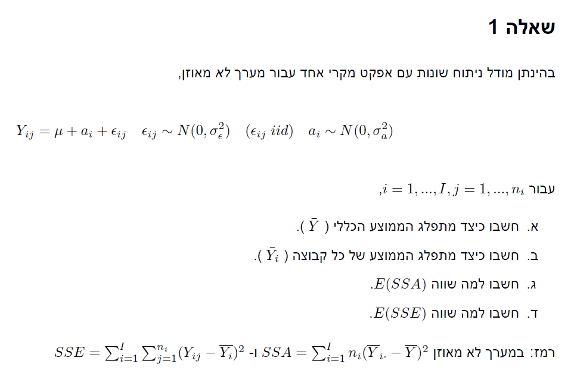
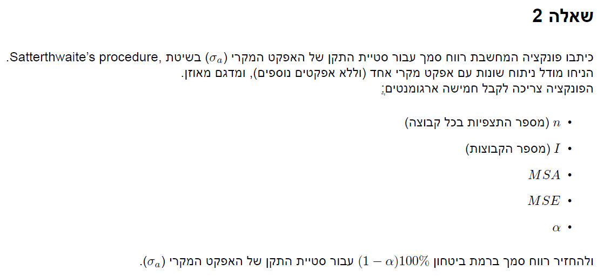
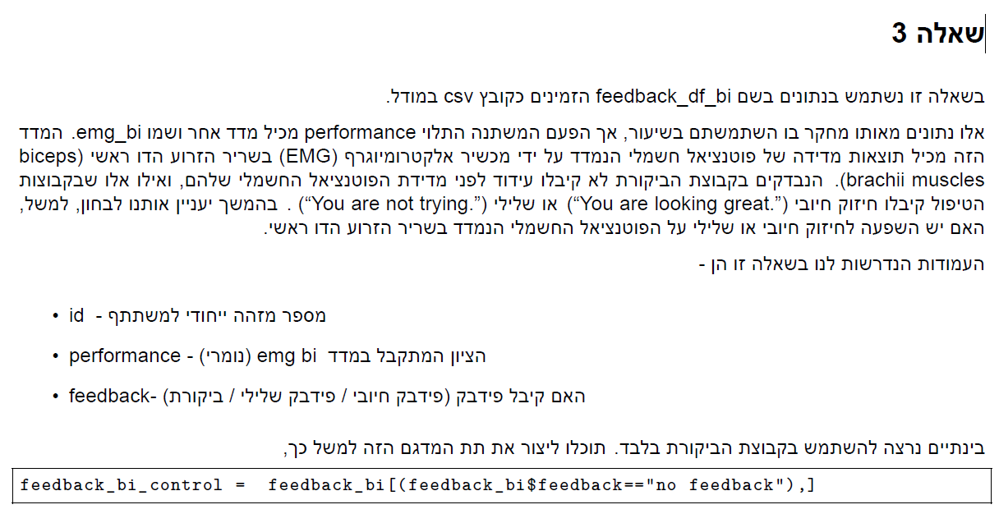
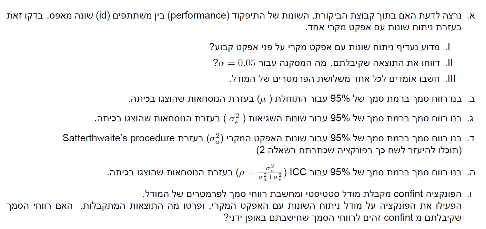

```{r setup, include=FALSE}
knitr::opts_chunk$set(echo = TRUE)
```

# Q.1


## a

$$
\bar{Y} = \frac{1}{N}\sum_{i=1}^I\sum_{j=1}^{n_i} Y_{ij} = \frac{1}{N}\sum_{i=1}^I\sum_{j=1}^{n_i} \mu + \alpha_i + \varepsilon_{ij}= \mu + \frac{1}{N}\sum_{i=1}^In_i\alpha_i + \bar \varepsilon\\
E(\bar{Y}) = E(\mu + \frac{1}{N}\sum_{i=1}^In_i\alpha_i + \bar \varepsilon) = \mu + \frac{1}{N}\sum_{i=1}^In_iE(\alpha_i) + E(\bar\varepsilon) = \mu  \\
V(\bar{Y}) = V(\mu + \frac{1}{N}\sum_{i=1}^In_i\alpha_i + \bar \varepsilon) = V(\frac{1}{N}\sum_{i=1}^In_i\alpha_i) + V(\bar \varepsilon) = \frac{1}{N^2}\sum_{i=1}^In_i^2V(\alpha_i) + \frac{\sigma_{\varepsilon}^2}{N} = \frac{\sum_{i=1}^In_i^2}{N^2}\sigma_{\alpha}^2 + \frac{\sigma_{\varepsilon}^2}{N}\\
\textrm{because } \alpha_i \textrm{ are iid and independent of all the errors, we get that } \bar{Y} \textrm{ distributes normally:}\\
\bar{Y} \sim N(\mu ,\frac{\sum_{i=1}^In_i^2}{N^2}\sigma_{\alpha}^2 + \frac{\sigma_{\varepsilon}^2}{N})
$$

## b

$$
\bar Y_i = \frac{1}{n_i}\sum_{j=1}^{n_i} Y_{ij} = \frac{1}{n_i}\sum_{j=1}^{n_i}\mu + \alpha_i + \varepsilon_{ij}=\mu+\alpha_i + \bar \varepsilon_i\\
E(\bar Y_i) = \mu+E(\alpha_i) + E(\bar \varepsilon_i) = \mu\\
V(\bar Y_i) = V(\mu+\alpha_i + \bar \varepsilon_i) = V(\alpha_i) + V(\bar \varepsilon_i) = \sigma_{\alpha}^2 + \frac{\sigma_{\varepsilon}^2}{n_i}\\
\textrm{because } \alpha_i \textrm{ are iid and independent of all the errors, we get that } \bar{Y_i} \textrm{ distributes normally:}\\
\bar{Y_i} \sim N(\mu,\sigma_{\alpha}^2 + \frac{\sigma_{\varepsilon}^2}{n_i})
$$

$$
(1):SSA = \sum_{i=1}^In_i(\bar Y_i- \bar Y)^2\\
(2):(\bar Y_i- \bar Y)^2 = (\mu+\alpha_i + \bar \varepsilon_i - (\mu + \frac{1}{N}\sum_{j=1}^In_j\alpha_j + \bar \varepsilon))^2 = ((\alpha_i - \frac{1}{N}\sum_{j=1}^In_j\alpha_j) + (\bar \varepsilon_i - \bar \varepsilon))^2=\\
=(\alpha_i - \frac{1}{N}\sum_{j=1}^In_j\alpha_j)^2 + (\bar \varepsilon_i - \bar \varepsilon)^2 + 2(\bar \varepsilon_i - \bar \varepsilon)(\alpha_i - \frac{1}{N}\sum_{j=1}^In_j\alpha_j)\\
(3):E((\bar Y_i- \bar Y)^2) = E((\alpha_i - \frac{1}{N}\sum_{j=1}^In_j\alpha_j)^2 + (\bar \varepsilon_i - \bar \varepsilon)^2 + 2(\bar \varepsilon_i - \bar \varepsilon)(\alpha_i - \frac{1}{N}\sum_{j=1}^In_j\alpha_j)) = \\
=E((\alpha_i - \frac{1}{N}\sum_{j=1}^In_j\alpha_j)^2) + E((\bar \varepsilon_i - \bar \varepsilon)^2) + 2E((\bar \varepsilon_i - \bar \varepsilon)(\alpha_i - \frac{1}{N}\sum_{j=1}^In_j\alpha_j)) = E((\alpha_i - \frac{1}{N}\sum_{j=1}^In_j\alpha_j)^2) + E((\bar \varepsilon_i - \bar \varepsilon)^2)\\
(4):E((\alpha_i - \frac{1}{N}\sum_{j=1}^In_j\alpha_j)^2) = E^2(\alpha_i - \frac{1}{N}\sum_{j=1}^In_j\alpha_j) + V(\alpha_i - \frac{1}{N}\sum_{j=1}^In_j\alpha_j) = 0 + V(\alpha_i) + V(\frac{1}{N}\sum_{j=1}^In_j\alpha_j) - 2 Cov(\alpha_i,\frac{1}{N}\sum_{j=1}^In_j\alpha_j) =\\
=\sigma_{\alpha}^2 + \frac{\sum_{j=1}^In_j^2}{N^2}\sigma_{\alpha}^2 - 2\frac{n_i}{N}\sigma_{\alpha}^2 = (1+\frac{\sum_{j=1}^In_j^2}{N^2}-2\frac{n_i}{N})\sigma_{\alpha}^2\\
(5):E((\bar \varepsilon_i - \bar \varepsilon)^2) = V(\bar \varepsilon_i - \bar \varepsilon) = V(\bar \varepsilon_i) + V(\bar \varepsilon) - 2cov(\bar \varepsilon_i,\bar \varepsilon) = (\frac{1}{n_i} - \frac{1}{N})\sigma_{\varepsilon}^2  = \frac{I-1}{N}\sigma_{\varepsilon}^2
\\
(6): E(SSA) = \sum_{i=1}^In_iE(\bar Y_i- \bar Y)^2 = \sum_{i=1}^In_i((1+\frac{\sum_{j=1}^In_j^2}{N^2}-2\frac{n_i}{N})\sigma_{\alpha}^2 +  \frac{I-1}{N}\sigma_{\varepsilon}^2) =
(N + \frac{\sum_{j=1}^In_j^2}{N} -2 \frac{\sum_{i=1}^In_i^2}{N})\sigma_{\alpha}^2 + (I-1)\sigma_{\varepsilon}^2 = \\
= (N - \frac{\sum_{i=1}^In_i^2}{N})\sigma_{\alpha}^2 + (I-1)\sigma_{\varepsilon}^2
$$

$$
(7):SSE =  \sum_{i=1}^I\sum_{j=1}^{n_i}(Y_{ij}-\bar Y)^2 = \sum_{i=1}^I\sum_{j=1}^{n_i}(\mu + \alpha_i + \varepsilon_{ij}-(\mu + \frac{1}{N}\sum_{k=1}^In_k\alpha_k + \bar \varepsilon))^2= \sum_{i=1}^I\sum_{j=1}^{n_i}[(\alpha_i - \frac{1}{N}\sum_{k=1}^In_k\alpha_k) + (\varepsilon_{ij}-\bar \varepsilon)]^2 =\\ = \sum_{i=1}^I\sum_{j=1}^{n_i}[(\alpha_i - \frac{1}{N}\sum_{k=1}^In_k\alpha_k)^2 + (\varepsilon_{ij}-\bar \varepsilon)^2 + 2 (\alpha_i - \frac{1}{N}\sum_{k=1}^In_k\alpha_k)(\varepsilon_{ij}-\bar \varepsilon)]
\\
(8):E(SSE) = E(\sum_{i=1}^I\sum_{j=1}^{n_i}[(\alpha_i - \frac{1}{N}\sum_{k=1}^In_k\alpha_k)^2 + (\varepsilon_{ij}-\bar \varepsilon)^2 + 2 (\alpha_i - \frac{1}{N}\sum_{k=1}^In_k\alpha_k)(\varepsilon_{ij}-\bar \varepsilon)]) = \\=
\sum_{i=1}^I\sum_{j=1}^{n_i}[E[(\alpha_i - \frac{1}{N}\sum_{k=1}^In_k\alpha_k)^2] + E[(\varepsilon_{ij}-\bar \varepsilon)^2] + 2E (\alpha_i - \frac{1}{N}\sum_{k=1}^In_k\alpha_k)(\varepsilon_{ij}-\bar \varepsilon)] =
\\
\sum_{i=1}^I\sum_{j=1}^{n_i}[V(\alpha_i - \frac{1}{N}\sum_{k=1}^In_k\alpha_k) + V(\varepsilon_{ij}-\bar \varepsilon)
\\
(9):V(\varepsilon_{ij}-\bar \varepsilon) = V(\varepsilon_{ij}) + V(\bar \varepsilon)-2cov(\varepsilon_{ij},\bar \varepsilon) = (1+\frac{1}{N} -\frac{2}{N})\sigma_{\varepsilon}^2 = \frac{N-I}{N}\sigma_{\varepsilon}^2
\\
(10):V(\alpha_i - \frac{1}{N}\sum_{k=1}^In_k\alpha_k) = \sigma_{\alpha}^2 + \frac{\sum_{k=1}^In_k^2}{N^2}\sigma_{\alpha}^2 - 2\frac{n_i}{N} \sigma_{\alpha}^2
\\
(11):E(SSE) = \sum_{i=1}^I\sum_{j=1}^{n_i}[\frac{N-I}{N}\sigma_{\varepsilon}^2 + \sigma_{\alpha}^2 + \frac{\sum_{k=1}^In_k^2}{N^2}\sigma_{\alpha}^2 - 2\frac{n_i}{N} \sigma_{\alpha}^2] = (N-I)\sigma_{\varepsilon}^2 + N\sigma_{\alpha}^2 -\frac{\sum_{k=1}^In_k^2}{N^2}\sigma_{\alpha}^2
$$

# Q.2



```{r}
s_p <- function(n,I,MSA,MSE,alpha){
  N <- n*I
  c_s <- c(1/n,-1/n)
  Ms <- c(MSA,MSE)
  df <- c(I-1,N-I)
  sigma_hat <- c_s %*% Ms
  df_sigma = (sigma_hat)^2/ sum(c_s^2*Ms^2/df)
  u_q <- qchisq(1-alpha/2,df_sigma)
  l_q <- qchisq(alpha/2,df_sigma)
  ci <- c(df_sigma*sigma_hat/u_q,df_sigma*sigma_hat/l_q)
  return(ci)
}
```


# Q.3




```{r message=TRUE, warning=TRUE}
#imports
library(tidyverse)
library(glue)
library(lme4)
```

## a

```{r}
feed_back <- read.csv("feedback_df_bi.csv")
feed_back_cont <- feed_back %>%
  select(id,performance,feedback) %>%
  filter(feedback == "no feedback")
rand_a <- lmer(performance ~ (1|id) , data = feed_back_cont)
summary(rand_a)
n <-  12
I <- 22
N <- n*I
sigma_a <- 68.69
sigma_e <- 67.29
mu <- 89.503
MSE <-  sigma_e
MSA <- n*sigma_a+MSE
f_stat <- MSA/MSE
glue("pvalue is: {pf(f_stat,I-1,N-I,lower.tail = FALSE)} thus we will reject the null with a confidance level of 95%")
glue("the estimators are:
     mu = {mu}
     sigma alpha = {sigma_a}
     sigma epsilon = {sigma_e}")
```

נעדיך ניתוח שונות עם אפקט מקרי על פני קבוע מכיוון ויש שונות בין אנשים שונים ללא קשר לקבוצת איכות/ביקורת בה הם נמצאים

## b

```{r}
ci_mu <- round(mu +c(-1,1)*qt(0.975,I-1)*sqrt(MSA/N),3)
glue("ci at a confidance level of 95% for mu is:({ci_mu[1]},{ci_mu[2]})")
```

## c

```{r}
alpha <- 0.05
ci_sigma_e <- round(MSE*(N-I)/c(qchisq(1-alpha/2,N-I),qchisq(alpha/2,N-I)),3)
glue("ci at a confidance level of 95% for sigma epsilon is:({ci_sigma_e[1]},{ci_sigma_e[2]})")
```

## d

```{r}
ci_sigma_a = round(s_p(n,I,MSA,MSE,alpha),3)
glue("ci at a confidance level of 95% for sigma alpha is:({ci_sigma_a[1]},{ci_sigma_a[2]})")
```

## e

```{r}
L_U <- ((MSA/MSE)/c(qf(1-alpha/2,I-1,N-I),qf(alpha/2,I-1,N-I)) -1)/n
L <- L_U[1]
U <- L_U[2]
ci_ICC <- round(c(L/(L+1),U/(U+1)),3)
glue("ci at a confidance level of 95% for ICC is:({ci_ICC[1]},{ci_ICC[2]})")
```

## f

```{r}
confint(rand_a)
```

הרווח סמך לתוחלת זההה, אך הרווחי סמך לסיגמאות שונות וזאת מיכוון והרווח סמך כאן הינו לסטיית תקן ואילו אנו חישבנו רווח סמך לשונות

נשים לב שאם ניקח את הקצוות של הרווחי סמך של פונקציה זו ונעלה אותם בריבוע נקבל ביטוי קרוב לביטוי שלנו ועל כן רווחי הסמך שקולים.
