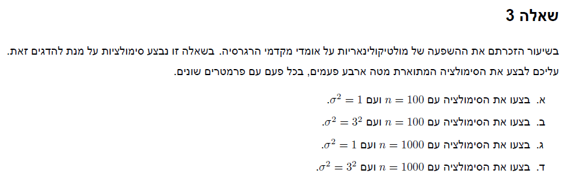

```{r setup, include=FALSE}
knitr::opts_chunk$set(echo = TRUE)
```

# Q1


## a


$$
\bar Y \sim N(\mu_{\bar Y},\sigma_{\bar Y}^2)\ \textrm{ as a sum of normally distributed random variables}
\\
E(\bar Y) = E[\frac{1}{N}\sum_i\sum_j\sum_k (\mu + \alpha_i + \beta_j +\varepsilon_{ijk})] = \mu + \frac{1}{J}\sum_j\beta_j
\\
V(\bar Y) = \frac{1}{N^2}V[\sum_i\sum_j\sum_k (\mu + \alpha_i + \beta_j +\varepsilon_{ijk})] = \frac{1}{N^2}V[\sum_i\sum_j\sum_k (\alpha_i +\varepsilon_{ijk})] = \frac{1}{N^2}[V(\sum_i\sum_j\sum_k \alpha_i) + V(\sum_i\sum_j\sum_k\varepsilon_{ijk})]=
\\
=\frac{1}{N^2} [n^2J^2\sum_i V(\alpha_i) + N\sigma_{\varepsilon}^2] = 
\\
\frac{1}{N^2}[NnJ\sigma_\alpha^2 + N\sigma_{\varepsilon}^2] = \frac{\sigma_{\varepsilon}^2 + nJ\sigma_\alpha^2}{N}\\
\textrm{thus we get } \bar Y \sim N(\mu + \frac{1}{J}\sum_j\beta_j,\frac{\sigma_{\varepsilon}^2 + nJ\sigma_\alpha^2}{N})
$$


## b


$$
\bar Y_{i..} \sim N(\mu_{\bar Y_{i..}},\sigma_{\bar Y_{i..}}^2)\ \textrm{ as a sum of normally distributed random variables}
\\
E(\bar Y_{i..}) = E[\frac{1}{nJ}\sum_j\sum_k (\mu + \alpha_i + \beta_j +\varepsilon_{ijk})] = \mu + \frac{1}{J}\sum_j\beta_j
\\
V(\bar Y_{i..}) = V[\frac{1}{nJ}\sum_j\sum_k (\mu + \alpha_i + \beta_j +\varepsilon_{ijk})] = V[\frac{1}{n^2J^2}\sum_j\sum_k (\alpha_i+\varepsilon_{ijk})] = \frac{\sigma_\alpha^2 + \sigma_\varepsilon^2}{nJ}
\\
\textrm{thus we get } \bar Y_{i..} \sim N(\mu + \frac{1}{J}\sum_j\beta_j,\frac{\sigma_\alpha^2 + \sigma_\varepsilon^2}{nJ})
$$


## c


$$
\bar Y_{.j.} \sim N(\mu_{\bar Y_{.j.}},\sigma_{\bar Y_{.j.}}^2)\ \textrm{ as a sum of normally distributed random variables}
\\
E(\bar Y_{.j.}) = E[\frac{1}{nI}\sum_i\sum_k (\mu + \alpha_i + \beta_j +\varepsilon_{ijk})] = \mu + \beta_j
\\
V(\bar Y_{.j.}) = V[\frac{1}{nI}\sum_i\sum_k (\mu + \alpha_i + \beta_j +\varepsilon_{ijk})] = \frac{1}{n^2I^2}V[\sum_i\sum_k (\alpha_i +\varepsilon_{ijk})] = \frac{\sigma_\varepsilon^2}{nI} + \frac{V(\sum_i\alpha_i)}{I^2} = \frac{\sigma_\varepsilon^2}{nI} + \frac{\sigma_\alpha^2}{I}
\\
\textrm{thus we get } \bar Y_{.j.} \sim N(\mu + \beta_j,\frac{\sigma_\varepsilon^2}{nI} + \frac{\sigma_\alpha^2}{I})
$$


# Q2


$$
V(Y_{ij}) = \sigma_\varepsilon^2 + \sigma_b^2
\\
corr(Y_{ij},Y_{ij'}) = \frac{Cov(Y_{ij},Y_{ij'})}{\sqrt{\sigma_\varepsilon^2 + \sigma_b^2}\sqrt{\sigma_\varepsilon^2 + \sigma_b^2}}
\\
Cov(Y_{ij},Y_{ij'}) = Cov(\beta_0+b_{0i} + x^T_{ij}\beta + \varepsilon_{ij},\beta_0+b_{0i} + x^T_{ij'}\beta + \varepsilon_{ij'}) = Cov(b_{0i}+\varepsilon_{ij},b_{0i} + \varepsilon_{ij'}) = Cov(b_{0i}+\varepsilon_{ij},b_{0i}) + Cov(b_{0i}+\varepsilon_{ij},\varepsilon_{ij'}) = 
\\
= Cov(b_{0i}+\varepsilon_{ij},b_{0i}) = V(b_{0i}) = \sigma_b^2 \Rightarrow corr(Y_{ij},Y_{ij'}) =  \frac{\sigma_b^2}{\sigma_\varepsilon^2 + \sigma_b^2}
$$


# Q3




```{r message=TRUE, warning=TRUE}
#imports
library(tidyverse)
library(glue)
library(patchwork)
library(lme4)
library(lmerTest)
```

## a-d

```{r}
N <-  1000
simulation <- function(n,sigma){
  beta1 <- c()
  beta2 <- c()
  for (i in 1:N){
    x1 <- rnorm(n)
    x2 <- x1 + rnorm(n,0,sigma^2)
    y <- x1+x2+rnorm(n)
    lm_model <- lm(y~x1+x2)
    beta1[i] <- lm_model$coefficients[2]
    beta2[i] <- lm_model$coefficients[3]
  }
  tbl <- tibble(beta1 = beta1, beta2 = beta2)
  summary_tbl <- tbl%>%
    summarise("mean beta1" = mean(beta1),
              "mean beta2" = mean(beta2),
              "sd beta1" = sd(beta1),
              "sd beta2" = sd(beta2),
              "cor beta1,beta2" = cor(beta1,beta2))
  plt <- tbl %>%
    ggplot(aes(y=beta2,x=beta1)) +
    geom_point()+
    geom_smooth(method='lm', formula= y~x,se=F)+
    ggtitle(glue("n = {n}, sigma = {sigma}"))
  return(list(summary_tbl,plt))
}
s1 <- simulation(100,1)
s2 <- simulation(100,3)
s3 <- simulation(1000,1)
s4 <- simulation(1000,3)
bind_rows(s1[[1]],s2[[1]],s3[[1]],s4[[1]]) %>%
  mutate(n = c(100,100,1000,1000), sd = c(1,3,1,3))
(s1[[2]] + s2[[2]])
(s3[[2]] + s4[[2]])
```

## e

### for changing n 

*we can see: the means,correlation and plots didn't change much but the beta_sd decreased dramatically*

*this is due to the fact that the correlation depends on the sd, the mean becomes closer to the expected value, and the plots don't change because the distribution is the same. beta_sd changes because as n increases beta_sd decreases*


### for changing the sd 

*we can see: the means didn't change much but the correlation and beta_sd decreased dramatically and the plots changed*

*the mean does not change because the sd does not effect the expected value*

*beta_sd changes because we can better estimate it without correlation between x1,x2*

*correlation changes because beta_2 has much more weight in the formula as it increases the correlation decreases*

*plots changes because the correlation changes*

# Q4


## a

*the proper analysis would be a mixed model because each participant has it's own variance and we expect a fixed effect for gender*

```{r}
feed_back <- read.csv("feedback_df_bi.csv") %>%
  select(id,performance,feedback,gender) %>%
  mutate(across(c(gender,feedback),as.factor))
model1 <- lmerTest::lmer(performance ~ gender + (1|id) , data = feed_back)
summary(model1)
mu <- 92.121
sigma_a <- 84.59
sigma_e <- 131.28
glue("the estimators are:
     mu = {mu}
     sigma alpha = {sigma_a}
     sigma epsilon = {sigma_e}")
confint(lme4::lmer(performance ~ gender + (1|id) , data = feed_back))
```

*we do not reject the null with  pvlaue of 0.793 therefor we conclude that gender has no contribution (which makes sense beacuse results are normalized based on participant)*

## b

```{r}
model2 <- lmerTest::lmer(performance ~ feedback + (1|id) , data = feed_back)
summary(model2)
mu <- 95.7
sigma_a <- 80.92
sigma_e <- 122.87
glue("the estimators are:
     mu = {mu}
     sigma alpha = {sigma_a}
     sigma epsilon = {sigma_e}")
confint(lme4::lmer(performance ~ feedback + (1|id) , data = feed_back))
```

*we can see that feedback has a pv <0.05 therefore we can reject the null at 95% confidence and conclude that feedback has an effect on performance*

## c


```{r}
model3 <- lmerTest::lmer(performance ~ feedback+ gender + (1|id) , data = feed_back)
summary(model3)
mu <- 96.24
sigma_a <- 84.82
sigma_e <- 122.87
glue("the estimators are:
     mu = {mu}
     sigma alpha = {sigma_a}
     sigma epsilon = {sigma_e}")
confint(lme4::lmer(performance ~ feedback+ gender + (1|id) , data = feed_back))
```

*the same results as before...*

## d


```{r}
model4 <- lmerTest::lmer(performance ~ feedback+ gender+ gender*feedback + (1|id) , data = feed_back)
summary(model4)
mu <- 98.849
sigma_a <- 84.91
sigma_e <- 119.63
glue("the estimators are:
     mu = {mu}
     sigma alpha = {sigma_a}
     sigma epsilon = {sigma_e}")
confint(lme4::lmer(performance ~ feedback+ gender + gender*feedback+ (1|id) , data = feed_back))
```

*same results for feedback+ gender but we can see that the interaction also effects the performance*

## e

*we can see that the parameters have not changed much*

*also the ICC stayed the same*

*the ci's for the coefficients corresponding to gender,feedback and their interaction has changed, this happens because when we add variables to the model we change the spanned space there for the projection is different leading to different coefficients*

*i would prefer to use the last model, this is due to the fact that the interaction is significant and when we have an interaction in the model we should keep all interacting variables (models A)*


