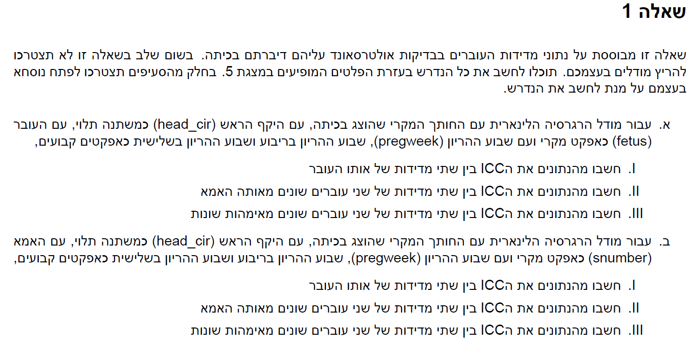

```{r setup, include=FALSE}
knitr::opts_chunk$set(echo = TRUE)
```

# Q1




## a

$$
1. \ \rho = \frac{\sigma_a^2}{\sigma_a^2 + \sigma_\varepsilon^2} = \frac{61.39}{61.39+44.33}=0.58
\\ 
2. \ \rho = cov(Y_{kij},Y_{ki'j'}) = 0 \quad(i \ne i')
\\ 
3. \ \rho = cov(Y_{kij},Y_{k'i'j'}) = 0 \quad(k \ne k')
$$

## b

$$
1. \ \rho = \frac{\sigma_a^2}{\sigma_a^2 + \sigma_\varepsilon^2} = \frac{44.69}{44.69+61.96}=0.419
\\ 
2. \ \rho = \frac{\sigma_a^2}{\sigma_a^2 + \sigma_\varepsilon^2} = \frac{44.69}{44.69+61.96}=0.419
\\ 
3. \ \rho = cov(Y_{kij},Y_{k'i'j'}) = 0 \quad(k \ne k')
$$

## c

$$
1. \ \rho = \frac{\sigma_a^2+sigma_b^2}{\sigma_a^2+sigma_b^2 + \sigma_\varepsilon^2} = \frac{37.59+23.54}{37.59+23.54+44.42}=0.579
\\ 
2. \ \rho = \frac{\sigma_b^2}{\sigma_a^2+sigma_b^2 + \sigma_\varepsilon^2} = \frac{23.54}{7.59+23.54+44.42}=0.223
\\ 
3. \ \rho = cov(Y_{kij},Y_{k'i'j'}) = 0 \quad(k \ne k')
$$

## d

המודל הראשון מניח כי השונות היא עבור העוברים

המודל השני מניח כי השונות נובעות מהאמהות

והמודל השלישי מניח כי עבור כל עובר וכל אמא יש שונות אחרת

התוצאות לא כלכך מסתדרות שכן זה מוזר שהשונות עבור המודל הראשון גדולה מזאת של המודל השלישי.

# Q2


## a

```{r message=FALSE, warning=FALSE}
library(tidyverse)
library(lme4)
library(glue)
data("sleepstudy")
```

**1**

```{r}
model_1 <- lmer(Reaction ~ (1|Subject) + Days,data = sleepstudy)
confint(model_1)
```

אפס לא נמצא ברווח סמך ברמת סמך של 95% לכן ניתן לדחות את השערת ה0 עבור אלפא של 0.05

**2**

מודל זה שקול למודל ניתוח שונות די כיווני עם אפקטים מעורבים

## b

**1**

```{r}
model_2 <- lmer(Reaction ~ (1+Days|Subject) + Days,data = sleepstudy)
summary(model_2)
confint(model_2)
```

ניתן לראות כי השיפוע המקרי אינו מובהק שכן אם ניקח רווח סמך עם סטיית התקן 5.922 נקבל כי 0 ברווח סמך

**2**

המודלים אינם שקולים שכן מודל זה מתאים שיפוע אחר עבור כל נבדק ואילו מודל ניתוח שונות דו כיווני עם אפקטים מעורבים לא עושה זאת

**3**

```{r}
glue("for {round(1- pnorm(0,10.467,5.922),3)*100} %")
```

**4**

מהפלט של סעיף 1 ניתן לראות כי האומדן הינו 0.07

וכן רווח הסמך הינו:

(-0.4815,0.6849)

אנו לומדים מזה כי אין מובהקות לכך שיש קורצליה בין החותך המקרי לשיפוע המקרי

**5**

$$
\textrm{Level 1: }
\\
Reaction_{ij} = \beta_{0i} + \beta_{1i}Days_{ij} + \varepsilon_{ij}
\\
\textrm{Where:}
\\
Rreaction_{ij} - \textrm{average reaction time of subject i after day j}
\\
Days_{ij} - \textrm{Day j for subject i}
\\
\beta_{0i} - \textrm{intercept of subject i}
\\
\beta_{1i} - \textrm{slope of subject i}
\\
\varepsilon_{ij} - \textrm{resitual of subject i at day j} \sim N(0,\sigma_\varepsilon^2)
$$

$$
\textrm{Level 2: }
\\
\beta_{0i} = \beta_0 + b_{0i}
\\
\beta_{1i} = \beta_1 + b_{1i}
\\
\textrm{Where:}
\\
\beta_0 - \textrm{general intercept}
\\
b_{0i} - \textrm{addition to intercept for subject i} \sim N(0,\sigma_{0b}^2)
\\
\beta_1 - \textrm{general slope}
\\
b_{1i} - \textrm{addition to slope for subject i} \sim N(0,\sigma_{1b}^2)
$$


