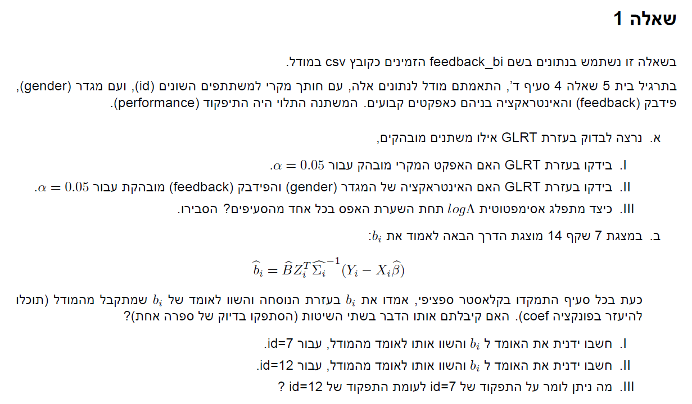
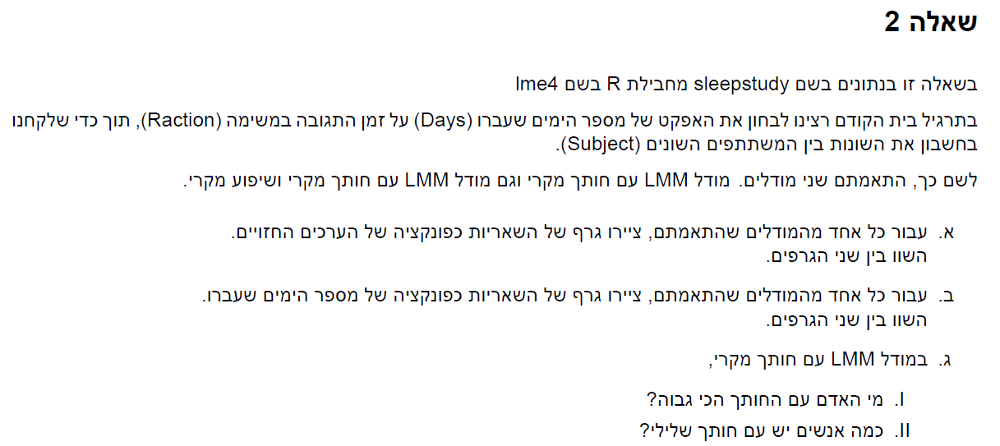
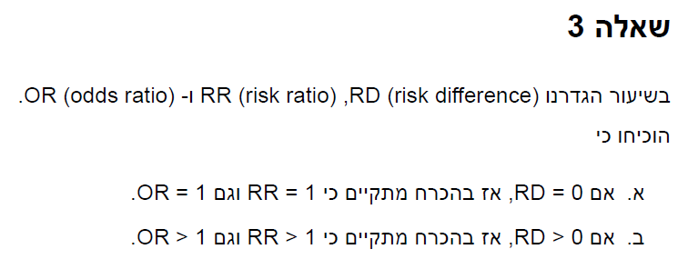
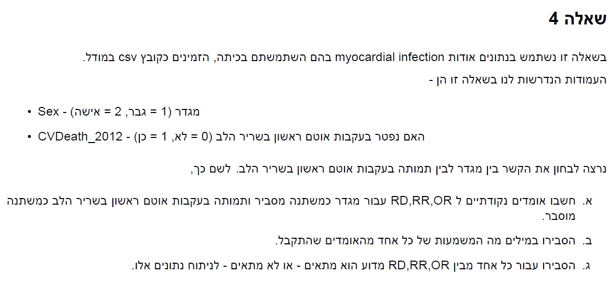

```{r setup, include=FALSE}
knitr::opts_chunk$set(echo = TRUE)
```

```{r}
# imports
library(tidyverse)
library(glue)
library(lmerTest)
library(lme4)
```


# Q1



## a

```{r}
feed_back <- read.csv("feedback_df_bi.csv") %>%
  select(id,performance,feedback,gender) %>%
  mutate(across(c(gender,feedback),as.factor))
#full model
model <- lmer(performance ~ feedback+ gender+ gender*feedback + (1|id) , data = feed_back)
#no random effect model
model_no_ra <- lm(performance ~ feedback+ gender+ gender*feedback , data = feed_back)
anova(model,model_no_ra)
glue("alpha < 0.05 therefore we can reject the GLRT null and conclude that the random effect is significant")

# no interaction model
model_no_inter <- lmer(performance ~ feedback+ gender+ (1|id) , data = feed_back)
anova(model,model_no_inter)
glue("alpha < 0.05 therefore we can reject the GLRT null and conclude that the interaction is significant")
```

$$
-2log\Lambda \overset D \rightarrow \chi^2_k \ \textrm{where k = difference in the degrees of freedom}
\\
\textrm{for the random effect test the difference in the degrees of freedom is the number of participantes (22) thus:}
\\
log\Lambda \overset D \rightarrow \frac{-\chi^2_{22}}{2}
\\
\textrm{for the interaction test the difference in the degrees of freedom is 1 thus:}
\\
log\Lambda \overset D \rightarrow \frac{-\chi^2_{1}}{2}
$$


## b

```{r}
model_summary = summary(model)
#model intercept
inter <- 98.849 #from summary
#B
var_id <- 84.91 #from summary
B <-  as.matrix(var_id)
#relevant obervations
obs7 <- feed_back$id == 7
obs12 <- feed_back$id == 12
#Z
z7 <- rep(1,36)
z12 <- rep(1,36)
#res
res7 <- feed_back$performance[obs7] - model.matrix(model)[obs7,]%*%model_summary$coefficients[,1]
res12 <- feed_back$performance[obs12] - model.matrix(model)[obs12,]%*%model_summary$coefficients[,1]
var_res <- 119.63 #from summary
#sigma
sigma7 <- z7%*%B%*%t(z7) + var_res*diag(36)
sigma12 <- z12%*%B%*%t(z12) + var_res*diag(36)

b7 <- B*t(z7)%*%solve(sigma7)%*%(res7) + inter
b12 <- B*t(z12)%*%solve(sigma12)%*%(res12) + inter

#check if distance between estimates is less than 0.01
coef(model)$id[c(7,12),1] -c(b7,b12) <0.01
```

*we can see that the performance of subject 7 is better (by 15 units) than subject 12*

# Q2




## a

```{r}
data("sleepstudy")
model_1 <- lmer(Reaction ~ (1|Subject) + Days,data = sleepstudy)
model_2 <- lmer(Reaction ~ (1+Days|Subject) + Days,data = sleepstudy)
plot(model_1)
plot(model_2)
```

*it looks like the 2nd graph better fits the data, the dots are spreaded quite even across the line, on the other hand in the first model we can see *
*that the the residuals has a cubic form suggesting the model does not fit the data well and might need a transformation*

## b

```{r}
sleepstudy_days <- sleepstudy$Days
m1_res <- summary(model_1)$residuals
m2_res <- summary(model_2)$residuals
par(mfrow = c(1,2))
plot(sleepstudy_days,m1_res, main = "model 1")
plot(sleepstudy_days,m2_res, main = "model 2")
```

*model 2 has less variability than model 1*

## c

```{r}
b_estimates1 <- coef(model_1)$Subject[,1] -251.41 #intercept from model summary
largest_subj1 <- which.max(b_estimates1)
neg_inter1 <- sum(b_estimates1<0)
neg_precent1 <- neg_inter1/length(b_estimates1)
glue("subject {largest_subj1} has the largest intercept, there are {neg_inter1} ({round(neg_precent1,2)*100}%) subject with negetive intercept for model 1")
```


## d

```{r}
b_estimates2 <- coef(model_2)$Subject[,1] -251.41#intercept from model summary
n <-  length(b_estimates2)
largest_subj2 <- which.max(b_estimates2)
lower_inter <- b_estimates2<0
neg_inter2 <- sum(lower_inter)
neg_precent2 <- neg_inter2/n
slope_estimates <- coef(model_2)$Subject[,2]
largest_slope <- which.max(slope_estimates)
faster_react <- slope_estimates > 0
neg_inetr_pos_slope <- sum(lower_inter * faster_react)
pos_inetr_neg_slope <- sum((1-lower_inter) * (1-faster_react))
glue("subject {largest_subj2} has the largest intercept,
     there are {neg_inter2} ({round(neg_precent2,2)*100}%) subject with negative intercept,
     subject {largest_slope} has the largest slope,
     there are {sum(faster_react)} subject that show an increacment in reaction time,
     there are {sum(neg_inetr_pos_slope)} subjects with negative intercept and positive slope,
     there are {pos_inetr_neg_slope} subjects with positive intercept and negative slope,
     for model 2")
```

*there is no really negative intercepts i assumed that be negative intercepts you meant in comparison to the population*

# Q3



## a

$$
Rd = Pr(Y=1|X=1) - Pr(Y=1|X=0)
\\
Rd =0 \iff Pr(Y=1|X=1) = Pr(Y=1|X=0) \iff RR = \frac{Pr(Y=1|X=1)}{Pr(Y=1|X=0)} = 1
\\
OR = \frac{\frac{Pr(Y=1|X=1)}{Pr(Y=0|X=1)}}{\frac{Pr(Y=1|X=0)}{Pr(Y=0|X=0)}} = \frac{Pr(Y=1|X=1)Pr(Y=0|X=0)}{Pr(Y=0|X=1)Pr(Y=0|X=1)} = RR*\frac{Pr(Y=0|X=0)}{Pr(Y=0|X=1)}
\\
\frac{Pr(Y=0|X=0)}{Pr(Y=0|X=1)} = \frac{1-Pr(Y=1|X=0)}{1-Pr(Y=1|X=1)} 
\\
Rd = 0 \iff RR\frac{1-Pr(Y=1|X=0)}{1-Pr(Y=1|X=1)} = RR\frac{1-Pr(Y=1|X=1)}{1-Pr(Y=1|X=1)} \iff OR =1
$$

## b

$$
Rd = Pr(Y=1|X=1) - Pr(Y=1|X=0)
\\
Rd > 0 \iff Pr(Y=1|X=1) > Pr(Y=1|X=0) \iff RR = \frac{Pr(Y=1|X=1)}{Pr(Y=1|X=0)} > 1
\\
OR = \frac{\frac{Pr(Y=1|X=1)}{Pr(Y=0|X=1)}}{\frac{Pr(Y=1|X=0)}{Pr(Y=0|X=0)}} = \frac{Pr(Y=1|X=1)Pr(Y=0|X=0)}{Pr(Y=0|X=1)Pr(Y=0|X=1)} = RR*\frac{Pr(Y=0|X=0)}{Pr(Y=0|X=1)}
\\
Rd > 0 \iff RR\frac{1-Pr(Y=1|X=0)}{1-Pr(Y=1|X=1)} > \frac{1-Pr(Y=1|X=1)}{1-Pr(Y=1|X=1)} \iff OR  > 1
$$

# Q4



## a

```{r}
MI <- read.csv("MI_PracticeDataset.csv") %>%
  dplyr::select(Sex,CVDeath_2012)
pr_death_man <-  mean(MI[MI$Sex==1,]$CVDeath_2012)
pr_death_woman <-  mean(MI[MI$Sex==2,]$CVDeath_2012)
RD <- pr_death_man - pr_death_woman
RR <- pr_death_man/pr_death_woman
OR <- (pr_death_man/(1-pr_death_man))/(pr_death_woman/(1-pr_death_woman))
glue("RD:{RD}
     RR:{RR}
     OR:{OR}")
```


## b

*the RD estimates suggests that a man has 7% lower chance of dying from myocardial infection*

*the RR estimates suggests that a man chance of dying from myocardial infection is 72.5% of the chance woman has*

*the OR estimates suggests that a man chance of dying from myocardial infection compared to not getting an infection is 66% of the chance woman has*

## c

*RD is good to use because it tells us that man has 7% less chance of dying from myocardial infection*

*RR by its own does not give us much information it tells us that a man chance of dying from myocardial infection is 72.5% of the chance woman has, but if woman chance is low then this does not provide us important information*

*OR is good to use because it tell us that man are less prone to dying from myocardial infection*
