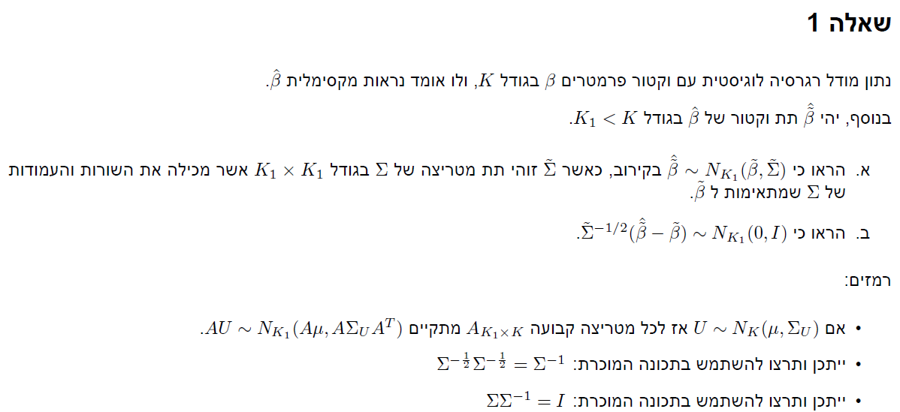
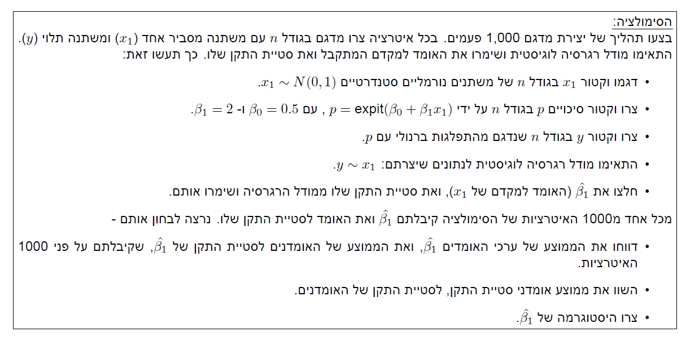
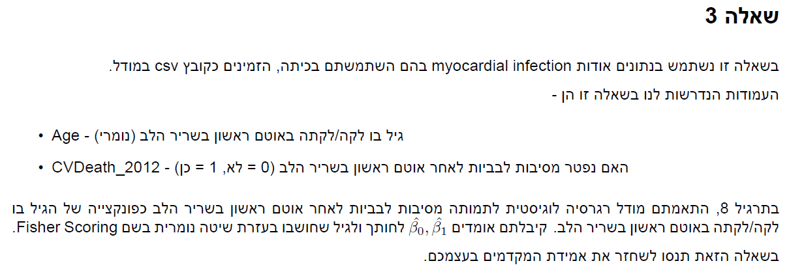
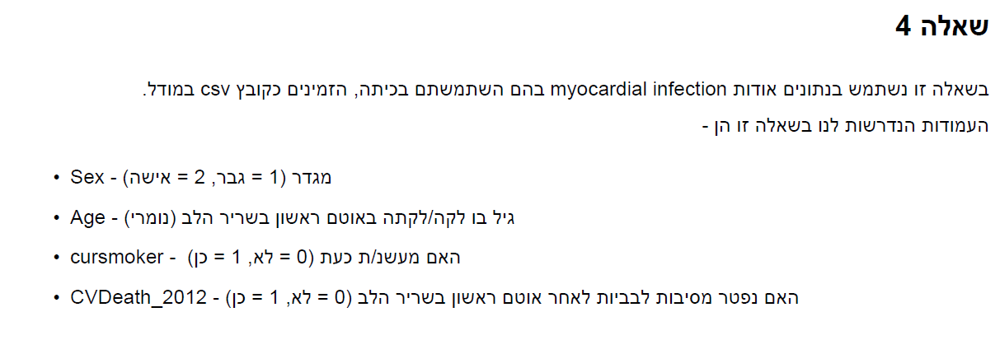

```{r setup, include=FALSE}
knitr::opts_chunk$set(echo = TRUE)
```

```{r message=FALSE, warning=FALSE}
# imports
library(tidyverse)
library(glue)
library(tidymodels)
```

# Q1



## a

$$
\textrm{w.l.o.g assume } \tilde{\beta} = \beta_{1:K_1}
\\
\textrm{thus we get: } E(\hat{\tilde{\beta}}) = E(\hat\beta_{1:K_1}) = \beta_{1:K_1} =  \tilde{\beta}
\\
\tilde{\Sigma}_{ij} = Cov(\hat{\tilde{\beta_i}},\hat{\tilde{\beta_j}}) = Cov(\hat{{\beta_i}},\hat{{\beta_j}}) = \Sigma_{ij}
\\
\textrm{thus } \tilde{\Sigma} \textrm{ is a sub matrix of } \Sigma \textrm{ with rows and columns of } \Sigma \textrm{ corrosponing to } \tilde{\beta}
$$

## b

$$
\hat{\tilde{\beta}} \sim N(\tilde{\beta},\tilde{\Sigma})
\\
\textrm{ from linearity of expected value we get: } \hat{\tilde{\beta}} -\tilde{\beta} \sim N(0,\tilde{\Sigma})
\\
\textrm{from the properties of variance and matrix multiplications we get: }
V(\tilde{\Sigma}^{-1/2} (\hat{\tilde{\beta}} -\tilde{\beta})) = \tilde{\Sigma}^{-1/2} \tilde{\Sigma} (\tilde{\Sigma}^{-1/2})^t = \tilde{\Sigma}^{-1/2} \tilde{\Sigma} \tilde{\Sigma}^{-1/2} = I
\\
\textrm{thus } \tilde{\Sigma}^{-1/2} (\hat{\tilde{\beta}} -\tilde{\beta}) \sim N(0,I)
$$

# Q2




```{r}
expit <- function(p){exp(p)/(1+exp(p))}

sim <- function(n){
  beta_hats = c()
  beta_stds = c()
  for (i in 1:1000){
    x1 <- rnorm(n)
    p <- expit(0.5 + 2*x1)
    y <- rbinom(n,1,p)
    model<- glm(y~x1,family = "binomial")
    coef_mat <- tidy(model)
    beta_hat <- coef_mat$estimate[2]
    beta_std <- coef_mat$std.error[2]
    beta_hats[i] <- beta_hat
    beta_stds[i] <- beta_std
  }
  sigma = sqrt(solve(t(x1)%*%diag((p*(1-p)))%*%x1)[1,1])
  
  return(list(beta_hats,beta_std,sigma))
}

for (n in c(100,1000,10000)){
  res <- sim(n)
  print(glue("the mean for beta for {n} observations is: {mean(res[[1]])}
       the mean for beta std for {n} observations is: {mean(res[[2]])}
       the real std is: {res[[3]]}"))
  
  print(tibble(beta_hat = res[[1]]) %>%
    ggplot(aes(x = beta_hat))+
    geom_histogram()+
    geom_vline(xintercept =  mean(res[[1]]),color = "blue"))
}
```


*we can see that the average, std and histograms change with different n values, as n increases *

$$
\textrm{we can see that the average, std and histograms change with different n values, as n increases } mean(\hat{\beta_1}) \textrm{ get closer to 2}
\\
\textrm{also the real sigma decreaces, and the estimated sigma as well, the histograms look more symetric around the real mean and look rather normal}
\\
\textrm{the fact that } \hat{\beta_1} \textrm{ is a consistent estimator is seen in the simultaion, as n increaces } \bar{\hat{\beta_1}} \textrm{ gets close to 2}
$$

# Q3




## a

$$
\textrm{there is no closed form for the MLE therefore we need to find the maximum numericlly}
$$

## b

```{r}
MI <- read.csv("MI_PracticeDataset.csv") %>%
  select(Age,CVDeath_2012)

ML_logistic <- function(beta_0,beta_1){
  p <-  expit(beta_0 + beta_1 * MI$Age)
  y <- MI$CVDeath_2012
  log_lik <- as.numeric(t(y)%*%log(p) + t(1-y)%*%log(1-p))
  return(log_lik)
}
```


## c

```{r}
beta_0_canidates <- seq(-5,5,length.out=100)
beta_1_canidates <- seq(-5,5,length.out=100)
search_grid <- expand.grid(beta_0 = beta_0_canidates,beta_1 = beta_1_canidates)
glue("best values in grid are:")
val_100 <- search_grid[which.max(map2_dbl(search_grid$beta_0,search_grid$beta_1,ML_logistic)),]
val_100
```

## d

```{r}
beta_0_canidates <- seq(-5,5,length.out=500)
beta_1_canidates <- seq(-5,5,length.out=500)
search_grid <- expand.grid(beta_0 = beta_0_canidates,beta_1 = beta_1_canidates)
glue("best values in grid are:")
val_500 <- search_grid[which.max(map2_dbl(search_grid$beta_0,search_grid$beta_1,ML_logistic)),]
val_500
```

## e

```{r}
model_c <- glm(CVDeath_2012~Age,data = MI,family = "binomial")
coef_mat_c <- tidy(model_c)
beta_c <- coef_mat_c$estimate
out_mat <- cbind(c("simulation 100","simulation 500","glm"),rbind(val_100,val_500,beta_c))
colnames(out_mat) <- c("method","b0","b1")
rownames(out_mat) <- 1:3
out_mat
```

*values are rather close*

# Q4




## a

```{r}
MI <- read.csv("MI_PracticeDataset.csv") %>%
  select(cursmoker,Sex,Age,CVDeath_2012) %>%
  mutate(across(c(cursmoker,Sex,CVDeath_2012),factor))
y = MI$CVDeath_2012
model <- glm(CVDeath_2012~cursmoker + Sex+Sex*cursmoker,data = MI,family = "binomial")
summary(model)
```

*sex has a large impact on the model but cursmoker and the interaction is not significant*

```{r}
person_res <- residuals(model, type = "pearson")

tibble(y = y,person_res = person_res)%>%
  ggplot(aes(x = y,y = person_res))+
    geom_point()
```

*we can learn that given y=1 the variance of pearson residuals is larger then y =0*

```{r}
deviance_res <- residuals(model, type = "deviance")

tibble(y = y,deviance_res = deviance_res)%>%
  ggplot(aes(x = y,y = deviance_res))+
    geom_point()
```

*we can learn that given y=1 the variance of deviance residuals is the same as y =0*

```{r}
coef_mat <- tidy(model)
beta <- coef_mat$estimate
diff_vec <- c(1,0,0,0) - c(1,1,1,1)
pe <- beta%*% diff_vec
OR <- as.numeric(exp(pe))
v_or <- as.numeric(sqrt(diff_vec %*% vcov(model) %*% diff_vec))

glue("the OR estimate is: {round(OR,3)}
     and the CI is ({round(exp(pe -  qnorm(0.975)*v_or),3)},{round(exp(pe +qnorm(0.975)*v_or),3)})")

```


## b

```{r}
model_b <- glm(CVDeath_2012~cursmoker + Age+cursmoker*Age,data = MI,family = "binomial")
summary(model_b)
```

*age has a large impact on the model but cursmoker and the interaction is not significant*

```{r}
person_res <- residuals(model_b, type = "pearson")

tibble(y = y,person_res = person_res)%>%
  ggplot(aes(x = y,y = person_res))+
    geom_point()
```

*we can learn that given y=1 the variance of pearson residuals is larger then y =0*

```{r}
deviance_res <- residuals(model_b, type = "deviance")

tibble(y = y,deviance_res = deviance_res)%>%
  ggplot(aes(x = y,y = deviance_res))+
    geom_point()
```

*we can learn that given y=1 the variance of deviance residuals is the same as y =0*


```{r}
coef_mat <- tidy(model_b)
beta <- coef_mat$estimate
diff_vec <- c(1,0,50,0) - c(1,1,50,50)
pe <- beta%*% diff_vec
OR <- as.numeric(exp(pe))
v_or <- as.numeric(sqrt(diff_vec %*% vcov(model_b) %*% diff_vec))

glue("the OR for a 50 year old person who doesnt smoke or smoke estimate is: {round(OR,3)}
     and the CI is ({round(exp(pe -  qnorm(0.975)*v_or),3)},{round(exp(pe +qnorm(0.975)*v_or),3)})")

```

```{r}
coef_mat <- tidy(model_b)
beta <- coef_mat$estimate
diff_vec <- c(1,0,50,0) - c(1,1,57,57)
pe <- beta%*% diff_vec
OR <- as.numeric(exp(pe))
v_or <- as.numeric(sqrt(diff_vec %*% vcov(model_b) %*% diff_vec))

glue("the OR for a 50 year old person who doesnt smoke and a 57 year old person who smokes estimate is: {round(OR,3)}
     and the CI is ({round(exp(pe -  qnorm(0.975)*v_or),3)},{round(exp(pe +qnorm(0.975)*v_or),3)})")

```
