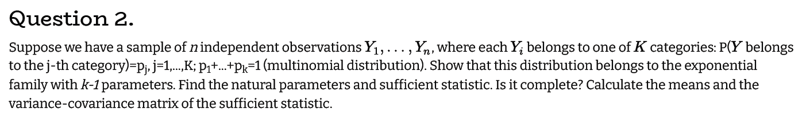
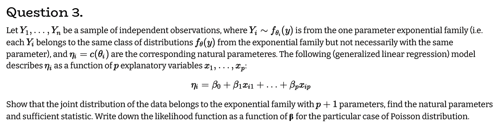
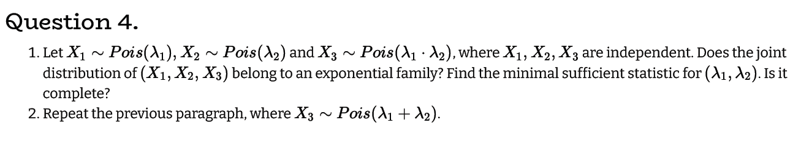

# Q1

$$
\textrm{let } Y \sim Pois(\lambda)
\\
L(y,\lambda) = \Pi_{i=1}^n \frac{\lambda^{y_i}e^{-\lambda}}{y_i!} = \frac{\lambda^{\sum_{i=1}^ny_i}e^{-n \lambda}}{\Pi_{i=1}^n y_i!}
\\
\textrm{let: } h(y) := \frac{1}{\Pi_{i=1}^n y_i!},\quad  g(\lambda, \sum_{i=1}^ny_i) = \lambda^{\sum_{i=1}^ny_i}e^{-n \lambda}
\\
\textrm{from the factorization therom we can conlude that } \sum_{i=1}^ny_i \textrm{ is a sufficent statistic.}
\\
\textrm{ (1) let us prove that } \sum_{i=1}^ny_i \sim Pois(n \lambda)
\\
\textrm{let X,Y be two poisson random variable with } \lambda_x, \lambda_y \textrm{ respectivly, and let us show } X+Y \sim Pois(\lambda_x + \lambda_y)
\\
P(X+Y=k) = \sum_{i=0}^k P(X=i)P(Y=k-i) = \sum_{i=0}^k\frac{\lambda_x^ie^{-\lambda_x}}{i!}\frac{\lambda_y^{(k-i)}e^{-\lambda_y}}{(k-i)!} = e^{-(\lambda_x+\lambda_y)}
\sum_{i=0}^k\frac{\lambda_x^i\lambda_y^{k-i}}{(k-i)!i!} = \frac{e^{-(\lambda_x+\lambda_y)}}{k!} \sum_{i=0}^k\frac{\lambda_x^i \lambda_y^{k-i}k!}{(k-i)!i!} = 
\\
=\frac{e^{-(\lambda_x+\lambda_y)}}{k!} \sum_{i=0}^k\frac{(\lambda_x^i \lambda_y^{k-i})k!}{(k-i)!i!} = \frac{e^{-(\lambda_x+\lambda_y)}}{k!} \sum_{i=0}^k\lambda_x^i \lambda_y^{k-i}{n\choose k} = \frac{e^{-(\lambda_x+\lambda_y)}}{k!}(\lambda_x+\lambda_y)^k
\\
\textrm{from the proof above and with induction we get (1)}
\\
\textrm{lets show its minimality: }
\\
\frac{L(y_1,\lambda)}{L(y_2,\lambda)} = \frac{\frac{\lambda^{\sum_{i=1}^ny_{1i}}e^{-n \lambda}}{\Pi_{i=1}^n y_{1i}!}}{\frac{\lambda^{\sum_{i=1}^ny_{2i}}e^{-n \lambda}}{\Pi_{i=1}^n y_{2i}!}} = \frac{\Pi_{i=1}^n y_{2i}!}{\Pi_{i=1}^n y_{1i}!}\lambda^{\sum_{i=1}^ny_{1i} - \sum_{i=1}^ny_{2i}}
\\
\textrm{the liklhidood ratio is independed of } \lambda \textrm{ if} \sum_{i=1}^ny_{1i} = \sum_{i=1}^ny_{2i} \Rightarrow \sum_{i=1}^ny_{i} \textrm{ is a minial sufficient statistic}
\\
\textrm{lastly lets show completness: }
\\
E(g(\sum_{i=1}^ny_{i})) = \sum_{i=0}^{\infty} P(\sum_{i=1}^ny_{i} =k)g(k) = \sum_{i=0}^{\infty}\frac{\lambda^{k}e^{-\lambda}}{k!}g(k) = 0 \iff g(k) = 0 \textrm{ thus } \sum_{i=1}^ny_{i} \textrm{ is complete} 
$$

# Q2

$$
L(y,p) = \Pi_{i=1}^kp_i^{\sum_{l=1}^n{I(y_l = i)}} = \frac{n!}{\Pi_{i=1}^k\sum_{l=1}^n{I(y_l = i)}}(1-\sum_{m=1}^{k-1}p_m)^{n-\sum_{j=1}^nI(y_i<k)} \Pi_{i=1}^{k-1}p_i^{\sum_{l=1}^n{I(y_l = i)}}
\\
\textrm{denote } \frac{n!}{\Pi_{i=1}^k\sum_{l=1}^n{I(y_l = i)}} =: e^{d(y)}
\\
loglik(y,p) = d(y) +(n-\sum_{j=1}^nI(y_i<k)) ln(1-\sum_{m=1}^{k-1}p_m) + \sum_{i=1}^{k-1}[ln(p_i){\sum_{l=1}^n{I(y_l = i)}}] =
\\
=d(y)+ nln(1-\sum_{m=1}^{k-1}p_m)+\sum_{i=1}^{k-1}[ln\left(\frac{p_i}{1-\sum_{m=1}^{k-1}p_m}\right){\sum_{l=1}^n{I(y_l = i)}}]
\\
\textrm{ denote: } T_j(y) = \sum_{l=1}^n{I(y_l = j)} \quad \forall i<k, \quad C_j(p) = ln\left(\frac{p_j}{1-\sum_{m=1}^{k-1}p_m}\right) \quad \forall i<k
\quad S(p) = nln(1-\sum_{m=1}^{k-1}p_m)
\\
\textrm{thus we get: }loglik(y,p) = S(p) + \sum_{i=1}^{k-1}T_j(y)C_j(p)
\\
\textrm{T has k-1 paramaters so we can conclude that the multinomial distribtuion belongs to the exponintioal family with k-1 paramaters}
$$

$$
\textrm{lets see if T is complete:}
\\
\textrm{denote } x_j = \sum_{l=1}^n{I(y_l = j)}
\\
E(g(T_j(y))) = E(g(x_j)) = \sum_{i=0}^nP(x_j=i)g(x_j) = 0 \iff P(x_i=j) =0 \ \forall i \ or \ g(x_j)=0
\\
P(x_i=j) > 0 \ thus \ E(g(T_j(y))) =0 \iff g(x_j)=0
\\
\textrm{we get the T is complete}
\\
E(T_j) = E(\sum_{l=1}^n{I(y_l = j)}) = \sum_{l=1}^n{E(I(y_l = j))} = np_j
\\
E(T) = n(p_1,\ldots,p_{k-1})^t =: n\tilde{p}^t
\\
V(T_j) = n(p_j)(1-p_j); \quad(\textrm{we know the variance for binomial distribution})
\\
V(T_i + T_j) = n(p_j+p_i)(1-p_j-p_i);  \quad(T_i + T_j \sim B(n,p_i+p_j))
\\
2Cov(T_j,T_i) = V(T_i + T_j) - V(T_j) - V(T_i) = n(p_j+p_i)(1-p_j-p_i) - n(p_j)(1-p_j) - n(p_i)(1-p_i) = 
\\
=np_j + np_i - np_j^2 - 2np_jp_i-np_i^2 - np_j + np_j^2 - np_i + np_i^2 = -2np_jp_i \Rightarrow  Cov(T_j,T_i) = -np_jp_i
\\
V(T) = -n(\tilde{p})\tilde{p}^t + Diag(n\tilde{p})
$$

# Q3

$$
x_0 := \underline1
\\
f_{\theta_i}(y) = exp \{ \eta_i T_i(y_i) + d_i(\theta_i) +S(y_i)\}
\\
L(\theta,y) = \Pi_{i=1}^nf_{\theta_i}(y) = exp\{  \sum_{i=1}^n\eta_iT_i(y_i) + nd(\theta) +\sum_{i=1}^nS(y_i)\} = 
\\
=exp\{  \sum_{i=1}^n\sum_{j=0}^{p+1}\beta_jx_{ji}T_i(y_i) + nd(\theta) +\sum_{i=1}^nS(y_i)\} = exp\{  \sum_{j=0}^{p+1}\beta_j\sum_{i=1}^nx_{ji}T_i(y_i) + nd(\theta) +\sum_{i=1}^nS(y_i)\}
\\
C_j(\theta) = \beta_j, \quad T'_j(y) = \sum_{i=1}^nx_{ji}T_i(y_i)
\\
\textrm{thus the distribution belongs to the p+1 paramaters exponential family with the above sufficent statistic and natural paraamters}
\\
Y_i \sim Pois(\lambda_i)
\\
\textrm{we saw that a sufficent statistic in the poission regression is: } \sum_{j=1}^{n_i}Y_{ij}
\\
\textrm{thus in the Poission distribution case:}
\\
L(\lambda,y) = exp\{  \sum_{j=0}^{p+1}\beta_j\sum_{i=1}^nx_{ji}\sum_{m=1}^{n_i}Y_{im} + nd(\lambda) +\sum_{i=1}^nS(y_i)\}
\\
\textrm{where: } d(\lambda) = ln(\lambda) - n\lambda, \quad S(y_i) = ln\left(\Pi_{j=1}^{n_i}y_{ij}!\right)
$$

# Q4

### 4.1

$$
L(\lambda_1,\lambda_2,X_1,X_2,X_3) = \Pi_{k=1}^3(\Pi_{i=1}^{n_k} x_{ki}!)^{-1}\lambda_1^{\sum_{j=1}^{n_1}x_{1j}}e^{-n_1 \lambda_1}\lambda_2^{\sum_{j=1}^{n_2}x_{2j}}e^{-n_2 \lambda_2}(\lambda_2\lambda_1)^{\sum_{j=1}^{n_3}x_{3j}}e^{-n_3 \lambda_2\lambda_1}
\\
denote  \ d(X) = ln(\Pi_{k=1}^3(\Pi_{i=1}^{n_k} x_{ki}!)^{-1})
\\
loglik(\lambda_1,\lambda_2,X_1,X_2,X_3) = d(X) -n_1\lambda_1 -n_2\lambda_2 -n_3\lambda_1\lambda_2 + \sum_{j=1}^{n_1}x_{1j}ln(\lambda_1) + \sum_{j=1}^{n_2}x_{2j}ln(\lambda_2) +
\sum_{j=1}^{n_3}x_{3j}ln(\lambda_1) + \sum_{j=1}^{n_3}x_{3j}ln(\lambda_2) = 
\\
= d(X) + S(\lambda) + (\sum_{j=1}^{n_1}x_{1j} + \sum_{j=1}^{n_3}x_{3j})ln(\lambda_1) + (\sum_{j=1}^{n_2}x_{2j} + \sum_{j=1}^{n_3}x_{3j})ln(\lambda_2)
\\
denote: \  T_1(X) = (\sum_{j=1}^{n_1}x_{1j} + \sum_{j=1}^{n_3}x_{3j}), \quad T_2(X) = (\sum_{j=1}^{n_2}x_{2j} + \sum_{j=1}^{n_3}x_{3j}), \quad C_1(\lambda) = ln(\lambda_1), \quad C_2(\lambda) = ln(\lambda_2)
\\
the \ set \ \{(ln(\lambda_1),ln(\lambda_2)) ; \lambda_i \in \mathbb{R}^+\} \ contains \ an \ open \ 2d \ rectangele \ thus \ the  \ sufficent \ statistic \ is \ complete \ (and \ minimal)
\\
\textrm{thus the joint distribution of } (X_1,X_2,X_3) \textrm{ belongs to the 2 paramater exponential family with the minimal and complete sufficent statistic: }
\\
(T_1(X),T_2(X))
$$

### 4.2

$$
L(\lambda_1,\lambda_2,X_1,X_2,X_3) = \Pi_{k=1}^3(\Pi_{i=1}^{n_k} x_{ki}!)^{-1}\lambda_1^{\sum_{j=1}^{n_1}x_{1j}}e^{-n_1 \lambda_1}\lambda_2^{\sum_{j=1}^{n_2}x_{2j}}e^{-n_2 \lambda_2}(\lambda_2+\lambda_1)^{\sum_{j=1}^{n_3}x_{3j}}e^{-n_3 (\lambda_2+\lambda_1)}
\\
loglik(\lambda_1,\lambda_2,X_1,X_2,X_3) = d(X) -n_1\lambda_1 -n_2\lambda_2 -n_3\lambda_1 - n_3\lambda_2 + \sum_{j=1}^{n_1}x_{1j}ln(\lambda_1) + \sum_{j=1}^{n_2}x_{2j}ln(\lambda_2) + \sum_{j=1}^{n_3}x_{3j}ln(\lambda_1+\lambda_2) =
\\
= d(X) + S'(\lambda) + \sum_{j=1}^{n_1}x_{1j}ln(\lambda_1) + \sum_{j=1}^{n_2}x_{2j}ln(\lambda_2) + \sum_{j=1}^{n_3}x_{3j}ln(\lambda_1+\lambda_2)
\\
denote: \  T'_1(X) = \sum_{j=1}^{n_1}x_{1j}, \quad T'_2(X) = \sum_{j=1}^{n_2}x_{2j}, \quad T'_3(X) = \sum_{j=1}^{n_3}x_{3j}
\\
C'_1(\lambda) = ln(\lambda_1), \quad C'_2(\lambda) = ln(\lambda_2) , \quad C'_3(\lambda) = ln(\lambda_1 + \lambda_2)
\\
\textrm{thus the joint distribution of } (X_1,X_2,X_3) \textrm{ belongs to the 3 paramater exponential family with the sufficent statistic } (T_1(X),T_2(X),T_3(X))
$$

$$
\frac{L(\lambda_1,\lambda_2,X_1,X_2,X_3)}{L(\lambda_1,\lambda_2,X'_1,X'_2,X'_3)} = 
\frac{\Pi_{k=1}^3(\Pi_{i=1}^{n_k} x_{ki}!)^{-1}\lambda_1^{\sum_{j=1}^{n_1}x_{1j}}e^{-n_1 \lambda_1}\lambda_2^{\sum_{j=1}^{n_2}x_{2j}}e^{-n_2 \lambda_2}(\lambda_2+\lambda_1)^{\sum_{j=1}^{n_3}x_{3j}}e^{-n_3 (\lambda_2+\lambda_1)}}
{\Pi_{k=1}^3(\Pi_{i=1}^{n_k} x'_{ki}!)^{-1}\lambda_1^{\sum_{j=1}^{n_1}x'_{1j}}e^{-n_1 \lambda_1}\lambda_2^{\sum_{j=1}^{n_2}x'_{2j}}e^{-n_2 \lambda_2}(\lambda_2+\lambda_1)^{\sum_{j=1}^{n_3}x'_{3j}}e^{-n_3 (\lambda_2+\lambda_1)}}
\\
\textrm{the liklihood ratio is independet of } \lambda \textrm{ if:}
\\
\sum_{j=1}^{n_1}x_{1j} = \sum_{j=1}^{n_1}x'_{1j}, \quad \sum_{j=1}^{n_2}x_{2j}=\sum_{j=1}^{n_2}x'_{2j}, \quad \sum_{j=1}^{n_3}x'_{3j} = \sum_{j=1}^{n_3}x'_{3j}
\\
\textrm{thus the sufficent statistic we derived above is minimal}
$$

$$
E(g(T_i(X))) = \sum_{k=0}^\infty P(T_i(X) = k)g(k) = 0 \iff g(k) = 0 \Rightarrow \textrm{T is complete}
$$
