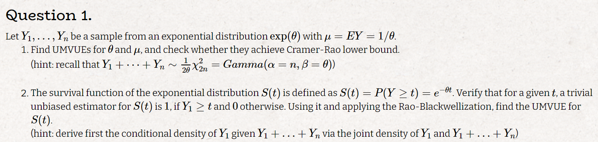
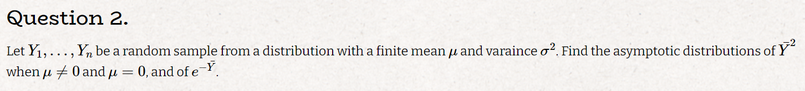
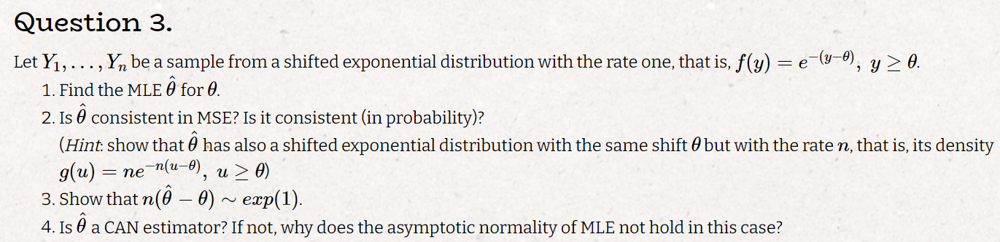
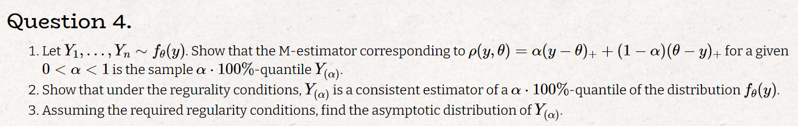
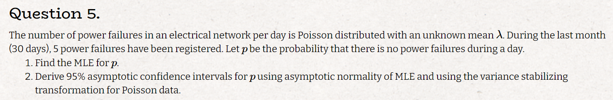
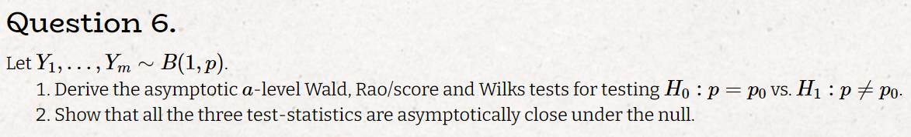
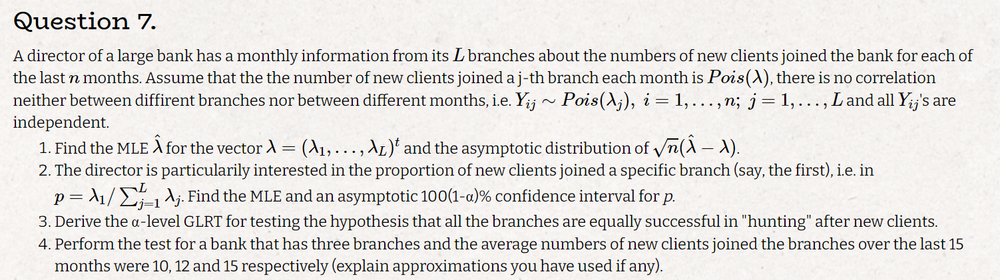

```{r setup, include=FALSE}
knitr::opts_chunk$set(echo = TRUE)
```


# Q1



### a

$$
Y_1, \ldots Y_n \sim exp(\theta)
\\
\hat\mu = \bar y
\\
E(\hat\mu)  = E(y_1) = \frac{1}{\theta} \Rightarrow \hat\mu \textrm{ is an unbiased estimator and also MLE so UMVUE}
\\
\textrm{lets show it achives the CRB:}
\\
\textrm{define: } g(\theta) = \frac{1}{\theta}
\\
CRB(\mu) = \frac{g'(\theta)^2}{I(\theta)} = \frac{\frac{1}{\theta^4}}{-E(l''(\theta,y))} = \frac{\frac{1}{\theta^4}}{E(\frac{-n}{\theta^2})} = \frac{n}{\theta^2}
\\
V(\bar y) = \frac{1}{4\theta^2}4n = \frac{n}{\theta^2} = CRB(\mu)
\\
\textrm{from MLE properties we can derive: } \hat\theta = \frac{1}{\bar y} := \frac{n}{x}; \quad x = n\bar y
\\
E(\hat \theta) = \int_0^\infty \frac{n}{x} \frac{\theta^n}{\Gamma(n)}e^{-\theta x}x^{n-1}dx = \frac{n\theta \Gamma(n-1)}{\Gamma(n)}\int_0^\infty \frac{\theta^{n-1}}{\Gamma(n-1)}e^{-\theta x}x^{n-2}dx = \frac{n\theta \Gamma(n-1)}{(n-1)\Gamma(n-1)} = \frac{n\theta }{(n-1)} \Rightarrow
\\
\hat\theta \  is \  biased; \frac{(n-1)\hat \theta}{n} = \frac{n-1}{x} \ is \ unbiased
$$

$$
\textrm{lets see if it achives the CRB: }
\\
V(\hat\theta) = V(\frac{n-1}{x}) = E((\frac{n-1}{x})^2) - E(\frac{n-1}{x})^2 = E((\frac{n-1}{x})^2) - \theta^2
\\
E((\frac{n-1}{x})^2) = \int_0^\infty \frac{(n-1)^2}{x^2} \frac{\theta^n}{\Gamma(n)}e^{-\theta x}x^{n-1}dx =  \frac{(n-1)^2\theta^n}{\Gamma(n)}\int_0^\infty e^{-\theta x}x^{n-3}dx=
\\
= \frac{(n-1)^2\theta^2\Gamma(n-2)}{\Gamma(n)}\int_0^\infty\frac{\theta^{n-2}}{\Gamma(n-2)} e^{-\theta x}x^{n-3}dx = \frac{(n-1)^2\theta^2\Gamma(n-2)}{(n-1)(n-2)\Gamma(n-2)} = 
\\
= \frac{(n-1)\theta^2}{(n-2)}  \Rightarrow V(\hat\theta) = \frac{(n-1)\theta^2}{(n-2)}-\theta^2 = \frac{\theta^2}{n-2} > \frac{\theta^2}{n} =  \frac{1}{I(\theta)} = CRB(\theta)
\\
\textrm{thus the MLE for } \theta \textrm{ does not achive the CRB}
$$

### b


$$
define \  T_s(y) \in \{0,1\}, T_s = 1 \iff Y_1 >t 
\\
E(T_s(y)) = P(Y_1 >t) = e^{-\theta y} \Rightarrow bias(T_s(y)) = 0
\\
T_1 = E(T_s(y)| \sum_{i=1}^n y_i = x) = P(y_1>t| \sum_{i=1}^n y_i = x) = \frac{P(y_1>t, \sum_{i=1}^n y_i = x)}{P(\sum_{i=1}^n y_i = x)} = \frac{\theta e^{-t\theta} \frac{\theta^{n-1}}{\Gamma(n-1)}e^{-\theta (x-t)}(x-t)^{n-2}}{\frac{\theta^n}{\Gamma(n)}e^{-\theta x}x^{n-1}} = 
\frac{\frac{\theta^{n}}{\Gamma(n-1)}(x-t)^{n-2}}{\frac{\theta^n}{\Gamma(n)}x^{n-1}}=
\\
=\frac{\frac{\Gamma(n)}{\Gamma(n-1)}(x-t)^{n-2}}{x^{n-1}} = \frac{(n-1)(x-t)^{n-2}}{x^{n-1}}
\\
T_1 \textrm{ is unbiased and } \sum_{i=1}^n y_i = x \textrm{ is complete thus from lemann scheffe theorom we get: } T_1 is\  UMVUE
$$


# Q2




$$
y_1,\ldots,y_m \sim f_{\mu,\sigma^2}  \Rightarrow \bar Y \overset{.}{\sim}  N(\mu,\frac{\sigma^2}{n})
\\
\textrm{ in the case: }  \mu = 0:
\bar Y \overset{.}{\sim}  N(0,\sigma^2) \Rightarrow \frac{\bar Y \sqrt n}{\sigma} \overset{.}{\sim} N(0,1) \Rightarrow (\frac{\bar Y \sqrt n}{\sigma})^2 \overset{.}{\sim} \chi_n^2  \Rightarrow
\bar Y^2 \overset{.}{\sim} \frac{\sigma^2}{n}\chi_n^2
\\
\textrm{ in the case: }  \mu \ne 0:
\\
\textrm{define } g(x) = x^2 \textrm{ and recall } \bar Y \textrm{ is a CAN estimator: }
\\
\sqrt n(\bar Y^2 - \mu^2) \overset{.}{\sim} N(0,4\mu^2\sigma^2) \Rightarrow \bar Y^2 \overset{.}{\sim} N(\mu^2,4\mu^2\sigma^2n^{-1})
\\
e^{-\bar Y} \overset{.}{\sim} N(e^{-\mu},  e^{-2\mu}\sigma^2n^{-1})
$$


# Q3




### a


$$
L(\theta,y) = e^{-\sum_i(y-\theta)} \Rightarrow  \textrm{L is an ascending function of } \theta \textrm{ thus we want to get the maximal } \theta \textrm{ possible}:
\\
\hat \theta = y_{(1)}
\\
$$

### b

$$
\textrm{as the hint suggets lets derive the density of } \hat \theta
\\
P(\hat\theta \le t) = P(y_{(1)}\le t) = 1- P(y_{(1)} > t) = 1- \Pi_i^n P(y_i > t) = 1 - (1-(1-e^{t-\theta}))^n = 1-e^{-n(t- \theta)} = F(shiftedexp(n,\theta))
\\
V(\hat \theta) = \frac{1}{n^2} \textrm{(location doesnt change variance)}
\\
E(\hat \theta) = \frac{1}{n} + \theta \overset{n \to \infty }{\rightarrow} \theta \Rightarrow consistent \ in \ MSE \Rightarrow consistent \ in \ probability
$$

### c

$$
P(n(\hat\theta- \theta)<t) = P(\hat\theta<t/n + \theta) = 1-e^{n(t/n-\theta +\theta)} = 1-e^{-t}  = F(exp(1))
$$

### d

$$
\hat \theta \textrm{ is not a CAN estimator: }
\\
P(\sqrt n(\hat\theta- \theta)<t) = P(\hat\theta<t/\sqrt n + \theta) = 1-e^{n(t/\sqrt n-\theta +\theta)} = 1-e^{-\sqrt n t}  = F(exp(\sqrt n))
\\
\textrm{when } n \to \infty, \quad \hat\theta\to 0
\\
\textrm{in this case the MLE is not a CAN estimate because } f_\theta(y) \textrm{ is not a continous function it has an asymptote at } \theta
$$

# Q4



### a

$$
\textrm{we are looking for a } \hat{\theta} = argmin_\theta \sum_{i=1}^n \rho(y_i,\theta)
\\
\textrm{denote } n_- =\sum_{i=1}^n I(y_i<\theta),\quad  n_+ = n-n_-
\\
\sum_{i=1}^n \rho(y,\theta) = n_+ \alpha+ (1-\alpha) n_-
\\
\psi(y,\theta) = \begin{cases}
-1 ,& y>\theta \\
0 ,& y=\theta  \\
1 ,& y<\theta 
\end{cases}
\\
\frac{\partial \sum_{i=1}^n \rho(y,\theta)}{\partial \theta} = -n_+\alpha + n_-(1-\alpha)
\\
\textrm{if } \theta = \hat{\theta_{(\alpha)}} = y_{(\alpha)}:
\\
n_+ = n(1-\alpha) , \quad n_- = n\alpha \Rightarrow \frac{\partial \sum_{i=1}^n \rho(y,\theta)}{\partial \theta} = - n(1-\alpha)\alpha + (1-\alpha)n\alpha  = 0 \Rightarrow \hat{\theta_{(\alpha)}} = argmin_\theta \sum_{i=1}^n \rho(y_i,\theta)
\\
\textrm{notice that this is indeed a minimum point as the function is not bound from above w.l.o.g difine } \alpha > 0.5
\\
\textrm{we can alwyas decreace }  \theta \textrm{ and get a higher value for the function }  \rho
$$

### b

$$
\textrm{because M-stimator are unbiased all we need to show is that } E(\frac{n_-}{n}) = \alpha \textrm{ this is stright forward from the quantile defenition}
$$

### c

$$
\sqrt n (y_\alpha - Y_\alpha) \overset{.}{\sim} N(0, V(Y_\alpha))
\\
\textrm{we know from class that: } Y_\alpha = \frac{E(\psi^2)}{E^2(\psi')}
\\
\textrm{but in our case: } \psi' = 0
\\
\textrm{thus the variance is not finite}
$$


# Q5




### a

$$
\textrm{denote the number of power failures per day as :} pfd, \textrm{ and power failures per month as: } pfm
\\
pfd \sim Pois(\lambda) \Rightarrow pfm \sim Pois(30\lambda) (\textrm{ as a sum of poisson variables})
\\
L(\lambda, pfm) = (30\lambda)^5e^{-30\lambda}/ 5! \Rightarrow l = 5ln(30\lambda) - 30\lambda - ln(5!) 
\\
\frac{\partial l}{\partial \lambda} = \frac{5}{\lambda} - 30 = 0 \iff \lambda = \frac{5}{30} = \frac{1}{6} := \hat \lambda_{MLE}
\\
\hat p_{MLE} = e^{-\hat \lambda_{MLE}} \approx 0.846
$$

### b

$$
-E(l'') = \frac{30 \lambda}{\lambda ^2} = \frac{30}{\lambda}
\\
\hat \lambda_{MLE} \overset{.}{\sim} N(30 \lambda, \frac{1}{-E(l'')}) = N(30 \lambda, \frac{\lambda}{30})
\\
g(\lambda) := e^{-\lambda}
\\
\textrm{ from the variance stability transformation we get: }
\\
\hat p_{MLE} = g(\hat \lambda_{MLE} ) \overset{.}{\sim} N(e^{-30 \lambda}, \frac{\lambda ^2 e^{-2\lambda}\lambda}{30}) = N(e^{-30 \lambda}, \frac{\lambda ^3 e^{-2\lambda}}{30})
$$

# Q6



### a

$$
\hat p = \frac{\sum_{i=1}^nyi}{n}
\\
\hat p \overset{.}{\sim} N(p, \frac{1}{nI^*(p)})
\\
I^*(p) = - E(l'') = -E[(y_i ln(p) + (1-y_i)ln(1-p))''] = -E[(\frac{y_i}{p^2} + \frac{1-y_i}{(1-p)^2})] = \frac{1}{1-p} \Rightarrow \hat p \overset{.}{\sim} N(p, \frac{p(1-p)}{n})
\\
Wald \ test: (\hat p - p_0)^2  I(\hat p) = (\hat p - p_0)^2  \frac{n}{p_0(1-p_0)}  = \frac{n(\bar y -p_0)^2}{p_0(1-p_0)}> \chi_{1,1-\alpha}^2 
\\
Wilks \ test: 2 l(\hat p)- 2 l( p_0) = 2 (n\bar y \ ln(\frac{\bar y}{p_0}) + n(1- \bar y)ln (\frac{1-\bar y}{1-p_0}))  > \chi_{1,1-\alpha}^2
\\
Rao \ test: \frac{(l'(p_0))^2}{I(p_0)} = (\frac{n\bar y}{p_0} - \frac{n(1-\bar y)}{1-p_0})^2 \frac{p_0(1-p_0)}{n} =  \frac{n^2(\bar y -p_0)^2}{p_0^2(1-p_0)^2}\frac{p_0(1-p_0)}{n} =
\frac{n(\bar y -p_0)^2}{p_0(1-p_0)}  > \chi_{1,1-\alpha}^2 
$$

### b

$$
\textrm{we can see that Rao and Wald are equivelent, let's use tylor expention for the wilks test:}
\\
Wilks = 2 l(\hat p)- 2 l( p_0)  \approx l''(\hat p)(\hat p - p_0)^2 = (\frac{n \bar y}{\bar y ^2} + \frac{n(1-\bar y)}{(1-\bar y)^2}) (\hat p - p_0)^2 = (\frac{n}{\bar y} + \frac{n}{(1-\bar y)}) (\hat p - p_0)^2 = 
\\
=(\frac{n}{\bar y(1-\bar y)}) (\hat p - p_0)^2 \underset{CLT}{\overset{n \to \infty}{\longrightarrow}} (\frac{n}{ p(1- p)}) (\hat p - p_0)^2
\\
\textrm{under the null } p = p_0 \textrm{ thus wilks is equivelent to wald and rao}
$$

# Q7



### a


$$
L = \Pi_{j=1}^L\Pi_{i=1}^n \lambda_j ^ {y_{ij}}e^{-\lambda_j} (y_{ij}!)^{-1} = \Pi_{j=1}^L\lambda_j ^ {\sum_i y_{ij}}e^{-n\lambda_j} (\Pi_i y_{ij}!)^{-1} \Rightarrow
\\
l = \sum_j [(\sum_i y_{ij}) ln(\lambda_j)-n \lambda_j + f(y) ]
\\
\textrm{ take the deravetive with respect to } \lambda_j:
\\
\frac{\partial l}{\partial \lambda_j} = \frac{(\sum_i y_{ij})}{\lambda_j} - n = 0 \iff \lambda_j= \bar y_j
\\
\hat \lambda_{MLE} = (\bar y_1, \ldots, \bar y_L)
\\
E(\hat \lambda_{MLE}) = \lambda, \quad V(\lambda) = I \lambda
\\
\textrm{thus from CLT we get: }
\\
\sqrt(n)(\hat \lambda_{MLE} - \lambda) \overset{.}{\sim} N(0, V(\lambda))
$$ 


### b


$$
\textrm{define } g(\lambda) = (\lambda_i/\sum_j \lambda_j)_{i=1}^n
\\
p = g(\lambda)
\\
\textrm{thus from the delta therom: }
\\
\hat p = (\hat \lambda_i/\sum_j \hat \lambda_j)_{i=1}^n \overset{.}{\sim} N(p, \nabla g ^T V(\lambda) \nabla g)
\\
\nabla g(\lambda) = (\frac{\sum_j \lambda_j - \lambda_i}{(\sum_j \lambda_j)^2})_{i=1}^n
\\
[\nabla g ^T V(\lambda) \nabla g]_{ik} = \begin{align*}
    y = 
    \begin{cases}
        (\frac{\sum_j \lambda_j - \lambda_i}{(\sum_j \lambda_j)^2})^2\lambda_i, & \text{if } i = k \\
        0, & \text{if } i \ne k
    \end{cases}
\end{align*}
$$

$$
\textrm{100(1-a)% CI is: }
\\
\hat p \pm Z_{1-\alpha/2}* \sqrt {\nabla g(\hat \lambda) ^T V(\hat \lambda) \nabla g(\hat \lambda) n^{-1}}
$$

### c


$$
\text{we can use the wilks test: }
\\
H_0: \lambda_1 = \ldots =  \lambda_L
\\
H_1: \text{otherwise}
\\
\text{wilks test: }2 l(\hat \lambda) - 2 l(\lambda_0)\sim \chi^2_L
\\
l(\lambda_0) = \sum_i\sum_jy_{ij}ln(\lambda_0) - nL\lambda_0 - f(y)=  ln(\bar y)\sum_i\sum_jy_{ij} - nL\bar y = ln(\bar y)\sum_i\sum_jy_{ij} - n\sum_j \bar y_j
\\
l(\hat \lambda) = \sum_j[\sum_i y_{ij} ln(\bar y_j)]- n\bar y_j
\\
\text{plug it back in the wilks test and we will reject } H_0 \text{ if:}
\\
2(\sum_j[\sum_i y_{ij} ln(\bar y_j)]- ln(\bar y)\sum_i\sum_jy_{ij}) > \chi^2_{L, 1-\alpha}
$$


### d


$$
\text{difine s as the wilks statistic: }
\\
s = 2(150ln(10) + 180ln(12) + 225ln(15) - ln(37/3)555) = 15.30527 > 7.814 = \chi^2_{3, 0.95}
\\
\text{thus we reject the null at 95% confidence}
$$

