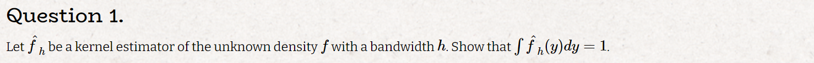
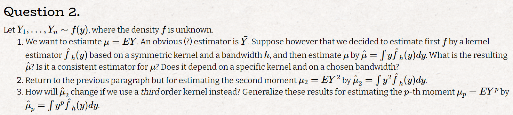
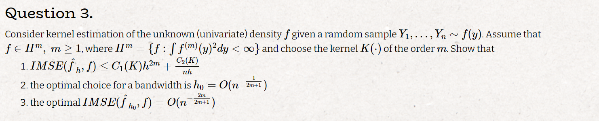

# Q1

$$
\hat f_h(y) = \frac{1}{nh}\sum_{i=1}^n K(\frac{y_i-y}{h})
\\
\int \hat f_h(y)dy = \int \frac{1}{nh}\sum_{i=1}^n K(\frac{y_i-y}{h}) dy = \sum_{i=1}^n \frac{1}{nh} \int K(\frac{y_i-y}{h}) dy
\\
\text{subtitute } u = \frac{y-y_i}{h}
\\
\int \hat f_h(y)dy = \sum_{i=1}^n \frac{1}{nh} \int K(u) h du = \sum_{i=1}^n \frac{1}{n} \int K(u) du = \sum_{i=1}^n \frac{1}{n}  = 1
$$

# Q2

### a

$$
\hat \mu = \sum_{i=1}^n \frac{1}{nh} \int y K(\frac{y_i-y}{h}) dy
\\
\text{using the subtitute as before and the fact that: } \int u K(u) du =0 \text{ we get the following expression: }
\\
\sum_{i=1}^n \frac{1}{nh} \int (uh -y_i) K(u) h du = \sum_{i=1}^n \frac{1}{n} \int y_i K(u) du = \bar y
\\
\text{as we already know this estimatoe is consistent}
\\
\text{also we didn't assume anything about K (beside what we assumed in class) so the result does not depend on the kernel or bandwidth}
$$

### b

$$
\hat \mu_2 = \sum_{i=1}^n \frac{1}{nh} \int y^2 K(\frac{y_i-y}{h}) dy
\\
\text{using the subtitute as before and the fact that: } \int u K(u) du =0 \text{ we get the following expression: }
\\
\sum_{i=1}^n \frac{1}{nh} \int (uh -y_i)^2 K(u) h du = \sum_{i=1}^n \frac{1}{nh} \int (u^2h^2 - 2y_iu + y_i^2) K(u) h du = 
\sum_{i=1}^n \frac{1}{n} [h\int u^2h^2K(u) du - 2y_i\int uK(u) du + y_i^2\int K(u) du] = 
\\
= \sum_{i=1}^n \frac{1}{n} [y_i^2 +h^2\int u^2K(u) du ] = h^2\int u^2K(u) du+ \sum_{i=1}^n \frac{y_i^2}{n}  
\\
\sum_{i=1}^n \frac{y_i^2}{n} \text{ is a consistnt estimator for } \mu_2 \text{ Law of large numbers}
\\
\text{but } h^2\int u^2K(u) du \text{ does not converge to zero unless } h \to 0
\\
\text{and the estimator depends both on h and K}
$$

### c

$$
\text{if we use a Kernel of order 3 then: }
\\
\int u^2K(u) du = 0 \text{ thus in this case the precious estimator is consistent}
\\
\text{i will show the general case for a kernel of order p by induction that: } \hat \mu_p = h^p\int u^pK(u) du+ \sum_{i=1}^n \frac{y_i^p}{n} 
\\
\text{we saw that this is true for the case where p=2, now assume its true for p=m-1 and prove for p=m}
\\
\hat \mu_m = \sum_{i=1}^n \frac{1}{nh} \int y^m K(\frac{y_i-y}{h}) dy = \sum_{i=1}^n \frac{1}{n} \int (uh -y_i)^m K(u) du= \sum_{i=1}^n \frac{1}{n} \int (uh -y_i)^{m-1}(uh -y_i) K(u) du =
\\
= \sum_{i=1}^n \frac{1}{n} \int (uh -y_i)^{m-1} K(u)  (uh -y_i) du = (h^{m-1}\int u^{m-1}K(u) du+ \sum_{i=1}^n \frac{y_i^{m-1}}{n})y_i + \sum_{i=1}^n \frac{h}{n} \int (uh -y_i)^{m-1} uK(u) du
\\
\text{lets break down this expression:}
\\
(1) (h^{m-1}\int u^{m-1}K(u) du+ \sum_{i=1}^n \frac{y_i^{m-1}}{n})y_i = h^{m-1}\int u^{m-1}K(u) duy_i + \sum_{i=1}^n \frac{y_i^m}{n} \underset{\text{K is of order m}}{=} \sum_{i=1}^n \frac{y_i^m}{n}
\\
(2)\sum_{i=1}^n \frac{h}{n} \int (uh -y_i)^{m-1} uK(u) du = \sum_{i=1}^n \frac{h}{n} \int (uh -y_i)^{m-2}(uh -y_i) uK(u) du = \sum_{i=1}^n \frac{h^2}{n} \int (uh -y_i)^{m-2} u^2 K(u) du=
\\ \ldots = \sum_{i=1}^n \frac{h^m}{n} \int u^m K(u) du
\\ 
\text{i used the fact that K is of order m, m-2 times}
\\
\text{plugging it back in we get :}
\\
\hat \mu_m = \sum_{i=1}^n \frac{y_i^m}{n} + h^m \int u^m K(u) du
\\
\text{as in the previous case we get that } \hat \mu_m \text{ is consistent if K is of order p+1 and the estimator depends both on K and h}
$$

# Q3

### a

$$
IMSE(\hat f_h, f) = \int MSE(\hat f_h, f)
\\
bias(y_0) = E(\hat f_h(y_0)) - f(y_0) = \int f(y_0+uh)K(u)du - f(y_0) = \int [f(y_0+uh)- f(y_0)]K(u)du =
\\
\underset{taylor}{=} \int [f(y_0) + hu f'(y_0) + \ldots \frac{1}{m}h^mu^mf^{(m)}(y_0) + O(h^{m+1})- f(y_0)]K(u)du \underset{\text{K is of order m}}{=} \frac{1}{m}h^mf^{(m)}(y_0)\int u^mK(u)du + O(h^{m+1})
\\
\text{thus: } bias(y_0)^2 = \frac{1}{m^2}h^{2m}(f^{(m)}(y_0))^2(\int u^mK(u)du)^2 + O(h^{2m+2})
\\
Var(\hat f_h(y_0)) = Var[\frac{1}{nh}\sum_{i=1}^nK(\frac{y_i-y_0}{h})] = \frac{1}{n^2h^2}Var[\sum_{i=1}^nK(\frac{y_i-y_0}{h})] = \frac{1}{nh^2}Var[K(\frac{y_1-y_0}{h})] =
\\
= \frac{1}{nh^2}(E([K(\frac{y_1-y_0}{h})]^2) - E^2[K(\frac{y_1-y_0}{h})]) \le \frac{1}{nh^2}E([K(\frac{y_1-y_0}{h})]^2) =
\\
= \frac{1}{nh^2} \int (K(\frac{y-y_0}{h}))^2f(y)dy = \frac{1}{nh} \int K(u)^2f(y_0+uh) du \underset{taylor}{=} \frac{1}{nh} \int K(u)^2[f(y_0) + O(h)] du =
\\
= \frac{f(y_0)}{nh} \int K(u)^2du + O(\frac{1}{n}) 
\\
MSE(\hat f_h, f) \le \frac{f(y_0)}{nh} \int K(u)^2du + O(\frac{1}{n}) + \frac{1}{m^2}h^{2m}(f^{(m)}(y_0))^2(\int u^mK(u)du)^2 + O(h^{2m+2})
$$

$$
IMSE(\hat f_h, f) \le \int \left [\frac{f(y)}{nh} \int K(u)^2du + O(\frac{1}{n}) + \frac{h^{2m}}{m^2}(f^{(m)}(y))^2(\int u^mK(u)du)^2 + O(h^{2m+2})\right ]dy =
\\
= O(\frac{1}{n}) + O(h^{2m+2}) +\frac{1}{nh} \int K(u)^2du + \frac{h^{2m}}{m^2}[\int (f^{(m)}(y))^2dy][\int u^mK(u)du]^2 = C_1(K)h^{2m} + C_2(K)\frac{1}{nh}
$$

### b

$$
\frac{\partial IMSE}{\partial h} = 2mC_1(K)h^{2m-1} - C_2(K)\frac{1}{nh^2} = 0 \iff h^{2m+1} = C_2(K)\frac{1}{n2mC_1(K)} \iff h = O(n^{-\frac{1}{2m+1}})
\\
\frac{\partial^2 IMSE}{\partial^2 h} = 2m(2m-1)C_1(K)h^{2m-2} + C_2(K)\frac{1}{nh^3} > 0 \ \forall h
\\
\text{thus the optimal bandwidth is } h_0 = O(n^{-\frac{1}{2m+1}})
\\
$$

### c

$$
\text{plug } h_0 \text{ back in the IMSE we get:}
\\
C_1(K)O(n^{-\frac{1}{2m+1}})^{2m} + C_2(K)\frac{1}{nO(n^{-\frac{1}{2m+1}})} = O(n^{-\frac{2m}{2m+1}}) + O(n^{2m}) = O(n^{-\frac{2m}{2m+1}})
$$

