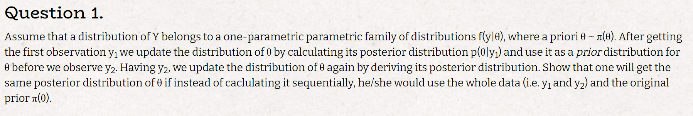
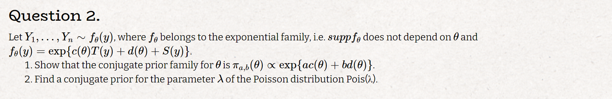
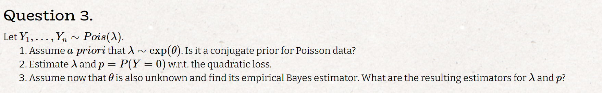
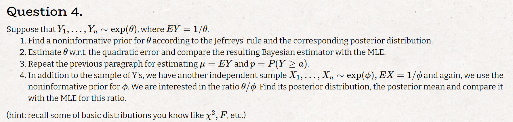
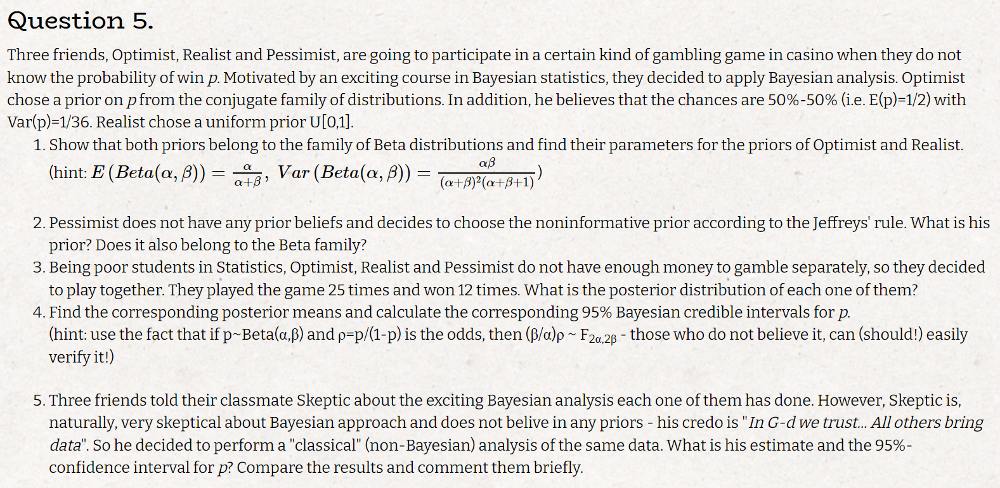
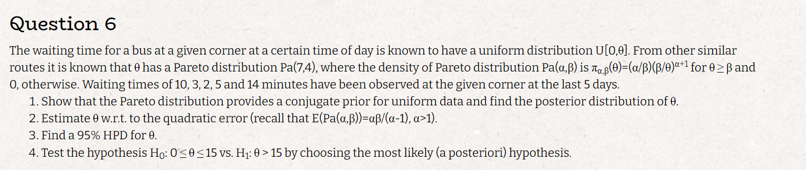

# Q1

$$
\text{let } y_1 \text{ be a sample from } Y \sim f(y|\theta) ; \theta \sim \pi(\theta)
\\
p(\theta | y_1) = \frac{f(y_1|\theta)\cdot \pi(\theta)}{f(y_1)} := \pi_1(\theta)
\\
\text{assume } \pi_1(\theta) \text{ is the prior for sampling } y_2 \text{ we get:}
\\
p(\theta | y_2) = \frac{f(y_2|\theta)\cdot \pi_1(\theta)}{f(y_2)} = \frac{f(y_2|\theta)}{f(y_2)}\frac{f(y_1|\theta)\cdot \pi(\theta)}{f(y_1)} := \hat \pi(\theta)
\\
p(\theta | \underline y) = \frac{f(\underline y|\theta)\cdot \pi(\theta)}{f(\underline y)} = \frac{f(y_2|\theta)}{f(y_2)}\frac{f(y_1|\theta)\cdot \pi(\theta)}{f(y_1)}
$$

# Q2

### Q2.1

$$
\pi(\theta|y) = \frac{f(\theta|y) \pi (\theta)}{f(y)} \propto L(\theta;y) \pi(\theta)
\\
L(\theta;y) = \Pi_i exp\{c(\theta) T(y_i) + d(\theta) + S(y_i)\} = exp\{c(\theta) \sum_i T(y_i) + b d(\theta)\} \cdot exp(\sum_iS(y_i)) \propto exp\{T'(y)c(\theta) + n d(\theta)\}
\\
\text{plug it back in and we get: }
\\
\pi(\theta|y) \propto L(\theta;y) \pi(\theta) \propto exp\{T'(y)c(\theta) + n d(\theta)\} \cdot exp\{ac(\theta) + bd(\theta)\} = exp\{(T'(y)+a)c(\theta) + (n+b) d(\theta)\} 
\\
\text{thus we get that the conjecture prior family is the exponenital family}
$$

### Q2.2

$$
\text{for the possion family the: }
\\
T(y) = \sum_i y_i; \quad c(\lambda) = ln(\lambda); \quad d(\lambda) = n\lambda
\\
\lambda \sim exp(ln(\theta) + n\theta) = gamma(1, ln(\theta) + n\theta)
\\
\text{lets show it's conjecture to the poison:}
\\
\pi(\lambda|y) \propto L(\lambda;y) \pi(\lambda) = e^{-n\lambda}\cdot \frac{\lambda^{T(y)}}{\Pi_i y_i} (ln(\theta) + n\theta)e^{-(ln(\theta) + n\theta)\lambda} \propto
\\
\propto \lambda^{T(y)} e^{-(ln(\theta)+n\theta+n)\lambda} \Rightarrow \lambda|y \sim Gamma(T(y)+1, (ln(\theta)+n\theta+n))
$$

# Q3

### Q3.1

$$
\text{the answer is yes, this is straightforward from the last question}
\\
\text{poisson, gamma, and the exponential distribution all belong to he exponential family}
$$

### Q3.2

$$
\lambda|y \sim Gamma(T(y)+1, \theta+n)
\\
\hat \lambda = E_{\lambda|y}[\lambda|y] = \frac{T(y)+1}{\theta+n}
\\
\hat p = \hat P(Y=0) = exp\{{-\frac{T(y)+1}{\theta+n}}\}
$$

### Q3.3

$$
L(\lambda ; y) = \Pi_i f(y_i|\lambda) = e^{-n\lambda}\cdot \frac{\lambda^{T(y)}}{\Pi_i y_i}
\\
\hat \lambda_{MLE} = \bar y
\\
\bar y = \frac{T(y)+1}{\theta+n} \Rightarrow \hat \theta_{MLE} = \frac{T(y)+1}{\bar y} - n = \frac{1}{\bar y}
$$

# Q4

### Q4.1

$$
\theta \sim \pi(\theta)
\\
\text{from jefrrey's rule:}
\\
\pi(\theta) \propto \sqrt{I^*(\theta)} = \sqrt {E(-l(\theta;y)'')} = \sqrt{-E(-\frac{1}{\theta^2})} =  \frac{1}{\theta} = \theta^{-1}
\\
\text{we derived the noninformative prior now lets calculate the posterior:}
\\
\pi(\theta|y) \propto L(\theta;y) \pi(\theta) = \theta^n e^{-n\bar y \theta} \theta^{-1} = \theta^{n-1}e^{-n\bar y \theta} \Rightarrow \theta|y \sim Gamma(n,n \bar y)
$$

### Q4.2

$$
\theta|y \sim Gamma(n,n \bar y)
\\
\hat \theta = E_{\theta|y}[\theta|y] = \frac{n}{n \bar y}= \frac{1}{ \bar y}
\\
\hat \theta_{MLE} = \frac{1}{\bar y} = \hat \theta
$$

### Q4.3

$$
\hat \mu = E(\frac{1}{\theta}|y) = \int_0^\infty \frac{1}{\theta}\theta ^{n-1}e^{n\bar y\theta} \frac{(n \bar y)^n}{\Gamma(n)} d\theta = \int_0^\infty \theta ^{n-1-1}e^{n\bar y\theta} \frac{(n \bar y)^n}{\Gamma(n)} \frac{\Gamma(n-1)}{\Gamma(n-1)} = 
\\
\frac{\Gamma(n-1)}{\Gamma(n)}n\bar y \int_0^\infty \theta ^{n-1-1}e^{n\bar y\theta} \frac{(n \bar y)^{n-1}}{\Gamma(n-1)} = \frac{n \bar y}{n-1}
\\
p = P(Y \ge a) = e^{-\theta a}
\\
\hat p = E(e^{-\theta a}|y) = \int_0^\infty e^{-\theta a}\theta ^{n-1}e^{n\bar y\theta} \frac{(n \bar y)^n}{\Gamma(n)} d\theta =
\int_0^\infty \theta ^{n-1}e^{(n\bar y-a)\theta} \frac{(n \bar y)^n}{\Gamma(n)} d\theta =
\int_0^\infty \theta ^{n-1}e^{(n\bar y-a)\theta} \frac{(n \bar y)^n}{\Gamma(n)}  \frac{(n \bar y - a)^n}{(n \bar y - a)^n} d\theta =
\\
= \frac{(n \bar y)^n}{(n \bar y - a)^n} \int_0^\infty \theta ^{n-1}e^{(n\bar y-a)\theta} \frac{(n \bar y - a)^n}{\Gamma(n)}  d\theta = \frac{(n \bar y)^n}{(n \bar y - a)^n}
\\
\hat \mu_{MLE} = \frac{1}{\hat \theta_{MLE}} = \bar y \ne \hat \mu
\\
\hat p_{MLE} = e^{-\hat \theta_{MLE} a} = e^{-\bar y a} \ne \hat p
$$

### Q4.4

$$
\text{if } X_1, X_2 \sim Gamma(\alpha_i, \beta_i) \text{ then } \frac{\beta_2\alpha_2X_1}{\beta_1\alpha_1X_2} \sim F(2\alpha_1,2 \alpha_2)
\\
\text{ using the idenity above and the fact that are paramaters are gamma distributed we can derive:}
\\
\frac{nn\bar Y\theta}{nn\bar X\phi}|(X,Y) \sim F(2n,2 n) \Rightarrow \frac{\theta}{\phi}|(X,Y) \sim \frac{\bar X}{\bar Y} F(2n,2 n)
\\
\text{the posterior mean is simply}: \frac{\bar X}{\bar Y}  \frac{2n}{2n-2} = \frac{\bar X}{\bar Y}  \frac{n}{n-1}
\\
\text{the MLE for this ratio is: } \frac{\bar X}{\bar Y} 
\\
\text{the MLE the the posterior mean are different but as n goes to infinity they become closer}
$$

# Q5

### Q5.1

$$
E(p_{opt}) = 1/2 = \frac{\alpha}{\alpha + \beta} \Rightarrow \alpha = \beta
\\
V(p_{opt}) = 1/36 = \frac{\alpha\beta}{(\alpha+\beta)^2(\alpha + \beta +1)} = \frac{\alpha^2}{(2\alpha)^2(2\alpha +1)} = \frac{1}{8\alpha + 4} \Rightarrow \alpha = \beta = 4
\\
\pi(p_{opt}) \sim Gamma(4,4)
\\
U(0,1) = Beta(1,1) \text{ thus the prior for the Realist also belong to the beta distribution}
\\
$$

### Q5.2

$$
\pi(p_{pes}) \propto \sqrt{I^*(p)} = \sqrt {E(-l(p;y)'')} = \sqrt{E(\frac{y_i}{p^2} + \frac{1-y_i}{(1-p)^2})}= \sqrt{(\frac{p}{p^2} + \frac{(1-p)}{(1-p)^2})} = \sqrt{(\frac{1}{p} + \frac{1}{1-p})} =
\\
=\sqrt {\frac{1}{p(1-p)}} = p^{-0.5}(1-p)^{-0.5} \Rightarrow \pi(p_{pes}) \sim Beta(0.5,0.5)
$$

### Q5.3

$$
\pi(p_{opt}|y) \propto L(p; y) \pi(p_{opt}) = p^{12}(1-p)^{13} p^{3}(1-p)^{3} \Rightarrow \pi(p_{opt}|y) \sim Beta(16,17)
\\
\pi(p_{rel}|y) \propto L(p; y) \pi(p_{rel}) = p^{12}(1-p)^{13} p^{0}(1-p)^{0} \Rightarrow \pi(p_{rel}|y) \sim Beta(13,14)
\\
\pi(p_{pes}|y) \propto L(p; y) \pi(p_{pes}) = p^{12}(1-p)^{13} p^{-0.5}(1-p)^{-0.5} \Rightarrow \pi(p_{pes}|y) \sim Beta(12.5,13.5)
$$

### Q5.4

$$
\text{before we start lets derive a general form for the creddibal sets}:
\\
\rho \in (L,U) \iff \frac{p}{1-p}\in (L,U) \iff \frac{1-p}{p}\in (1/U,1/L)\iff \frac{1}{p}\in (\frac{U+1}{U},\frac{L+1}{L}) \iff p\in (\frac{L}{L+1},\frac{U}{U+1})
\\
\rho \sim \frac{\alpha}{\beta}F_{2\alpha, 2\beta} \Rightarrow (L,U) = (\frac{\alpha}{\beta}F_{2\alpha, 2\beta, 0.025},\frac{\alpha}{\beta}F_{2\alpha, 2\beta,0.975})
\\
\text{optimist: }
\\
\hat p_{opt} = \frac{16}{16+17} = 0.484
\\
\alpha/\beta = 16/17
\\
F_{32, 34, 0.025} = 0.497, \quad F_{32, 34,0.975} = 1.996
\\
P(p_{opt} \in (0.318, 0.651)) = 0.95
\\
\text{realist: }
\\
\hat p_{rel} = \frac{13}{13+14} = 0.481
\\
\alpha/\beta = 13/14
\\
F_{26, 28, 0.46} = 0.459, \quad F_{26, 28,0.975} = 2.15
\\
P(p_{rel} \in (0.298, 0.666)) = 0.95
\\
\text{pessist: }
\\
\hat p_{pes} = \frac{12.5}{12.5+13.5} = 0.4807
\\
\alpha/beta = 12.5/13.5
\\
F_{25, 27, 0.46} = 0.452, \quad F_{25, 27,0.975} = 2.182
\\
P(p_{pes} \in (0.295, 0.669)) = 0.95
$$

### Q5.5

$$
\hat p_{MLE} = 12/25 = 0.48
\\
\text{from CLT: }
\hat p_{MLE} \overset{.}{\sim} N(p,\frac{p(1-p)}{n})
\\
\text{a 95% ci for p would be}:
\hat p_{MLE} \pm Z_{0.975}\sqrt{\frac{\hat p_{MLE}(1-\hat p_{MLE})}{25}} = 0.48 \pm 0.1958395 = (0.284,0.676)
$$

* we can see that the CI and CS are rather close

# Q6

### Q6.1

$$
\pi(\theta|y) = \frac{f(\theta|y) \pi (\theta)}{f(y)} \propto L(\theta;y) \pi(\theta) = \Pi_{i=1}^n \frac{1}{\theta} \frac{\alpha}{\beta} \left( \frac{\beta}{\theta} \right )^{\alpha+1} \mathbb{I}\{\theta \ge y_{max}\}\mathbb{I}\{\theta \ge \beta\} \propto
\\
\propto \frac{\alpha+n}{\tilde \beta} \left( \frac{\tilde \beta}{\theta} \right )^{\alpha+n+1}\mathbb{I}\{\theta \ge y_{max}\}\mathbb{I}\{\theta \ge \beta\} \Rightarrow \pi(\theta|y) \sim Pa(\alpha+n, max(y_{max}, \beta))
$$

### Q6.2

$$
\hat \theta = E[\theta|y]= \frac{(\alpha+n) max(y_{max}, \beta)}{(\alpha + n) -1} = \frac{12*14}{11} = 15.27
$$

### Q6.3

$$
\text{notice that the density function is a decrecing function of } \theta \text{ thus the HPD has a form of } (\tilde \beta, C_1)
\\
\text{we want a 95% HPD so } C_1 = Pa(12,14)_{0.95} = 17.97
\\\text{thus the 95% HPD is: } (14, 17.97)
$$

### Q6.4

$$
\pi_0 = P(\theta < 15) = 1 - (\frac{14}{15})^{12} = 1-0.437 = 0.563 > 0.5 \Rightarrow \text{we will not reject } H_0
$$

