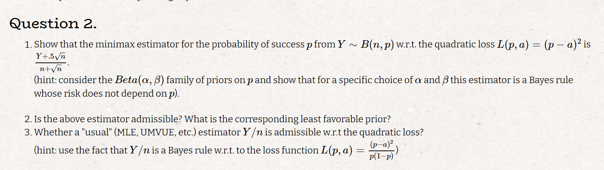
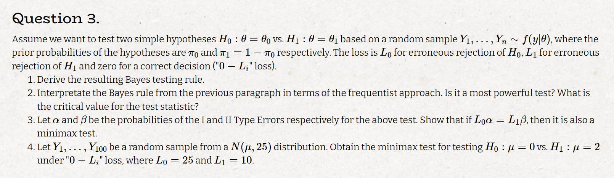
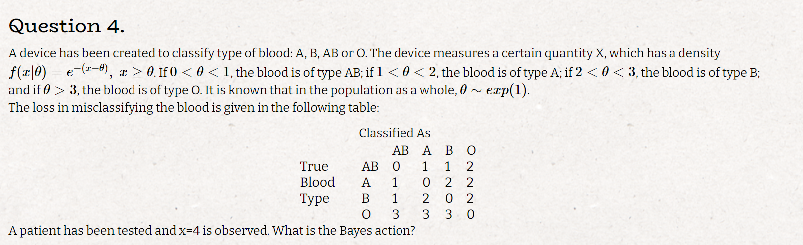
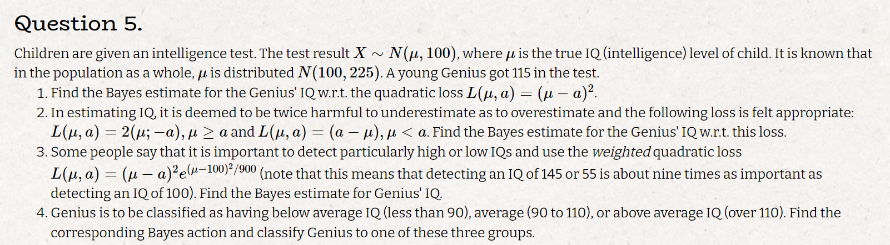

# Q1

### a

$$
L(\mu, \sigma, y) = \sum_{i=1}^n \frac{1}{\sqrt{2\pi \sigma^2}} e^{-\frac{1}{2\sigma^2}\sum_{i=1}^n (y_i - \mu)^2} \Rightarrow
\\
l = C - \sum_{i=1}^n (y_i - \mu)^2 \Rightarrow \frac{\partial l}{\partial \mu} = 2\sum_{i=1}^n (y_i - \mu) = 0 \iff \mu = \bar y \Rightarrow \mu_{MLE} = \bar y 
$$

### b

#### i

$$
L(\mu, \delta) = (\mu-\delta)^2
\\
R(\mu, \delta) = E_Y((\mu-\delta)^2) = Bias(\delta,\mu)^2 + V(\delta) = (c-1)^2\mu^2  + c^2\sigma^2
\\
\delta^* = \underset {\delta}{argmin} \ \underset{\mu}{sup} \ R(\mu, \delta) = \underset {\delta}{argmin} \ \underset{\mu}{sup} \ E_Y((\mu-\delta)^2)
\\
\quad \text{in order to maximize the risk function we want } \mu \text{ to be as far as large as possibe }
\\
\mu^* = a \Rightarrow c^*= \underset {c}{argmin} (c-1)^2a^2  + c^2\sigma^2
\\
\frac{\partial (c-1)^2a^2  + c^2\sigma^2}{\partial c} = ca-a+c\sigma^2 = 0 \iff c = \frac{a^2}{a^2 + \sigma^2}\Rightarrow c^* = \frac{a^2}{a^2 + \sigma^2}
\\
\text{thus we get: } \hat \mu_c = \frac{a^2}{a^2 + \sigma^2} y
$$

#### ii

$$
\rho(\pi, \delta) = \sum_{j=1}^2 R(\mu_j,\delta)\pi(\mu_j) = 0.5R(a, \delta) + 0.5R(-a, \delta) = 0.5((c-1)^2a^2  + c^2\sigma^2 + (c-1)^2a^2  + c^2\sigma^2) = (c-1)^2a^2  + c^2\sigma^2
\\
\text{as we saw the minmax estimator minimizes this funtion thus }  \delta_\pi^* \text{ is a minmax rule ,therfore it is a least favorable prior}
\\
\delta_\pi^* \text{ is unique and } \delta_\pi^* < \infty \text{ thus it is addmissible}
$$

# Q2

### a

$$
L(p, a) = (p - a)^2
\\
\text{using the hint and taking a beta prior we can calaulate te posterior: }
\\
\pi(p|y) \propto {n \choose y} p^{y}(1-p)^{n-y}p^{\alpha-1}(1-p)^{\beta-1} \propto p^{y+ \alpha-1}(y+1-p)^{n-y+\beta-1}
\\
\text{thus we get: } \pi(p|y) \sim Beta(y+ \alpha, n-y+\beta)
\\
\text{we can calculate the bayes rule estimator: }
\\
\hat p = E(p|y) = \frac{y+ \alpha}{y+ \alpha+n-y+\beta} = \frac{y+ \alpha}{\alpha+n+\beta}
\\
\text{plug it into the risk function: }
R(p,\hat p) = Bias(p- \hat p) + V(\hat p)
\\
Bias(\hat p-p) = \frac{np + \alpha}{\alpha+n+\beta} - p = \frac{\alpha - (\alpha+\beta)p}{\alpha+n+\beta}
\\
V(\hat p) = \frac{V(y)}{(\alpha+n+\beta)^2} = \frac{np(1-p)}{(\alpha+n+\beta)^2}
\\
\text{plug both equations back in } R(p,\hat p):
\\
R(p,\hat p) = \left (\frac{\alpha - (\alpha+\beta)p }{\alpha+n+\beta} \right )^2 + \frac{np(1-p)}{(\alpha+n+\beta)^2} = \frac{np(1-p) + (\alpha- (\alpha+\beta)p)^2}{(\alpha+n+\beta)^2} = \frac{np(1-p) + \alpha^2 - 2\alpha(\alpha+\beta)p + ((\alpha+\beta)p)^2}{(\alpha+n+\beta)^2} = 
\\
= \frac{\alpha^2 + (-2\alpha(\alpha+\beta) + np)p + ((\alpha+\beta)^2-n)p^2}{(\alpha+n+\beta)^2}
\\
\text{thus if } (-2\alpha(\alpha+\beta) + np) = 0 \text{ and } (\alpha+\beta)^2-n = 0
$$

$$
\text{thus if } (-2\alpha(\alpha+\beta) + np) = 0 \text{ and } (\alpha+\beta)^2-n = 0 
\\
\text{ we get a risk function which does not depend on p and we have a minmax estimator}
\\
\text{if we take } \alpha = \beta = 0.5\sqrt n :
\\
(1): (-2\alpha(\alpha+\beta) + np) = 0 \quad
(2): (\alpha+\beta)^2-n = 0
\\
\text{thus we ge that the minmax estimator is: } \hat p = E(p|y) = \frac{y+ 0.5 \sqrt n}{n + \sqrt n}
$$

### b

$$
\text{ the above estimator is addmissible since it is a unique bayes rule}
\\
Beta(\alpha, \beta) \text{ is a least favorable prior (the risk function is constant for all p)}
$$

$$
\rho(\pi, a) = \int L(p, a) \text{Beta}(\alpha, \beta) dp = \int (p - a)^2  \frac{p^{\alpha-1}(1-p)^{\beta-1}}{B(\alpha, \beta)}dp
\\
\int (p - a)^2 \frac{p^{\alpha-1}(1-p)^{\beta-1}}{B(\alpha, \beta)}dp = \int \frac{p^{\alpha+1}(1-p)^{\beta-1}}{B(\alpha,\beta)} - 2 a \frac{p^{\alpha}(1-p)^{\beta-1}}{B(\alpha,\beta)} - a^2 \frac{p^{\alpha-1}(1-p)^{\beta-1}}{B(\alpha,\beta)} dp =
\\
\int \frac{p^{\alpha+1}(1-p)^{\beta-1}}{B(\alpha,\beta)} dp = \frac{\alpha(\alpha +1)}{(\alpha + \beta + 1)(\alpha + \beta)}B(\alpha,\beta)\int \frac{p^{\alpha+1}(1-p)^{\beta-1}}{B(\alpha,\beta)B(\alpha+2,\beta)} = \frac{\alpha(\alpha +1)}{(\alpha + \beta + 1)(\alpha + \beta)}
\\
\int 2 a \frac{p^{\alpha}(1-p)^{\beta-1}}{B(\alpha,\beta)} dp =  \ldots= 2a \frac{\alpha}{(\alpha + \beta)}
\\
\int a^2 \frac{p^{\alpha-1}(1-p)^{\beta-1}}{B(\alpha,\beta)} dp = a^2
\\
\text{plugging all the calculations back in we get:}
\\
\int (p - a)^2 \frac{p^{\alpha-1}(1-p)^{\beta-1}}{B(\alpha, \beta)}dp = \frac{\alpha(\alpha +1)}{(\alpha + \beta + 1)(\alpha + \beta)} -2a \frac{\alpha}{(\alpha + \beta)} + a^2
\\
\frac{\alpha(\alpha +1)}{(\alpha + \beta + 1)(\alpha + \beta)} -2\frac{y+ \alpha}{\alpha+n+\beta} \frac{\alpha}{(\alpha + \beta)} + (\frac{y+ \alpha}{\alpha+n+\beta})^2
$$

### c

$$
\hat p = \frac{Y}{n} \text{ is addmissible:}
\\
\frac{Y}{n} \text{is a bayes rule w.r.t } \frac{(p-a)^2}{p(1-p)} \text{ (thus addmissible)}
\\
\text{assume there exsists some estimator } \tilde p \text{ such that: } MSE(p-\tilde p) < MSE(p-\hat p) \text{ we get the following:}
\\
L^*(p,\tilde p) = \frac{E[(p-\tilde p)^2]}{p(1-p)} \le \frac{E[(p-\hat p)^2]}{p(1-p)} = L^*(p,\hat p)
\\
\text{which is a contradiction to the addmissiblity of } \hat p \text{ w.r.t } L^*
$$

# Q3

### a

$$
difine: a = 0 \Rightarrow accept \ H_0, \quad a = 1 \Rightarrow accept \ H_1
\\
p_{yi} = P(\theta = \theta_i |y)
\\
L(\theta, a) = aL_1I(\theta = \theta_0) + (1-a)L_0I(\theta = \theta_1)
\\
\rho (\theta, \delta) = E_{\theta|y}(L(\theta, a)) = \delta L_1 p_{y0} + (1-\delta)L_0p_{y1} = \delta (L_1p_{y0} - L_0p_{y1}) + L_0p_{y1}
\\
\delta^* = argmin_\delta\ \delta (L_1p_{y0} - L_0p_{y1}) + L_0p_{y1}
\\
\text{thus if: } \delta^* = I(L_1p_{y0} < L_0p_{y1})
\\
p_{y0} = P(\theta = \theta_0 |y) = \frac{f(y|\theta_0) p_0}{ f(y)}
\\
p_{y1} = P(\theta = \theta_1 |y) = \frac{f(y|\theta_1) p_1}{ f(y)} = \frac{f(y|\theta) (1-p_0)}{ f(y)}
\\
L_1p_{y0} < L_0p_{y1} \iff \frac{p_{y1}}{p_{y0}} < \frac{L_0}{L_1} \iff  \frac{\frac{f(y|\theta_0) p_0}{ f(y)}}{\frac{f(y|\theta_1) (1-p_0)}{ f(y)}} < \frac{L_0}{L_1} \iff \frac{f(y|\theta_0)}{f(y|\theta_1)} < \frac{(1-p_0)L_0}{p_0L_1}
\\
\text{thus the bayes testing rule is: }  \frac{p_0L_1}{(1-p_0)L_0} < \frac{f(y|\theta_1)}{f(y|\theta_0)}
$$

### b

$$
\text{this is a liklihood ratio test and thus a most powerfull test. the critical values of the test is: } \frac{p_0L_1}{(1-p_0)L_0}
$$

### c

$$
\text{the risk function is: }
\\
R(\theta, \delta^*) = \begin{cases}
P(\delta^* = 1) L_0 & \theta = \theta_0 \\
P(\delta^* =0)L_1  & \theta = \theta_1
\end{cases} = \begin{cases}
\alpha L_0 & \theta = \theta_0 \\
\beta L_1  & \theta = \theta_1
\end{cases}  = \begin{cases}
\alpha L_0 & \theta = \theta_0 \\
\alpha L_0  & \theta = \theta_1
\end{cases}
\\
\text{which does not depend on } \theta \text{ thus the test is also minmax}
$$

### d

$$
* \text{LR- Liklihood ratio, LLR- Log Liklihood ratio}
\\
LR = \frac{f(y|\mu_1)}{f(y|\mu_0)} = exp \left \{-\frac{1}{50}\sum_{i=1}^{100} (y_i-2)^2+\frac{1}{50}\sum_{i=1}^{100} y_i^2  \right \}
$$

$$
\frac{10 p_0}{25 (1-p_0)} < LR \iff LLR > ln \left ( \frac{10 p_0}{25 (1-p_0)} \right ) \iff \left \{-\frac{1}{50}\sum_{i=1}^{100} (y_i-2)^2+\frac{1}{50}\sum_{i=1}^{100} y_i^2  \right \} > ln \left ( \frac{10 p_0}{25 (1-p_0)} \right ) \iff 
\\
\iff -\frac{1}{50}\sum_{i=1}^{100} (y_i^2-4y_i +4 -y_i^2)  >ln \left ( \frac{10 p_0}{25 (1-p_0)} \right ) \iff 8 \bar y - 8  >ln \left ( \frac{10 p_0}{25 (1-p_0)} \right ) \iff 
\\
\iff \bar y > 1+\frac{1}{8}ln \left ( \frac{10 p_0}{25 (1-p_0)} \right )
\\
\text{just need to add plug in } p_0 \text{ and we have a valid test}
\\
$$

# Q4

$$
\text{calculate te posterior: }
\\
\pi(\theta|x) \propto e^{-(x-\theta)} e^{-\theta}I(0<\theta <x) = e^{-x}I(0<\theta <x) \quad \text{which is a constant function of } \theta
\\
\text{ thus } \theta|x \sim U[0,x]
\\
\rho(\theta, \delta) = E_{\theta|x} L(\theta, \delta) \begin{cases}
P(1 < \theta < 2) + P(2 < \theta < 3) + 3P(3 < \theta < 4) & \delta = AB \\
1P(0 < \theta < 1) + 2P(2 < \theta < 3) + 3P(3 < \theta < 4) & \delta = A \\
1P(0 < \theta < 1) + 2P(1 < \theta < 2) + 3P(3 < \theta < 4) & \delta = B \\
2P(0 < \theta < 1) + 2P(1 < \theta < 2) + 2P(2 < \theta < 3) & \delta = O \\
\end{cases}
\\
\text{for the case where x=4: } P(1 < \theta < 2) = 0.25 \text{ plugging it back in yields: }
\\
\rho(\theta, \delta) = E_{\theta|x} L(\theta, \delta) \begin{cases}
1.25 & \delta = AB \\
1.5 & \delta = A \\
1.5 & \delta = B \\
1.5 & \delta = O \\
\end{cases}
\\
\text{the bayes action that minimizes } \rho(\theta, \delta) \text{ is } \delta = AB
$$

# Q5

### a

$$
\text{we saw that for: } X \sim N(\mu_x, \sigma^2_x), \mu_x \sim N(\tilde \mu, \sigma^2)
\\
\mu_x|x \sim N(\frac{\sigma^2}{\sigma^2 + \sigma^2_x}x+\frac{\sigma_x^2}{\sigma^2 + \sigma^2_x} \tilde \mu, (\frac{1}{\sigma^2} + \frac{1}{\sigma^2_x})^{-1})
\\
\text{the bayes estimate w.r.t the quadratic loss is: } E_{\mu_x|x} = \frac{\sigma^2}{\sigma^2 + \sigma^2_x}x+\frac{\sigma_x^2}{\sigma^2 + \sigma^2_x} \tilde \mu
\\
\text{pulgging in our setup yields: } E_{\mu_x|x} = \frac{225}{325}115+\frac{100}{325}100 = 110.3846
$$

### b

$$
\rho(x, \delta) = E_{\mu|x} L(\mu, \delta) = \int_{- \infty}^\delta (\delta - \mu)f(\mu|x) d\mu + 2\int_{\delta}^\infty (\mu- \delta)f(\mu|x) d\mu=
\\
= \delta\int_{- \infty}^\delta f(\mu|x) d\mu - \int_{- \infty}^\delta \mu f(\mu|x) d\mu + 2\int_{\delta}^\infty \mu f(\mu|x) d\mu - 2\delta \int_{\delta}^\infty f(\mu|x) d\mu=
\\
=\delta F(\delta) - \int_{- \infty}^\delta \mu f(\mu|x) d\mu + 2\int_{\delta}^\infty \mu f(\mu|x) d\mu - 2\delta(1-F(\delta))
\\
\frac{\partial \rho(x, \delta)}{\partial \delta} = F(\delta) + \delta f(\delta|x) - \delta f(\delta|x) - 2 \delta f(\delta|x) - 2 + 2F(\delta) + 2 \delta f(\delta|x) = 3F(\delta|x) - 2 = 0 \iff \delta = F^{-1}(2/3) \Rightarrow \delta^* = F^{-1}(2/3)
\\
\text{using r qnorm function we can estimate the genius IQ w.r.t to this loss which yileds: } 113.9685
\\
* qnorm(2/3, 110.3846, sqrt((\frac{1}{100} + \frac{1}{225})^{-1}))
$$

### c

$$
\rho(x, \delta) = E_{\mu|x} L(\mu, \delta) = \int_{- \infty}^\infty (\delta - \mu)^2e^{\frac{(\mu-100)^2}{900}}f(\mu|x) d\mu
\\
\frac{\partial \rho(x, \delta)}{\partial \delta}= 2\int_{- \infty}^\infty (\delta - \mu)e^{\frac{(\mu-100)^2}{900}}f(\mu|x) d\mu
\\
\text{setting the derevitive to 0 yields: }
\\
0= \int_{- \infty}^\infty (\delta - \mu)e^{\frac{(\mu-100)^2}{900}}f(\mu|x) d\mu = \delta \int_{- \infty}^\infty  e^{\frac{(\mu-100)^2}{900}}f(\mu|x) d\mu - \int_{- \infty}^\infty \mu e^{\frac{(\mu-100)^2}{900}}f(\mu|x) d\mu \Rightarrow
\\
\Rightarrow \delta^* = \frac{\int_{- \infty}^\infty \mu e^{\frac{(\mu-100)^2}{900}}f(\mu|x) d\mu}{\int_{- \infty}^\infty  e^{\frac{(\mu-100)^2}{900}}f(\mu|x) d\mu}
\\
\text{lets break down this expression, fisrt define } E(\mu|x) = \theta, V(\mu|x) = \tau^2
\\
\text{also lets forget abount the normalizing constant for the next calcultations as it will cancel out}
\\
e^{\frac{(\mu-100)^2}{900}}f(\mu|x) = e^{\frac{(\mu-100)^2}{900} - \frac{(\mu - \theta)^2}{2\tau^2}}  
\\
\text{taking a closer look at the power: }
\\
\frac{(\mu-100)^2}{900} - \frac{(\mu - \theta)^2}{2\tau^2} = \frac{1}{2}\frac{\tau^2(\mu-100)^2 - 450(\mu - \theta)^2}{450 \tau^2}= 
\frac{1}{2}\frac{\tau^2(\mu ^2-2*100 \mu + 100^2) - 450(\mu^2 - 2 \mu \theta + \theta^2)}{450 \tau^2} =
\\
= \frac{1}{2}\frac{(\tau^2- 450)\mu ^2 + (900  \theta-200 \tau^2) \mu  - 450 \theta^2 + 100^2 \tau^2}{450 \tau^2} =
\frac{1}{2}[(\frac{1}{450}- \frac{1}{\tau^2})\mu^2 -2(\frac{100}{450}- \frac{\theta}{\tau^2})\mu + \frac{100^2}{450} - \frac{\theta^2}{\tau^2}]=
\\
= -\frac{1}{2} (\frac{1}{\tau^2} - \frac{1}{450})[\mu - \frac{\frac{\theta}{\tau^2} - \frac{100}{450}}{\frac{1}{\tau^2} - \frac{1}{450}}]^2 + C
\\
\text{where C does not depend on } \mu
$$

$$
\text{plugging it back in we get: }
\\
\delta^* = \frac{\int_{- \infty}^\infty \mu e^{-\frac{1}{2} (\frac{1}{\tau^2} - \frac{1}{450})[\mu - \frac{\frac{\theta}{\tau^2} - \frac{100}{450}}{\frac{1}{\tau^2} - \frac{1}{450}}]^2 + C} d\mu}{\int_{- \infty}^\infty  e^{-\frac{1}{2} (\frac{1}{\tau^2} - \frac{1}{450})[\mu - \frac{\frac{\theta}{\tau^2} - \frac{100}{450}}{\frac{1}{\tau^2} - \frac{1}{450}}]^2 + C} d\mu}
\\
\text{if we multiple and divide by the relevent normalizing consant the numerator is the expected value of a normally distributed}
\\
\text{variable with an expected value of } \frac{\frac{\theta}{\tau^2} - \frac{100}{450}}{\frac{1}{\tau^2} - \frac{1}{450}}, \text{and the denominator is 1 (an integral over the density)}
\\
\text{plugging our known } \theta, \tau, \text{ yields:}
\\
(110.3846/69.23077 - 100/450)/(1/69.23077 - 1/450) = 112.2727
$$

### d

$$
P(below|x=115) = pnorm(90, 110.3846, sqrt(900/13)) = 0.007
\\
P(avg|x=115) = pnorm(90, 110.3846, sqrt(900/13)) = 0.475
\\
P(above|x=115) = 1- pnorm(110, 110.3846, sqrt(900/13)) = 0.518
\\
\rho(\mu, \delta) = E_{\mu|x} L(\mu, \delta) = \begin{cases}
1 - P(below|x=115)& \quad \delta = below \\
1 - P(avg|x=115)& \quad \delta = avg\\
1 - P(above|x=115)& \quad \delta = above\\
\end{cases} = \begin{cases}
0.993 & \quad \delta = below \\
0.525 & \quad \delta = avg\\
0.482 & \quad \delta = above\\
\end{cases}
\\
\text{thus } \delta ^* = above
$$

