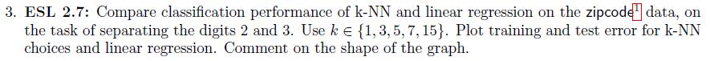
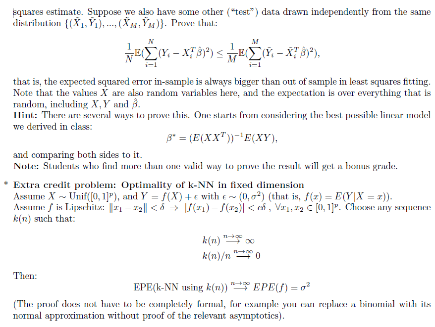

```{r message=FALSE, warning=FALSE}
library(dplyr)
library(ggplot2)
library(purrr)
library(caret)
library(class)
```


# Q1


$$
\textrm{notice that the median is a specific case for the quantile loss with } \tau = 0.5 \textrm{ so proving for the general case will cover both questions}
$$

### 1a

$$
\frac{\partial E_{Y|X}[(L_\tau(Y,f(X)))|X=x]}{\partial f(x)} = \frac{\partial}{\partial f(x)}[\int_{min_y}^{f(x)}  (1-\tau) F_Y(y)dy + \int_{f(x)}^{max_y}  -\tau F_Y(y)dy]= F_Y(f(x)) - \tau F_Y(f(x)) - \tau + \tau F_Y(f(x)) =
\\
= F_Y(f(x)) - \tau = 0 \iff f(x) = F_y^{-1}(\tau)
\\
\textrm{ thus the minimizer is the } \tau th \ qunatile \ of P(Y|X=x)
$$

# Q2


$$
denote \ D_c = min(||X_1||,\ldots,||X_n||)
\\
P(\textrm{all observations are outside a ball of radius r}) = P(D_c > r) 
\\
P(D_c > r) = \Pi_{i=1}^nP(||X_i|| > r) = P(||X_1||>r)^n = (1 - P(||X_1||<r))^n= (1-r^p)^n
\\
\textrm{we are looking for such r such that } P(D_c > r) = \frac{1}{2} \Rightarrow (1-r^p)^n = \frac{1}{2}  \Rightarrow (1-\frac{1}{2^{1/n}})^{1/p} = r
$$

```{r}
radius_function <- function(n){
  p <- 1:100
  return( (1 - 1/2^(1/n))^(1/p))
}
n_s <- c(100,5000,100000,100000000)
df <- map(n_s,radius_function)
df <- as.data.frame(df)
colnames(df) <- c("n_100","n_5000","n_100000","n_100000000")
df["p"] = 1:100
colors = c("n_100"="blue", "n_5000" ="red","n100000"="purple","n100mil"= "black")
ggplot(data = df) + 
  geom_smooth(aes(x = p, y = n_100,color = "n_100")) +
  geom_smooth(aes(x = p, y = n_5000,color = "n_5000")) +
  geom_smooth(aes(x = p, y = n_100000,color = "n100000")) +
  geom_smooth(aes(x = p, y = n_100000000,color = "n100mil")) +
  labs(x="p", y = "fraction outside ball", color = "legend") + 
  scale_color_manual(values = colors)
```


$$
\textrm{we can see that an p grows the fraction of observations outsde the ball increaces and even for a very high number of observations}
$$

# Q3



```{r}
acc_err <- function(y_true,y_pred){
  return (1-mean(y_true == y_pred))
}

df_train <- read.table("zip.train") %>% rename("y" = "V1") %>%
  filter(y %in% c(2,3)) %>% mutate(y = y-2)
df_test <- read.table("zip.test") %>% rename("y" = "V1") %>%
  filter(y %in% c(2,3)) %>% mutate(y = y-2)

get_knn_res <- function(k,df_train,df_test){
  X_tr <- as.matrix(df_train %>% select(-y))
  X_te <- as.matrix(df_test %>% select(-y))
  y_tr <- df_train %>% select(y)
  train_preds <- knn(train = X_tr,test = X_tr,cl = as.matrix(y_tr),k = k)
  test_preds <- knn(train = X_tr,test = X_te,cl = as.matrix(y_tr),k = k)
  train_err <- acc_err(df_train$y,train_preds)
  test_err <- acc_err(df_test$y,test_preds)
  return( c(train_err, test_err))
}

zip_lm <- lm(y~.,data = df_train)
lr_train_err <- acc_err(df_train$y,(predict(zip_lm,df_train) > 0.5)*1)
lr_test_err <- acc_err(df_test$y,(predict(zip_lm,df_test) > 0.5)*1)
k_s = 1:15
knn_train_res <- c()
knn_test_res <- c()
for (i in 1:length(k_s)){
  knn_res <- get_knn_res(k=k_s[i],df_train,df_test)
  knn_train_res <- c(knn_train_res,knn_res[1])
  knn_test_res <- c(knn_test_res,knn_res[2])
}
result_df <- tibble(k = c(0,k_s),train_res = c(lr_train_err,knn_train_res) ,test_res = c(lr_test_err,knn_test_res))
colors = c("train"="blue", "test" ="red","train_lr" = "orange", "test_lr" = "black")
ggplot(data = result_df) + 
  geom_smooth(aes(x = k, y = train_res,color = "train"),se=FALSE) +
  geom_smooth(aes(x = k, y = test_res,color = "test"),se=FALSE) +
  geom_hline(aes(yintercept  = lr_train_err, color = "train_lr")) +
  geom_hline(aes(yintercept  = lr_test_err, color = "test_lr")) +
  labs(x="k", y = "error", color = "legend") + 
  scale_color_manual(values = colors)
```

$$
\textrm{we can see that as k increaces the knn model error rate increace as well in the train and test set.}
\\
\textrm{we can also see that linear regression has the worst test results}
$$

# Q4




$$
\textrm{the expected error is the same for all obesravtions so we can assume M=N=1}
\\
denote \ E_{tr}, E_{te} \ \textrm{ the expected train and test error}
\\
E((\tilde Y-\tilde X \hat \beta)^2) \ge E((\tilde Y-\tilde X \tilde \beta)^2) \ (\tilde \beta \textrm{ being LSE for the test set}) \Rightarrow
\\
E_{te} \ge E((\tilde Y-\tilde X \tilde \beta)^2)
\\
E((\tilde Y-\tilde X \tilde \beta)^2) = E((Y-X \hat \beta)^2) \ \textrm{(its an expected value thus the point of estimate doesn't matter)}
\\
\textrm{to conclude we get: }
\\
E_{te} = E((\tilde Y-\tilde X \hat \beta)^2) \ge E((\tilde Y-\tilde X \tilde \beta)^2) = E((Y-X \hat \beta)^2) = E_{tr}
$$

$$
\textrm{try #2, i am not completly sure about the varinace claim here}
\\
\textrm{the expected error is the same for all obesravtions so we can assume M=N=1}
\\
denote \ E_{tr}, E_{te} \ \textrm{ the expected train and test error}
\\
E_{tr} = \sigma^2 + bias(f(x)) + var(f(x)) = \sigma^2 + var(f(x)) \ (\hat\beta \textrm{ is unbaised})
\\
E_{te} = \sigma^2 + bias(f(\tilde x)) + var(f(\tilde x))
\\
var(f(\tilde x)) = var(f(x)), \ \ and \ \ bias(f(\tilde x)) \ge 0
\\
\textrm{thus we get:} E_{te} \ge E_{tr}
$$


# Extra

$$
let \ x_0\in X  \textrm{ be a fixed point}
$$

$$
\forall \varepsilon \ \forall k \ \exists m_k \  ; \forall n > m_k, \quad ||x_0 -x_j|| <\varepsilon_k \ \forall x_j \in N_k(x_0)
\\
\textrm{thus form f being lipschitz :} |f(x_0) - f(x_1)| < \varepsilon_k \delta
$$

$$
\textrm{thus } |\hat f(x_0) - f(x_0)| = |\sum_{x_j \in N_k(x_0)} \frac{f(x_j)}{k} - f(x_0)| = |\sum_{x_j \in N_k(x_0)}\frac{f(x_j)- f(x_0)+ f(x_0)}{k} - f(x_0)|  \le
\\
\le \sum_{x_j \in N_k(x_0)}\frac{|f(x_j)- f(x_0)|}{k}+ |\sum_{x_j \in N_k(x_0)}\frac{f(x_0)}{k} - f(x_0)|  = \sum_{x_j \in N_k(x_0)}\frac{|f(x_j)- f(x_0)|}{k} \le
\varepsilon_k \delta
$$

$$
\textrm{thus for } \varepsilon_k \xrightarrow[]{n \to \infty} 0 : bias(\hat f(x_0)) \xrightarrow[]{n \to \infty} 0
$$

$$
V(E(\hat f(x_0))) = V(\sum_{x_j \in N_k(x_0)} \frac{E(f(x_j))}{k}) \xrightarrow[]{n \to \infty} V(\sum_{x_j \in N_k(x_0)} \frac{f(x_0)}{k}) = \sum_{x_j \in N_k(x_0)} \frac{V(f(x_0))}{k} = 0
$$

$$
\textrm{we get that the bais and variance terms both converge to zero as n goes to } \infty \textrm{ so from the prediction error decomposition we get that: }
\\
EPE(\textrm{k-nn using k(n)}) \xrightarrow[]{n \to \infty} \sigma^2
$$

