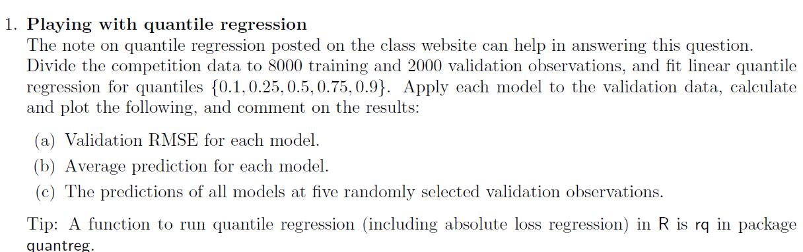
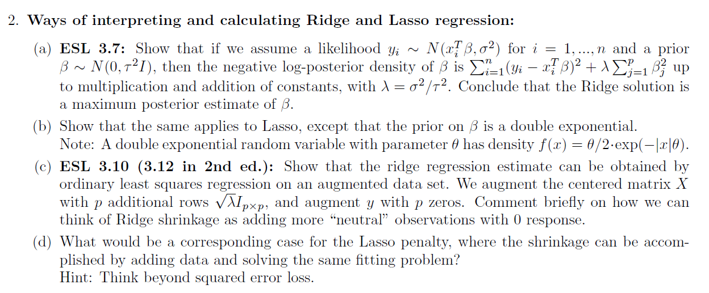
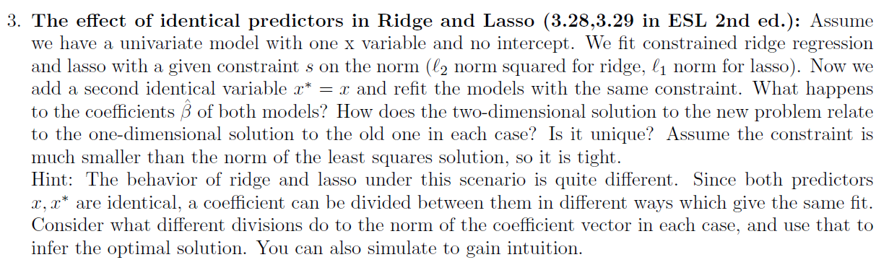
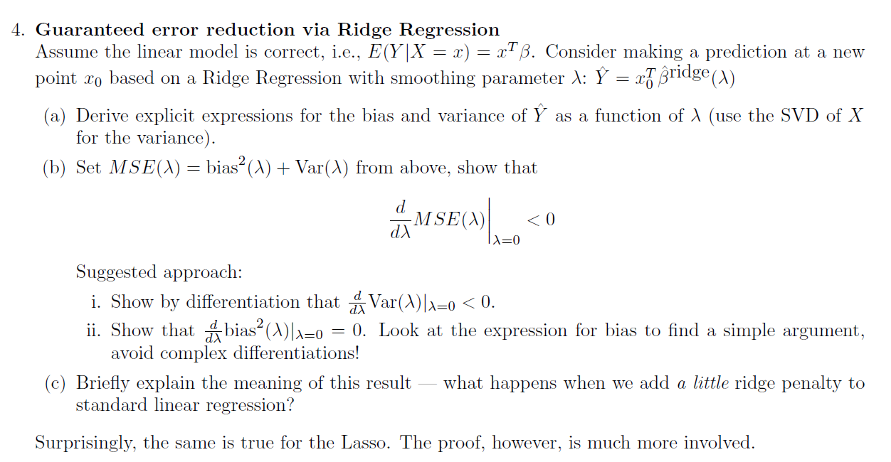
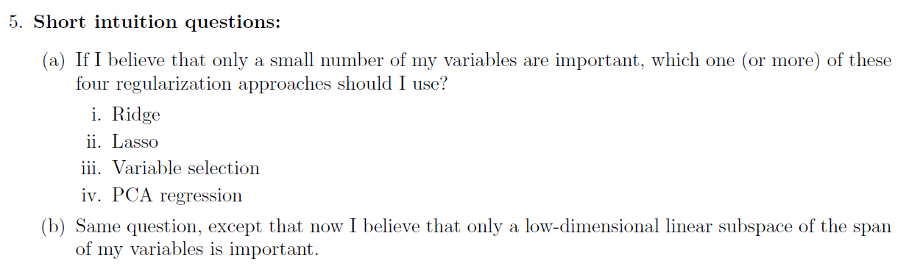

```{r setup, include=FALSE}
knitr::opts_chunk$set(echo = TRUE)
```


```{r message=FALSE, warning=FALSE}
library(dplyr)
library(ggplot2)
library(purrr)
library(quantreg)
library(tidymodels)
```


# Q1




```{r warning=FALSE}
con <- url("http://www.tau.ac.il/~saharon/StatsLearn2022/train_ratings_all.dat")
X <- tibble(read.table(con))
con <- url("http://www.tau.ac.il/~saharon/StatsLearn2022/train_y_rating.dat")
y <- read.table(con)

X_full <- X %>% mutate(y = y$V1)
splits <- X_full %>%
  initial_split(prop = 0.8)

X_tr <- training(splits)
X_val <- testing(splits)
set.seed(123)
random_obs <- sample(1:2000,5)
fit_qr <- function(q,X_tr,X_val,random_obs){
  rq_lm <- rq(y~.,tau = q, data = X_tr)
  y_pred <- predict(rq_lm,X_val)
  y_true <- X_val %>% pull(y)
  rmse_res <- rmse_vec(y_pred,y_true)
  avg_pred <- mean(y_pred)
  random_point_pred <- y_pred[random_obs]
  return( list(rmse_res,avg_pred,random_point_pred))
}
qs <- c(0.1,0.25,0.5,0.75,0.9)
rmses <- c()
avg_preds <- c()
random_point_preds <- c()
for (i in 1:5){
  cur_res <- fit_qr(qs[i],X_tr,X_val,random_obs)
  rmses <- c(rmses,cur_res[[1]])
  avg_preds <- c(avg_preds,cur_res[[2]])
  random_point_preds <- c(random_point_preds,cur_res[[3]])
}

red_df <- tibble(q = qs,rmse_res = rmses, avg_pred = avg_preds,
       obs1 = random_point_preds[seq(1,25,5)],
       obs2 = random_point_preds[seq(2,25,5)],
       obs3 = random_point_preds[seq(3,25,5)],
       obs4 = random_point_preds[seq(4,25,5)],
       obs5 = random_point_preds[seq(5,25,5)])

colors = c("rmse_res"="blue", "avg_pred" ="black","obs1"="green","obs2"="purple","obs3"= "red","obs4"= "yellow","obs5"= "orange")
ggplot(data = red_df) + 
  geom_smooth(aes(x = q, y = rmse_res,color = "rmse_res")) +
  geom_smooth(aes(x = q, y = avg_pred,color = "avg_pred")) +
  geom_smooth(aes(x = q, y = obs1,color = "obs1"),linetype='dotted') +
  geom_smooth(aes(x = q, y = obs2,color = "obs2"),linetype='dotted') +
  geom_smooth(aes(x = q, y = obs3,color = "obs3"),linetype='dotted') +
  geom_smooth(aes(x = q, y = obs4,color = "obs4"),linetype='dotted') +
  geom_smooth(aes(x = q, y = obs5,color = "obs5"),linetype='dotted') +
  labs(x="q", y = "", color = "legend")+
  scale_color_manual(values = colors)
```

$$
\textrm{we can clearly see that as q increases the observation prediction increases and the average prediction increases}
\\
\textrm{meaning our results lean towards higher values}
\\
\textrm{we can also see that the farther away q is from 0.5 the rmse increases as well}
$$

# Q2



## a

$$
\textrm{we are lookin for} p(\beta|y)
\\
\textrm{from Bayesien theory we know that: } p(\beta|y) = p(y|\beta)p(\beta)
\\
p(y|\beta) = C_\sigma e^{-\frac{\sum_{i=1}^n (y_i-x_i^t\beta)^2}{2\sigma^2}}
\\
p(\beta) = C_\tau e^{-\frac{\sum_{j=1}^p \beta_j^2}{2\tau^2}}
\\
p(y|\beta)p(\beta) \propto e^{-\frac{\sum_{i=1}^n (y_i-x_i^t\beta)^2}{2\sigma^2} - \frac{\sum_{j=1}^p \beta_j^2}{2\tau^2}} = e^{-\frac{\sum_{i=1}^n (y_i-x_i^t\beta)^2 + \frac{\sigma^2}{\tau^2}\sum_{j=1}^p \beta_j^2}{2\sigma^2}} = e^{-\frac{\sum_{i=1}^n (y_i-x_i^t\beta)^2 + \lambda\sum_{j=1}^p \beta_j^2}{2\sigma^2}}
\\
- ln(p(y|\beta)p(\beta)) \propto \sum_{i=1}^n (y_i-x_i^t\beta)^2 + \lambda\sum_{j=1}^p \beta_j^2
$$

## b

$$
\textrm{we can define } \theta = \frac{1}{\tau^2} \textrm{ and write the probabbility as a funtion of } \tau:
\\
p(\beta) = C_\tau e^{-\frac{\sum_{j=1}^p |\beta_j|}{\tau^2}}
\\
p(y|\beta)p(\beta) \propto e^{-\frac{\sum_{i=1}^n (y_i-x_i^t\beta)^2}{2\sigma^2} - \frac{\sum_{j=1}^p |\beta_j|}{2\tau^2}} = e^{-\frac{\sum_{i=1}^n (y_i-x_i^t\beta)^2 + \frac{\sigma^2}{\tau^2}\sum_{j=1}^p |\beta_j|}{2\sigma^2}} = e^{-\frac{\sum_{i=1}^n (y_i-x_i^t\beta)^2 + \lambda\sum_{j=1}^p |\beta_j|}{2\sigma^2}}
\\
- ln(p(y|\beta)p(\beta)) \propto \sum_{i=1}^n (y_i-x_i^t\beta)^2 + \lambda\sum_{j=1}^p |\beta_j|
$$

## c

$$
\textrm{for writing convenience reasons define } \delta = \sqrt \lambda
\\
X' := \begin{bmatrix} 
      	X \\
      	\delta I_p  \\
      	\end{bmatrix} 
      	\quad
      	Y' :=\begin{bmatrix} 
      	Y \\
      	0_p  \\
      	\end{bmatrix}
\\
\textrm{for out new set up the LSE is } \hat\beta' = (X'^tX')^{-1}X'^t Y' = (X^tX + \lambda I_p)\begin{bmatrix} X^t & \delta I_p \\\end{bmatrix}\begin{bmatrix} 
      	Y \\
      	0_p  \\
      	\end{bmatrix} = 
      	\\
= (X^tX + \lambda I_p)(X^tY + \delta I_p 0_p) = (X^tX + \lambda I_p)X^tY = \hat \beta_{ridge}
\\
\textrm{ we augmented the data set with p observation each with size } \delta \textrm{ in the direction of only one of the xes with y=0}
\\
\textrm{thus for each } x_i \textrm { our RSS will be pentelized proportional to the size of } \beta_i 
\\
\textrm{ due to the fact that as } \beta_i \textrm{ increaces our new observation becomces farther from the target y=0}
$$

## d

$$
\textrm{let our augmented dataset be: }
\\
X' := \begin{bmatrix} 
      	X \\
      	\lambda I_p  \\
      	\end{bmatrix} 
      	\quad
      	Y' :=\begin{bmatrix} 
      	Y \\
      	0_p  \\
      	\end{bmatrix}
\\
\textrm{and lets take a look at the absolute loss: }
\\
L(Y',\beta) = \sum_{i=1}^{n+p}|y_i' - x_i'^t\beta| = \sum_{i=1}^{n}|y_i - x_i^t\beta| + \sum_{i=n}^{n+p}|y_i' - x_i'^t\beta| = L(Y,\beta) + \lambda\sum_{i=n}^{n+p}|\beta_i|
$$

# Q3



## Ridge

$$
\textrm{our new optimization problem is: }
\\\
minimize ||y-x\beta_1 - x^*\beta_2|| + \lambda \beta_1^2 + \lambda \beta_2^2 := minimize L^*
\\
\frac{\partial L^*}{\partial\beta_1} = 2\sum_{i=1}^n (y_i - x_i(\beta_1  + \beta_2))x_i + 2 \lambda\beta_1
\\
\frac{\partial L^*}{\partial\beta_2} = 2\sum_{i=1}^n (y_i - x_i(\beta_1  + \beta_2))x_i + 2 \lambda\beta_2
\\
\textrm{setting both to zero and subtracting between the two equations gets us:}
\\
2\lambda\beta_1 =  2\lambda\beta_2 \Rightarrow \textrm{in the optimal solution: } \beta_1 = \beta_2 
\\
(\textrm{in the case where } \lambda =0 \textrm{ any combination that satisfiys: } \beta_1 + \beta_2 = \beta \textrm{ is an optimal solution})
\\
\textrm{now plugging the constraint back to } L^* \textrm{ yields the following problem: }
\\
minimize ||y-2x\beta_1|| + 2\lambda \beta_1^2
\\
\textrm{using our knowlage for its minimizer we can conclude: } \hat \beta_1 = (4x^tx +2\lambda)^{-1}2x^ty  = (2x^tx +\lambda)^{-1}x^ty = \hat \beta_2
\\
\textrm{we get a smaller coefficient then } \hat\beta \textrm{ and the solution is unique}
$$

## Lasso

$$
\textrm{our new optimization problem is: }
\\\
minimize ||y-x\beta_1 - x^*\beta_2|| + \lambda |\beta_1| + \lambda |\beta_2| := minimize L^*
\\
\frac{\partial L^*}{\partial\beta_1} = 2\sum_{i=1}^n (y_i - x_i(\beta_1  + \beta_2))x_i + sign(\beta_1) \lambda
\\
\frac{\partial L^*}{\partial\beta_2} = 2\sum_{i=1}^n (y_i - x_i(\beta_1  + \beta_2))x_i + sign(\beta_2) \lambda
\\
\textrm{setting both to zero and subtracting between the two equations gets us:}
\\
sign(\beta_1) \lambda =  sign(\beta_2) \lambda \Rightarrow \textrm{in the optimal solution: } sign(\beta_1) = sign(\beta_2) 
\\
(\textrm{in the case where } \lambda =0 \textrm{ any combination that satisfiys: } \beta_1 + \beta_2 = \beta \textrm{ is an optimal solution})
$$

$$
\\
\textrm{now plugging the constraint back to } L^* \textrm{ yields the following problem: }
\\
minimize ||y-x(\beta_1+\beta_2)|| + sign(\beta_1)\lambda (\beta_1+\beta_2) = ||y-x(\beta_1+\beta_2)|| + sign(\beta_1+\beta_2)\lambda (\beta_1+\beta_2)  = ||y-x(\beta')|| + sign(\beta')\lambda \beta'
\\
\textrm{we know that the minimezer for this function is: }  \hat\beta \Rightarrow 
\\
\Rightarrow \{(\hat\beta_1 , \hat\beta_2);\quad \hat\beta_1 + \hat\beta_2 = \hat \beta \wedge sign(\beta_1) = sign(\beta_2) \} \textrm{ is the set of optimal solutions}
$$

# Q4



## a

$$
\textrm{recall: }
\\
X = UDV^t
\\
X^tX = VD^2V^t
\\
(X^tX)^{-1} = VD^{-2}V^t
\\
(X^tX+\lambda I_p)^{-1} = V(D^2+\lambda I_p)^{-1}V^t
\\
X(X^tX+\lambda I_p)^{-1}X^t = UD(D^2+\lambda I_p)^{-1}DU^t = D^2 (D^2+\lambda I_p)^{-1}
\\
\hat Y = X\hat\beta = X(X^tX+\lambda I_p)^{-1}X^tY
\\
\textrm{express the variance}
\\
V(\hat Y) =V(X\hat\beta) = V(X(X^tX+\lambda I_p)^{-1}X^tY) = UD(D^2+\lambda I_p)^{-1}DU^t \sigma^2IUD(D^2+\lambda I_p)^{-1}DU^t = 
\\
=\sigma^2 UD(D^2+\lambda I_p)^{-1}D^2(D^2+\lambda I_p)^{-1}DU^t = \sigma^2 UD^4(D^2+\lambda I_p)^{-2}U^t = \sigma^2 D^4(D^2+\lambda I_p)^{-2}
\\
\textrm{express the } bias^2
\\
E(\hat Y) = E(X\hat\beta) = E(X(X^tX+\lambda I_p)^{-1}X^tY) = X(X^tX+\lambda I_p)^{-1}X^tE(Y)
\\
bias^2 = (E(Y) - E(\hat Y))^T(E(Y) - E(\hat Y)) = E(Y)^t(I-X(X^tX+\lambda I_p)^{-1}X^t)^t(I-X(X^tX+\lambda I_p)^{-1}X^t)E(Y) =
\\
= E(Y)^t(I-D^2 (D^2+\lambda I_p)^{-1})^t(I-D^2 (D^2+\lambda I_p)^{-1})E(Y) = E(Y)^t(I-2D^2 (D^2+\lambda I_p)^{-1} + D^4 (D^2+\lambda I_p)^{-2})E(Y) 
$$


## b

$$
\textrm{differentiate}
\\
\frac{\partial 2D^2 (D^2+\lambda I_p)^{-1}}{\partial \lambda} = -2D^2 (D^2+\lambda I_p)^{-2}
\\
\frac{\partial D^4 (D^2+\lambda I_p)^{-2}}{\partial \lambda} = -2D^4 (D^2+\lambda I_p)^{-3}
\\
\frac{\partial bias^2}{\lambda} = E(Y)^t(2D^2 (D^2+\lambda I_p)^{-2} -2D^4 (D^2+\lambda I_p)^{-3})E(Y) = E(Y)^t((2(D^2+\lambda I_p)^{-1}) (D^2 (D^2+\lambda I_p)^{-1} -(D^2 (D^2+\lambda I_p)^{-1})^2)E(Y)
\\
\textrm{plug in } \lambda = 0 \Rightarrow E(Y)^t((2(D^2)^{-1}) (D^2 (D^2)^{-1} -(D^2 (D^2)^{-1})^2)E(Y) = 0
\\
\frac{\partial \sigma^2 D^4(D^2+\lambda I_p)^{-2}}{\partial \lambda} = -\sigma^2 D^4(D^2+\lambda I_p)^{-3}
\\
\textrm{notice that all the values for D are positive, } \lambda, \sigma^2 \textrm{ are also positive thus: } \frac{\partial V(\hat Y)}{\partial \lambda} <0
$$

## c

$$
\textrm{adding a little ridge penalty will result in lowering the variance}
\\
\textrm{as we proved around } \lambda = 0  \textrm{ the variance of our predictions will decreace if we increace } \lambda
\\
\textrm{also our bias should stay close to zero thus our general MSE will decrease}
$$

# Q5




## a

$$
\textrm{ii) lasso tends to shrink some fo the betas to zero thus preforming variable selection, also if p (and the training time of the model)}
\\
\textrm{is not very large we can preform Variable selection}
$$

## b

$$
\textrm{iv) PCA projects our X to a new low dimensional linear space with a recombination of our original predictors}
$$
