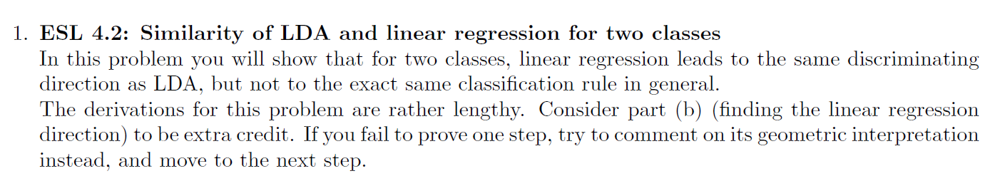
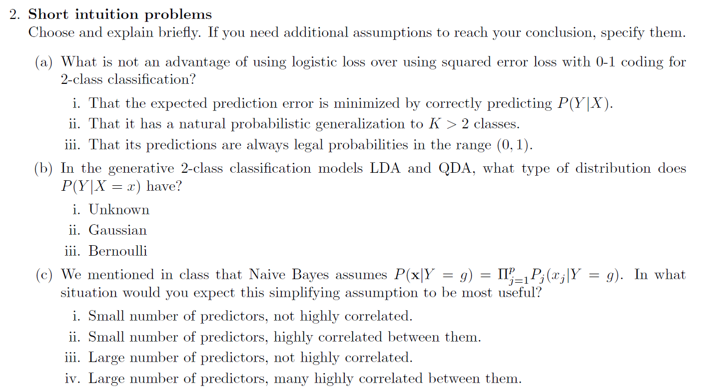
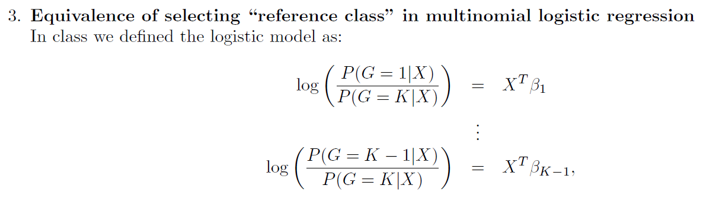
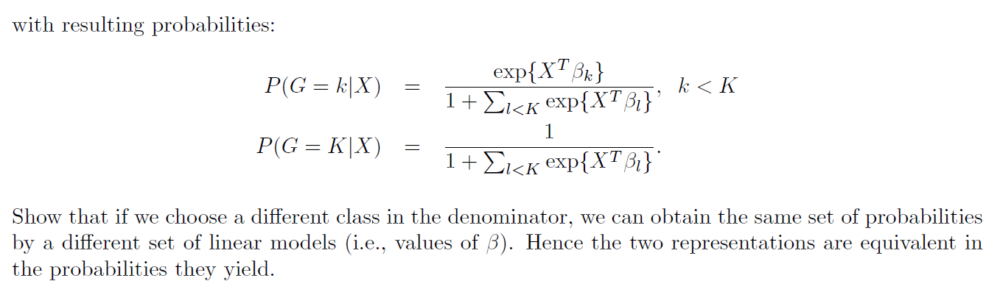
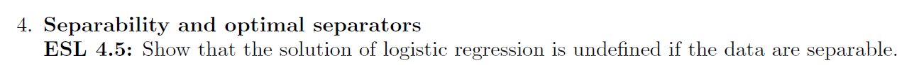
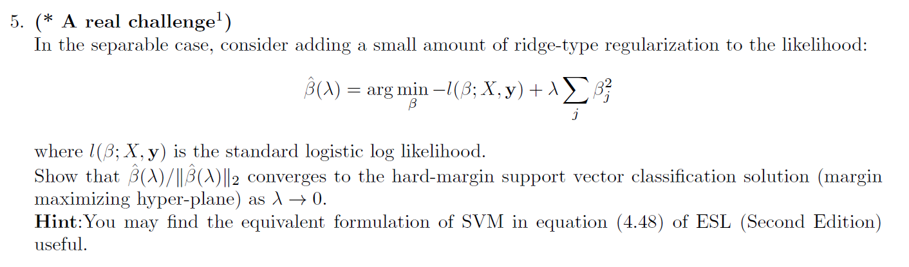

# Q1

$$
\text{WLOG assume class 1 is coded as } -N/N_1 \text{ and class 2 as } N/N_2, \text{also assume that each paramater is estimated by the unbiased estimator (for writing convinice)}
\\
\text{we know from calss that the LDA border is: }
\\
x^t \Sigma^{-1} (\mu_2 - \mu_1) > 0.5 \mu_2^t\Sigma^{-1}\mu_2 - 0.5 \mu_1^t\Sigma^{-1}\mu_1 + ln(\frac{N_1}{N}) - ln(\frac{N_2}{N})
\\
\text{lets take a closer look at the estimator for } \beta_{OLS} \text{ (with intercept)}
\\
X^tX \begin{bmatrix}
\beta_0
\\
\beta
\end{bmatrix} = X^TY
\\
X^TY = \begin{bmatrix}
1 & 1 & 1 & \dots & 1 \\
x_1 & x_2 & x_3 & \dots & x_n
\end{bmatrix} 
\begin{bmatrix}
-N/N_1  \\
\vdots
\\
-N/N_1
\\
N/N_2
\\
\vdots
\\
N/N_2
\end{bmatrix} = \begin{bmatrix}
N_1 (-N/N_1 ) + N_2 (N/N_2 )
\\
(-N/N_1 )\sum_{i=1}^{N_1}x_i  + (N/N_2 )\sum_{i=N_1+1}^{N_2}x_i
\end{bmatrix} =
\begin{bmatrix}
0
\\
N(\mu_2-\mu_1)
\end{bmatrix}
\\
X^TX  =\begin{bmatrix}
1 & 1 & 1 & \dots & 1 \\
x_1 & x_2 & x_3 & \dots & x_n
\end{bmatrix} 
\begin{bmatrix}
1 & x_1^t  \\
\vdots & \vdots
\\
1 & x_n^T
\end{bmatrix} =  \begin{bmatrix}
N & \sum_{i=1}^Nx_i \\
\sum_{i=1}^Nx_i & \sum_{i=1}^Nx_ix_i^t
\end{bmatrix} =  \begin{bmatrix}
N & N_1\mu_1+N_2\mu_2 \\
N_1\mu_1+N_2\mu_2 & \sum_{i=1}^Nx_ix_i^t
\end{bmatrix}
\\
X^tX \begin{bmatrix}
\beta_0
\\
\beta
\end{bmatrix} = 
\begin{bmatrix}
N\beta_0 + (N_1\mu_1^t+N_2\mu_2^t) \beta
\\
(N_1\mu_1+N_2\mu_2) \beta_0 + \sum_{i=1}^Nx_ix_i^t\beta
\end{bmatrix} = \begin{bmatrix}
0
\\
N(\mu_2-\mu_1)
\end{bmatrix}
\\
N\beta_0 + (N_1\mu_1^t+N_2\mu_2^t) \beta = 0 \Rightarrow \beta_0 = - \frac{(N_1\mu_1^t+N_2\mu_2^t)}{N} \beta
\\
\text{plug it back in: }
\\
(N_1\mu_1+N_2\mu_2) \beta_0 + \sum_{i=1}^Nx_ix_i^t\beta = [(N_1\mu_1+N_2\mu_2) \frac{-(N_1\mu_1^t+N_2\mu_2^t)}{N} + \sum_{i=1}^Nx_ix_i^t] \beta = N(\mu_2-\mu_1)
$$

$$
\Sigma = \frac{1}{N-2}[\sum_{i=1}^{N_1}(x_i - \mu_1)(x_i - \mu_1)^T + \sum_{i=N_1+1}^{N_2}(x_i - \mu_2)(x_i - \mu_2)^T] =
\\
=
\frac{1}{N-2}[\sum_{i=1}^{N_1}x_ix_i^t -\sum_{i=1}^{N_1}x_i\mu_1^t - \sum_{i=1}^{N_1}\mu_1x_i^t + N_1\mu_1\mu_1^t + 
\sum_{i=N_1 +1}^{N_2}x_ix_i^t -\sum_{i=N_1 +1}^{N_2}x_i\mu_2^t - \sum_{i=N_1 +1}^{N_2}\mu_2x_i^t + N_2\mu_2\mu_2^t] = \frac{1}{N-2}[\sum_{i=1}^{N}x_ix_i^t - N_1\mu_1\mu_1^t - N_2\mu_2\mu_2^t]
\\
\text{we get: } \sum_{i=1}^{N}x_ix_i^t = (N-2) \Sigma + N_1\mu_1\mu_1^t + N_2\mu_2\mu_2^t
\\
\text{plug it back in and we get: }
\\
[(N_1\mu_1+N_2\mu_2) \frac{-(N_1\mu_1^t+N_2\mu_2^t)}{N} + (N-2) \Sigma + N_1\mu_1\mu_1^t + N_2\mu_2\mu_2^t] \beta = N(\mu_2-\mu_1) \Rightarrow \beta \propto \Sigma^{-1}(\mu_2-\mu_1)
\\
\text{thus the lines are in the same directions but are not identical beacuse } \beta \ne \Sigma^{-1}(\mu_2-\mu_1)
$$

# Q2

### a

$$
\text{the answer is i, by predicting correctly P(Y|X) we also minimize the EPE in the linear regression case.}
$$

### b

$$
\text{the answer is iii - Bernoulli}
\\
\text{in the 2 class classification {1,-1}: } P(Y=1|X=x) = 1-P(Y=-1|X=x) = p < 1 \Rightarrow \text{the sidtribution is Bernoulli}
$$

### c

$$
\text{the answer is i - Small number of predictors, not highly correlated.}
\\
\text{if the observations x are  highly correlated then } P(x|Y = g) \ne \Pi^p_{j=1} Pj (xj |Y = g).
\\
\text{if the number of predictors is high this expression will go quicly to zero thus the probabilty will be very low for all x.}
$$

# Q3

$$
\text{wlog lets show that we can switch the denominator to calss 1}
\\
\text{difine } x^t\tilde \beta_i = ln(\frac{P(G=i|x)}{P(G=1|x)}) \quad \forall \ k>i >2
\\
ln(P(G=1|x)) - ln(P(G=K|x)) = x^t\beta_1
\\
ln(P(G=K|x)) - ln(P(G=1|x))  = x^t\tilde\beta_K
\\
\text{summing the 2 aboice equation yields: } x^t\beta_1 = - x^t\tilde\beta_K
\\
x^t\tilde \beta_i = ln(\frac{P(G=i|x)}{P(G=1|x)}) = ln(P(G=i|x)) - ln(P(G=1|x)) + ln(P(G=K|x)) - ln(P(G=K|x)) =
\\
=ln(\frac{P(G=i|x)}{P(G=K|x)}) + -x^t\beta_1 = x^t(\beta_i - \beta_1)
\\
\text{thus we get that } \tilde \beta_i = \beta_i - \beta_1 \ \&\ \tilde\beta_K = - \beta_1
\\
\text{this is the new linear model, we are left with shoing that the probabilities are the same}
\\
P(G=k|x) [\text{under class K as refrence}] = \frac{e^{x^t\beta_k}}{1 + \sum_{l<K}e^{x^t\beta_l}} = \frac{e^{x^t\beta_k}}{1 + \sum_{l<K}e^{x^t\beta_l}} \frac{e^{-x^t\beta_1}}{e^{-x^t\beta_1}} = 
\frac{e^{x^t\tilde \beta_k}}{e^{-x^t\beta_1} + \sum_{l<K}e^{x^t\tilde \beta_l}} =_* \frac{e^{x^t\tilde \beta_k}}{1 + \sum_{1<l}e^{x^t\tilde \beta_l}} =
\\=P(G=k|x) [\text{under class 1 as refrence}]
\\
*: e^{-x^t\beta_1} + \sum_{l<K}e^{x^t\tilde \beta_l} = e^{-x^t\beta_1} + \sum_{1 <l<K}e^{x^t\tilde \beta_l} + e^{x^t\tilde \beta_1} = 
e^{x^t\tilde \beta_K} + \sum_{1 <l<K}e^{x^t\tilde \beta_l} + e^{x^t 0}  = 1 + \sum_{1<l}e^{x^t\tilde \beta_l}
$$

# Q4

$$
\text{lets show it to the 2 dimentional case (classes 0,1), the p>2 dimentional case is equivelent (with p-1 equivilent equations)}
\\
\hat \beta = argmax \sum_{i=1}^n I(y_i =1)(x_i^t\beta) - log(1+exp(x_i^t\beta))
\\
\text{denote } L = x^t\hat\beta y - \sum_{i=1}^nlog(1+exp(x_i^t\hat\beta))
\\
\text{in the separable case: } \sum_{i=1}^n I(y_i =1)(x_i^t\beta) = x^t\beta y > 0
\\
\text{we will classafy a point as 1 if: } x^t \hat \beta >0
\\
\text{and for } m>0 : x^t \hat \beta >0 \iff x^t m\hat \beta >0
\\
mx^t\hat\beta y - \sum_{i=1}^nlog(1+exp(x_i^t\hat\beta)e^m) > mx^t\hat\beta y - \sum_{i=1}^nlog([1+exp(x_i^t\hat\beta)]e^m) = m(x^t\hat\beta y - n) -\sum_{i=1}^nlog(1+exp(x_i^t\hat\beta))>
\\
> m(x^t\hat\beta y-\sum_{i=1}^nlog(1+exp(x_i^t\hat\beta)) - n) = m(L-n) > L \iff m > \frac{L}{L-n}
\\
\text{so if we take } m = \frac{L+1}{L-n} \text{ and plug } m\hat \beta \text{ into the loss function we get a higer value thus } \hat \beta \text{ is not argmax}
\\
(*)\ x^t\hat\beta<log(1+exp(x_i^t\hat\beta)) \Rightarrow L<0
$$

# Q5

