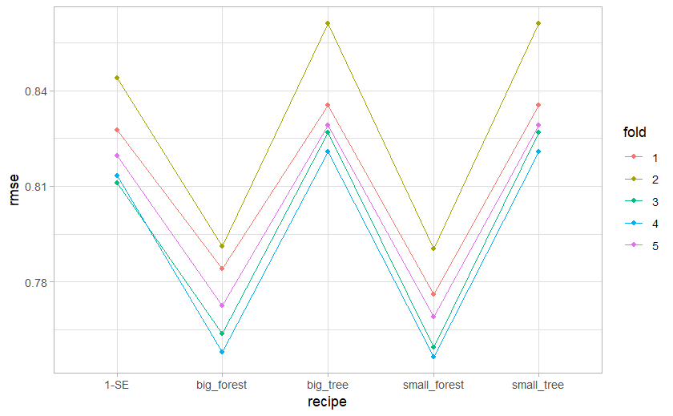

```{r message=FALSE, warning=FALSE}
library(dplyr)
library(ggplot2)
library(purrr)
library(caret)
library(class) 
library(tidymodels)
library(furrr)
library(rpart)
library(keras)
```

# Q1


```{r warning=FALSE, eval = FALSE}

plot_cv_res <- function(cv_results){
  cv_results_longer <- cv_results %>%
  pivot_longer(cols = colnames(cv_results),names_to = "recipe",values_to = "rmse") %>% mutate(fold = ceiling(1:(length(colnames(cv_results))*cv_v)/length(colnames(cv_results))))

  cv_results_longer %>% group_by(recipe) %>% summarize(m = median(rmse)) %>% arrange(m)

  cv_results_longer %>%
    mutate(fold = factor(fold)) %>%
    ggplot(aes(recipe, rmse,group=fold,color = fold)) +
    geom_line(aes(group=fold)) +
    geom_point() +
    theme_light()
}

set.seed(123)
con <- url("http://www.tau.ac.il/~saharon/StatsLearn2022/train_ratings_all.dat")
X <- tibble(read.table(con))
con <- url("http://www.tau.ac.il/~saharon/StatsLearn2022/train_y_rating.dat")
y <- read.table(con)

cv_model <- function(df_split, model, prune_tree = FALSE){
  train_df <- training(df_split)
  test_df <- testing(df_split)

  if (prune_tree){
    tree.mod= rpart (y~.,data=train_df,cp=0.0001)
    tree.res = printcp(tree.mod)
    #1-SE rule
    chosen.prune = min ((1:dim(tree.res)[1]) [tree.res[,"xerror"] < min(tree.res[,"xerror"]+tree.res[,"xstd"])])
    model = prune(tree.mod, cp=tree.res[chosen.prune,"CP"])
    model_pred <- predict(model, test_df %>% select(-y))
    rmse_vec(test_df$y, model_pred)
  }
  else{
    model <- model %>% fit(formula = y~., data = train_df)
    model_pred <- predict(model, test_df %>% select(-y))
    rmse_vec(test_df$y, model_pred$.pred)
  }
}

train <- X %>% mutate(y = y %>% pull)

small_tree <- decision_tree(mode = "regression", tree_depth = 5) %>%
  set_engine("rpart") 

big_tree <- decision_tree(mode = "regression") %>%
  set_engine("rpart") 

big_forest <- rand_forest(mode = "regression", trees = 100) %>%
  set_engine("randomForest")

small_forest <- rand_forest(mode = "regression", trees = 100, min_n = 50) %>%
  set_engine("randomForest")


cv_v <- 5
cv_splits<- vfold_cv(train, v = cv_v)
cv_results <- tibble(
        "1-SE" = map_dbl(cv_splits$splits,cv_model,tree_spec,TRUE),
        "small_tree" = map_dbl(cv_splits$splits,cv_model,small_tree),
        "big_tree" = map_dbl(cv_splits$splits,cv_model,big_tree),
        "big_forest" = map_dbl(cv_splits$splits,cv_model,big_forest),
        "small_forest" = map_dbl(cv_splits$splits,cv_model,small_forest))
```


```{r eval = FALSE}
plot_cv_res(cv_results)
```



-   in this plot we can see the behavior of each fold, alltough it is not the confidence interval it is indicative to where are test results should be (between the top and buttom folds)

-   we can see that the small forest achieved the best results, the big forest probably overfits and the single trees probably underfits

-   for the small tree i used he tree_depth parameter and choose arbitrarily 5, for the large tree i just didnt specify anything which by default leads to the larges tree possible

-   for the 1 - SE tree i used what we saw in class

-   for the random forest i used the min_n argument for the small trees which prevents the tree from being very deep, for the large forest i didnt specify anything meaning each tree can be as large as possible

# Q2


### a

$$
\text{i'll prove the 2nd property: }
\\
\alpha_t = argmin_\alpha \sum_i L(y_i,F^{(t-1)} + \alpha h_t) := argmin_\alpha L_\alpha
\\
\frac{\partial L_\alpha}{\partial \alpha} = \sum_i \frac{\partial exp\{y_i(F^{(t-1)} + \alpha h_t)\}}{\partial \alpha}= \sum_i\frac{\partial exp\{y_iF^{(t-1)}\}  exp\{y_i\alpha h_t\}}{\partial \alpha}= \sum_i [y_ih_t exp\{y_iF^{(t-1)}\}  exp\{y_i\alpha h_t\} ]=
\\
=\sum_{y_i = h_t} e^{y_i F^{(t - 1)}} e^{-\alpha} - \sum_{y_i \ne h_t} e^{y_i F^{(t - 1)}} e^{\alpha} := 0 \Rightarrow
\\
\Rightarrow \sum_{y_i=h_t} e^{y_i F^{(t - 1)}} e^{-\alpha} = \sum_{y_i\ne h_t} e^{y_i F^{(t - 1)}} e^{\alpha}\Rightarrow
\\
\Rightarrow \sum_{y_i = h_t} e^{y_i F^{(t - 1)}}  = \sum_{y_i \ne h_t} e^{y_i F^{(t - 1)}} e^{2\alpha}\Rightarrow
\\
\text{denote } w_i = w_i^{(t)}, \quad err = err^{(t)}
\\
\Rightarrow e^{2\alpha} = \frac{\sum_{y_i= h_t} e^{y_i F^{(t - 1)}}}{ \sum_{y_i \ne h_t} e^{y_i F^{(t - 1)}}} = \frac{\sum_{y_i = h_t} w_i}{ \sum_{y_i \ne h_t} w_i} = \frac{\sum_i w_i I(y_i =h_t)}{ \sum_{y_i \ne h_t} w_i} = \frac{\sum_i w_i I(y_i = h_t)}{ \sum_{i} w_iI(y_i \ne h_t)}=
\\
=\frac{1-err}{err} \Rightarrow \alpha_t =\frac{1}{2}ln(\frac{1-err}{err})
$$

### b

```{r, echo=FALSE}
########### Training data (rankings only, no dates):
set.seed(123)
con <- url("http://www.tau.ac.il/~saharon/StatsLearn2022/train_ratings_all.dat")
X.tr <- read.table(con)
con <- url("http://www.tau.ac.il/~saharon/StatsLearn2022/train_y_rating.dat")
y.tr <- read.table(con)

con = url("http://www.tau.ac.il/~saharon/StatsLearn2022/movie_titles.txt")
titles = read.table(con,sep=",")
names(X.tr) = substr(as.character(titles[,2]),1,15)
movies = substr(as.character(titles[,2]),1,15)


########### Divide training data into training and validation
n = dim(X.tr)[1]
nva=2000
va.id = sample (n,nva) # choose 2000 points for validation
trtr = data.frame (X = X.tr[-va.id,],y=(y.tr[-va.id,]>3) - (y.tr[-va.id,]<=3))

va = data.frame (X = X.tr[va.id,],y=(y.tr[va.id,]>3)- (y.tr[va.id,]<=3))


############# AdaBoost

train_val_ada_boost <- function(maxdepth = 2, cp = 0.00001, epsilon = 0, n_iter = 1000){
  train_miss_calssification <- c()
  test_miss_calssification <- c()
  w.now = rep (1, dim(trtr)[1]) # initialize w=1
  err.boost=err.tr.boost=NULL
  pred.boost = numeric(dim(va)[1])
  tr.boost = numeric(dim(trtr)[1])
  for (i in 1:n_iter){
      tree.mod= rpart (y~.,data=trtr,method="class",weights=w.now,maxdepth=maxdepth,cp=cp)
      yhat.now = predict(tree.mod,type="class")
      yhat.now.num = as.numeric(as.character(yhat.now))
      Err = sum( w.now*(yhat.now != trtr$y))/sum(w.now)
      if (epsilon == 0){
        alpha = 0.5*log((1-Err)/Err)
      }
      else {alpha = epsilon}
  # for sanity check:    
      # cat(i,Err, alpha,"\n")
      pred.boost = pred.boost + alpha*as.numeric(as.character(predict(tree.mod, newdata=va,type="class"))) 
      tr.boost = tr.boost + alpha*yhat.now.num
      w.now = w.now * exp(-alpha*yhat.now.num*trtr$y)
      w.now = w.now/sum(w.now)*dim(trtr)[1] # rescaling - not important!
      train_err = mean (sign(tr.boost)!=trtr$y)
      test_err = mean (sign(pred.boost)!=va$y)
      # cat (i, "train:", train_err, " test:", test_err,"\n")
      train_miss_calssification = c(train_miss_calssification,train_err)
      test_miss_calssification = c(test_miss_calssification,test_err)
      
  }
  out_tbl <- tibble(train_err = train_miss_calssification,
         test_err = test_miss_calssification,
         iteration = seq(1,n_iter))
  return(out_tbl)
}

```

#### i

```{r}
res1 = train_val_ada_boost()

res1 %>% 
  pivot_longer(cols = !iteration,names_to = "err_type",values_to = "err") %>%
    ggplot(aes(iteration, err,group=err_type,color = err_type)) +
    geom_line(aes(group=err_type)) +
    geom_point() +
    theme_light()
```

-   as we increase the number of iterations the training error and test error decreases until \~ iteration 200, this is where the test error increases.

-   this is due to the fact that the adaboost algorithm overfits the training data, this is why the training error keeps decreasing while the test error increases

#### ii

```{r}
res2 <- train_val_ada_boost(epsilon = 0.01)

res2 %>% 
  pivot_longer(cols = !iteration,names_to = "err_type",values_to = "err") %>%
    ggplot(aes(iteration, err,group=err_type,color = err_type)) +
    geom_line(aes(group=err_type)) +
    geom_point() +
    theme_light()
```

-   we can see that the train error decrease much slower, also the test error does increase as much as in the line search, this is due to the fact that we are taking a fixed step and not the best step as in line search.

#### iii

-   i changed the objective of the trees from the original y to the gradients

```{r}
train_val_ada_boost_mse <- function(maxdepth = 2, cp = 0.00001, epsilon = 0.01, n_iter = 1000){
  gbm_tr = trtr
  train_miss_calssification <- c()
  test_miss_calssification <- c()
  w.now = rep (1, dim(trtr)[1]) # initialize w=1
  err.boost=err.tr.boost=NULL
  pred.boost = numeric(dim(va)[1])
  tr.boost = numeric(dim(trtr)[1])
  alpha = epsilon
  for (i in 1:n_iter){
      tree.mod= rpart (y~.,data=gbm_tr,method="anova",maxdepth=maxdepth,cp=cp)
      yhat.now = predict(tree.mod)
      pred.boost = pred.boost + alpha*predict(tree.mod, newdata=va) 
      tr.boost = tr.boost + alpha*yhat.now
      gbm_tr$y = trtr$y-tr.boost
      train_err = mean (sign(tr.boost)!=trtr$y)
      test_err = mean (sign(pred.boost)!=va$y)
      # cat (i, "train:", train_err, " test:", test_err,"\n")
      train_miss_calssification = c(train_miss_calssification,train_err)
      test_miss_calssification = c(test_miss_calssification,test_err)
      
  }
  out_tbl <- tibble(train_err = train_miss_calssification,
         test_err = test_miss_calssification,
         iteration = seq(1,n_iter))
  return(out_tbl)
}

res3 <- train_val_ada_boost_mse()

res3 %>% 
  pivot_longer(cols = !iteration,names_to = "err_type",values_to = "err") %>%
    ggplot(aes(iteration, err,group=err_type,color = err_type)) +
    geom_line(aes(group=err_type)) +
    geom_point() +
    theme_light()
```

-   the results are not that good, firstly we achive a worse train and test error than before, second we get stuck rather quickly, changing the learning rate might help

#### iv

##### training results

```{r}
res4 <- train_val_ada_boost(cp = 0, maxdepth = 3)
res4 %>% 
  pivot_longer(cols = !iteration,names_to = "err_type",values_to = "err") %>%
    ggplot(aes(iteration, err,group=err_type,color = err_type)) +
    geom_line(aes(group=err_type)) +
    geom_point() +
    theme_light()
```

##### testing results

```{r}
res2 <- train_val_ada_boost(epsilon = 0.005, n_iter = 250, cp = 0.0001) 

res2 %>% 
  pivot_longer(cols = !iteration,names_to = "err_type",values_to = "err") %>%
    ggplot(aes(iteration, err,group=err_type,color = err_type)) +
    geom_line(aes(group=err_type)) +
    geom_point() +
    theme_light()
```

-   we can see that we get a better test error than before, this is due to stopping before the model starts overfitting, and chossing a better learning rate

# Q3


$$
\text{lets formalate KNN as a linear estimator:}
\\
\text{denote: } N_k(x) \text{ the k nearest niebors of x}
\\
\hat y_i = \frac{1}{k}\sum_{x_j \in N_k(x_i)} y_j = \frac{1}{k}\sum_{j} y_j I(x_j \in N_k(x_i))
\\
\text{difine } S \in \mathbb{R}^{n\times n}
\\
S_{ij} = \begin{cases}
1/k \quad x_i \in N_k(x_j)   \\
0 \quad \quad x_i \notin N_k(x_j)
\end{cases}
\\
\text{thus the dof that the k-nn model has is: } trace(S) = \frac{N}{k}
$$

# Q4


### a

$$
\text{linear activation function: } f(x^tw) = \sum_i x_iw_i
\\
\text{for both models i will use a neural net with an input layer and output layer with no hidden layers:}
\\
\text{linear regression:}
\\
\text{we can use a linear activation function and a } L_2\text{ loss function and our model will be:} 
\\
I(Xw>0.5), \quad \text{ where X is the input matrix and w is the vector of our weights}
\\
\text{thus the neural nets optimizes the following problem via GD: }  w = argmin_w||Xw -y||
\\
\text{due to the convexity of the problem if we choose a small enouth learning rate we will achive the same solution as linear regression}
\\
\text{logistic regression:}
\\
\text{we can use a sigmoid activation function and a cross entropy loss function and our model will be:} 
\\
I(\sigma(Xw)>0.5)
\\
\text{thus the neural nets optimizes the following problem via GD: }  w = argmin_w -\sum_i y_i ln(\sigma(Xw)_i) + (1-y_i)ln(1-\sigma(Xw)_i)
\\
\text{we can expect here different solutions beacuse the optimization algorithms differ, but the solutions should be rather similar}
\\
\text{if we choose a small enough tolerance for the algorithm we should reach the global minima - thus the same solution}
\\
\text{both networks implements the regression models in the sense that they seek to solve the same problem but via a different algorithm}
\\
\text{note that if we want to enclude bias in our model it needs to be in the input layer as an input of 1 (similar to what we do in OLS matrix)}
\\
$$

### b

#### logistic

```{r}
heart = read.csv("https://web.stanford.edu/~hastie/ElemStatLearn/datasets/SAheart.data",row.names=1)
heart$famhist= as.numeric(heart$famhist == "Present") # need only numbers
heart=array(unlist(heart),dim=c(462,10)) # move from data frame to array for keras

n = dim(heart)[1]
p = dim(heart)[2]
test.id = sample(n,n/3)

x_train = heart[-test.id,-p]
y_train = heart[-test.id,p]
x_test = heart[test.id,-p]
y_test = heart[test.id,p]


batch_size <- 32
epochs <- 1000
model_logistic <- keras_model_sequential()

model_logistic %>% 
  layer_dense(units = 1, activation = 'sigmoid', input_shape = c(dim(x_train)[2]))


summary(model_logistic)

```

```{r message=FALSE, warning=FALSE}

model_logistic %>% compile(loss = 'binary_crossentropy',optimizer = optimizer_adam(),metrics = c('accuracy'))

model_logistic %>% fit(x_train, y_train, validation_data = list(x_test, y_test),
  batch_size = batch_size,epochs = epochs,verbose = 1)
```

```{r}
print("neural net")
phat_NN_1_sig = predict(model_logistic,x_test, batch_size = NULL, verbose = 0, steps = NULL)
summary(phat_NN_1_sig)
tbl = table(phat_NN_1_sig>0.5, y_test) # 2*2 table
print(tbl)
paste("the test set preformance is:" , round(sum(diag(tbl))/sum(tbl),4))


# logistic regression
print("logistic regression")
mod.lr = glm(y~., data=data.frame(x=x_train,y=y_train), family=binomial)
phat_logit = predict.glm(mod.lr, newdata = data.frame(x=x_test,y=y_test),type="response")
table(phat_logit>0.5, y_test) # 2*2 table
```

-   the results seems as we would expect, they are close but not the same

#### linear

```{r}
batch_size <- 32
epochs <- 1000
model_lr <- keras_model_sequential()
model_lr %>% 
  layer_dense(units = 1, activation = 'linear', input_shape = c(dim(x_train)[2]))


summary(model_lr)

```

```{r message=FALSE, warning=FALSE}

model_lr %>% compile(loss = 'mse',optimizer = optimizer_adam(),metrics = c('accuracy'))

model_lr %>% fit(x_train, y_train, validation_data = list(x_test, y_test),
  batch_size = batch_size,epochs = epochs,verbose = 1)
```

```{r}
print("neural net")
phat_NN_1_sig = predict(model_lr,x_test, batch_size = NULL, verbose = 0, steps = NULL)
summary(phat_NN_1_sig)
tbl = table(phat_NN_1_sig>0.5, y_test) # 2*2 table
print(tbl)
paste("the test set preformance is:" , round(sum(diag(tbl))/sum(tbl),4))

print("linear regression")
mod.lr = lm(y~., data=data.frame(x=x_train,y=y_train))
phat_logit = predict(mod.lr, newdata = data.frame(x=x_test))
table(phat_logit>0.5, y_test) # 2*2 table
```

-   we would expect the results to be exactly the same, we are not getting the same results thus we can tweak the parameters of the optimizer or use a different one, (this results changes with knitting the notebook, i sometimes get very close results [even the same ones], and sometimes very different ones, usually its the first case)

### c

```{r}
model_3_layers <- keras_model_sequential()
model_3_layers %>% 
  layer_dense(units = 3, activation = 'relu', input_shape = c(dim(x_train)[2]))%>% 
  layer_dense(units = 2, activation = 'relu')%>% 
  layer_dense(units = 1, activation = 'sigmoid')


summary(model_3_layers)

```

```{r message=FALSE, warning=FALSE}
model_3_layers %>% compile(loss = 'binary_crossentropy',optimizer = optimizer_adam(),metrics = c('accuracy'))

model_3_layers %>% fit(x_train, y_train, validation_data = list(x_test, y_test),
  batch_size = batch_size,epochs = epochs,verbose = 1)
```

```{r}
phat_NN_1_sig = predict(model_3_layers,x_test, batch_size = NULL, verbose = 0, steps = NULL)
summary(phat_NN_1_sig)
tbl = table(phat_NN_1_sig>0.5, y_test) # 2*2 table
print(tbl)
paste("the test set preformance is:" , round(sum(diag(tbl))/sum(tbl),4))
```

-   i am not sure what will come up with this run, but sometimes we can see that the models has improved, and sometimes that it doesn't, i tried playing with the number of neuron at each layer, didnt came up with a stable result. this could be due to the fact that a larger network has higher flexibility so it can fit the data better, but it might also over fit, we are dealing with more than 40 parameters in the shallowest networks which might tend to overfit if we have a small dataset like in our case.

### d

```{r}
rm(model)
model <- keras_model_sequential()
model %>% 
  layer_dense(units = 3, activation = 'linear', input_shape = c(dim(x_train)[2]))%>% 
  layer_dense(units = 1, activation = 'linear')


summary(model)

```

```{r message=FALSE, warning=FALSE}
model %>% compile(loss = 'mse',optimizer = optimizer_adam(),metrics = c('accuracy'))

model %>% fit(x_train, y_train, validation_data = list(x_test, y_test),
  batch_size = batch_size,epochs = epochs,verbose = 1)
```

$$
\text{let } w^{(k)}_{ij} \text{ be the weights of the kth hidden layer between the ith node in layer k and jth node in layer k-1}
\\
\text{the fist layer outputs: } o^{(1)}_{i} = x^tw^{(1)}_i, \text{ where }  w_i \text{ is the vector of weights for the edges to node i}
\\
\text{the  2nd layer (output layer) outputs: } \hat y_i =  \sum_{k=1}^3 w^{(2)}_k \sum_{j=1}^nx_j w^{(1)}_{kj} = w^{(2)t}W^{(1)t}X_i^t
$$

-   it is a linear function of the original x
